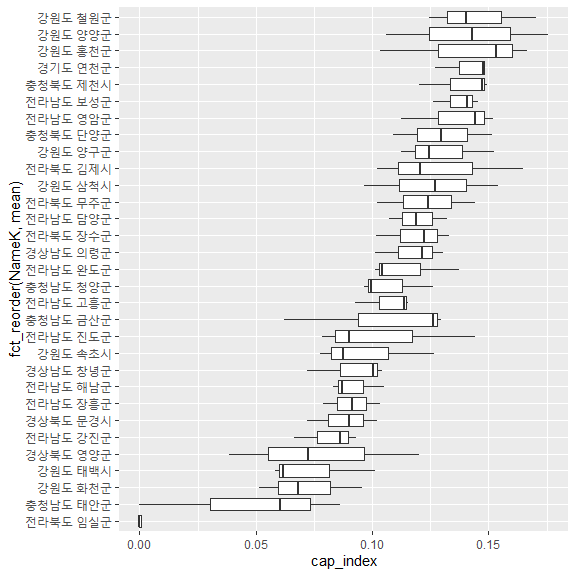

Capacity-소방/경창관서수밀도, 방재시설개수, 방재예산액
================
Kyungtak Kim
2020 3 26

``` r
# 패키지 설치
#install.packages("sf")
#install.packages("tmap")
#install.packages("dplyr")
```

``` r
library(tidyverse)
library(sf)
library(tmap)
Sys.setenv(Language="En")
library(caret)
library(knitr)
library(leaflet)
library(rgdal)
library(htmltools)
```

# 원본 데이터 읽기

``` r
DB <- as.data.frame(read.csv('input/capacity_db.csv'))
head(DB, 3)
```

    ##                   Name         NameK   SGG  area_km2 X16_cap_phy X16_fire
    ## 1 Gangwon Gangneung-si 강원도 강릉시 42150 1046.6571          20        7
    ## 2  Gangwon Goseong-gun 강원도 고성군 42820  661.4778          12        4
    ## 3   Gangwon Donghae-si 강원도 동해시 42170  198.1673          11        4
    ##   X16_police X16_ex_budget X16_main_budget X17_cap_phy X17_fire X17_police
    ## 1          8      11489640       324127632          27        7          8
    ## 2          5      24490167       324127632          12        4          5
    ## 3          7       9816380       324127632          11        4          7
    ##   X17_ex_budget X17_main_budget X18_cap_phy X18_fire X18_police X18_ex_budget
    ## 1       6073650       106612695          28        7         12       4698184
    ## 2      17998079       106612695          12        4          7       8487303
    ## 3       5047848       106612695          11        5          9       6956954
    ##   X18_main_budget
    ## 1        76670945
    ## 2        76670945
    ## 3        76670945

## 면적에 대한 분석 (area\_km2)

무슨 면적인가? 각 자치단체의 면적…

``` r
DB_a <- DB %>% 
  select(NameK, SGG, area_km2)
head(DB_a, 3)
```

    ##           NameK   SGG  area_km2
    ## 1 강원도 강릉시 42150 1046.6571
    ## 2 강원도 고성군 42820  661.4778
    ## 3 강원도 동해시 42170  198.1673

``` r
DB_a %>% 
  ggplot(aes(x=fct_reorder(NameK, area_km2),
             y=area_km2))+
  geom_point(aes(color=factor(SGG)))+
  coord_flip()+
  theme(legend.position = "none")
```

<!-- -->

``` r
DB_a %>% 
  ggplot(aes(area_km2))+
  geom_density()
```

<!-- -->

``` r
DB_a %>% 
  ggplot(aes(area_km2))+
  geom_histogram(aes(color=factor(SGG)))+
  theme(legend.position = "none")
```

    ## `stat_bin()` using `bins = 30`. Pick better value with `binwidth`.

<!-- -->

## 소방관서수에 대한 분석

``` r
DB_f <- DB %>% 
  select(NameK, SGG, contains("fire"))
head(DB_f, 3)
```

    ##           NameK   SGG X16_fire X17_fire X18_fire
    ## 1 강원도 강릉시 42150        7        7        7
    ## 2 강원도 고성군 42820        4        4        4
    ## 3 강원도 동해시 42170        4        4        5

``` r
DB_f_p <- DB_f %>%                           # pivoting
  pivot_longer(c("X16_fire", "X17_fire", "X18_fire"),
               names_to = "year",
               values_to = "fire")
DB_f_p %>% 
  ggplot()+
  geom_density(aes(x=fire, y=..density.., color=year))
```

<!-- -->

SGG는 시군 고유번호로 지역별 대략적인 분포를 알 수 있다.

``` r
DB_f_p %>% 
  group_by(year) %>% 
  ggplot(aes(fire, SGG))+
  geom_point(aes(color=factor(SGG)))+
  facet_grid(. ~year)+
  theme(legend.position = "none")
```

<!-- -->

``` r
DB_f_p %>% 
  group_by(NameK) %>% 
  mutate(mean=mean(fire))%>% 
  ggplot(aes(x=fct_reorder(NameK, mean),
             y=fire))+
  geom_boxplot()+
  coord_flip()
```

<!-- -->

## 경찰관서수에 대한 분석

``` r
DB_p <- DB %>% 
  select(NameK, SGG, contains("police"))
head(DB_p, 3)
```

    ##           NameK   SGG X16_police X17_police X18_police
    ## 1 강원도 강릉시 42150          8          8         12
    ## 2 강원도 고성군 42820          5          5          7
    ## 3 강원도 동해시 42170          7          7          9

``` r
DB_p_p <- DB_p %>%                           # pivoting
  pivot_longer(c("X16_police", "X17_police", "X18_police"),
               names_to = "year",
               values_to = "police")
DB_p_p %>% 
  ggplot()+
  geom_density(aes(x=police, y=..density.., color=year))
```

<!-- -->

SGG는 시군 고유번호로 지역별 대략적인 분포를 알 수 있다.

``` r
DB_p_p %>% 
  group_by(year) %>% 
  ggplot(aes(police, SGG))+
  geom_point(aes(color=factor(SGG)))+
  facet_grid(. ~year)+
  theme(legend.position = "none")
```

<!-- -->

``` r
DB_p_p %>% 
  group_by(NameK) %>% 
  mutate(mean=mean(police))%>% 
  ggplot(aes(x=fct_reorder(NameK, mean),
             y=police))+
  geom_boxplot()+
  coord_flip()
```

<!-- -->

## 연도별 (소방관서수+경찰서수) 밀도 산정

``` r
result_s1 <- as.data.frame(matrix(nrow = 0, ncol = 1))
result_s2 <- as.data.frame(matrix(nrow = 0, ncol = 1))
result_s3 <- as.data.frame(matrix(nrow = 0, ncol = 1))
for(i in 1:161){
  work1 <- as.data.frame((DB$X16_fire[i]+DB$X16_police[i])/DB$area_km2[i])
  result_s1 <- rbind(result_s1, work1)
  work2 <- as.data.frame((DB$X17_fire[i]+DB$X17_police[i])/DB$area_km2[i])
  result_s2 <- rbind(result_s2, work2)
  work3 <- as.data.frame((DB$X18_fire[i]+DB$X18_police[i])/DB$area_km2[i])
  result_s3 <- rbind(result_s3, work3)
}
result_soc <-cbind(result_s1, result_s2, result_s3)
colnames(result_soc) <- c("X16_cap_soc","X17_cap_soc","X18_cap_soc")
head(result_soc,3)
```

    ##   X16_cap_soc X17_cap_soc X18_cap_soc
    ## 1  0.01433134  0.01433134  0.01815303
    ## 2  0.01360590  0.01360590  0.01662943
    ## 3  0.05550865  0.05550865  0.07064737

## (소방관서수+경찰관서수)밀도에 대한 분석

**\[주\]소방/경찰관서수의 경우 밀도함수로 변화하여도 자료의 분포를 보면** \*\* sqrt 또는 log 함수를 취하는 것이
바람직함\*\*

``` r
result_soc1 <- cbind(DB[,2:3], result_soc) 
head(result_soc1, 3)
```

    ##           NameK   SGG X16_cap_soc X17_cap_soc X18_cap_soc
    ## 1 강원도 강릉시 42150  0.01433134  0.01433134  0.01815303
    ## 2 강원도 고성군 42820  0.01360590  0.01360590  0.01662943
    ## 3 강원도 동해시 42170  0.05550865  0.05550865  0.07064737

``` r
result_soc1_p <- result_soc1 %>%                           # pivoting
  pivot_longer(c("X16_cap_soc", "X17_cap_soc", "X18_cap_soc"),
               names_to = "year",
               values_to = "fp_density")
result_soc1_p %>% 
  ggplot()+
  geom_density(aes(x=fp_density, y=..density.., color=year))
```

<!-- -->

SGG는 시군 고유번호로 지역별 대략적인 분포를 알 수 있다.

``` r
result_soc1_p %>% 
  group_by(year) %>% 
  ggplot(aes(fp_density, SGG))+
  geom_point(aes(color=factor(SGG)))+
  facet_grid(. ~year)+
  theme(legend.position = "none")
```

<!-- -->

``` r
result_soc1_p %>% 
  group_by(NameK) %>% 
  mutate(mean=mean(fp_density))%>% 
  ggplot(aes(x=fct_reorder(NameK, mean),
             y=fp_density))+
  geom_boxplot()+
  coord_flip()
```

<!-- -->

## 방재시설개수 (개)에 대한 분석

``` r
DB_y <- DB %>% 
  select(NameK, SGG, contains("phy"))
head(DB_y, 3)
```

    ##           NameK   SGG X16_cap_phy X17_cap_phy X18_cap_phy
    ## 1 강원도 강릉시 42150          20          27          28
    ## 2 강원도 고성군 42820          12          12          12
    ## 3 강원도 동해시 42170          11          11          11

``` r
DB_y_p <- DB_y %>%                           # pivoting
  pivot_longer(c("X16_cap_phy", "X17_cap_phy", "X18_cap_phy"),
               names_to = "year",
               values_to = "cap_phy")
DB_y_p %>% 
  ggplot()+
  geom_density(aes(x=cap_phy, y=..density.., color=year))
```

<!-- -->

SGG는 시군 고유번호로 지역별 대략적인 분포를 알 수 있다. **소방/경찰관서수 자료에 비해서는 양호하나** **sqr 변환을
시도하는 것이 적절할것 같음**

``` r
DB_y_p %>% 
  group_by(year) %>% 
  ggplot(aes(cap_phy, SGG))+
  geom_point(aes(color=factor(SGG)))+
  facet_grid(. ~year)+
  theme(legend.position = "none")
```

<!-- -->

``` r
DB_y_p %>% 
  group_by(NameK) %>% 
  mutate(mean=mean(cap_phy))%>% 
  ggplot(aes(x=fct_reorder(NameK, mean),
             y=cap_phy))+
  geom_boxplot()+
  coord_flip()
```

<!-- -->

## 재난방재민방위 세출예산(천원) 자료에 대한 분석

``` r
DB_x <- DB %>% 
  select(NameK, SGG, contains("ex_budget"))
head(DB_x, 3)
```

    ##           NameK   SGG X16_ex_budget X17_ex_budget X18_ex_budget
    ## 1 강원도 강릉시 42150      11489640       6073650       4698184
    ## 2 강원도 고성군 42820      24490167      17998079       8487303
    ## 3 강원도 동해시 42170       9816380       5047848       6956954

``` r
DB_x_p <- DB_x %>%                           # pivoting
  pivot_longer(c("X16_ex_budget", "X17_ex_budget", "X18_ex_budget"),
               names_to = "year",
               values_to = "ex_budget")
DB_x_p %>% 
  ggplot()+
  geom_density(aes(x=ex_budget, y=..density.., color=year))
```

<!-- -->

SGG는 시군 고유번호로 지역별 대략적인 분포를 알 수 있다. **sqr 변환을 시도하는 것이 적절할것 같음**

``` r
DB_x_p %>% 
  group_by(year) %>% 
  ggplot(aes(ex_budget, SGG))+
  geom_point(aes(color=factor(SGG)))+
  facet_grid(. ~year)+
  theme(legend.position = "none")
```

<!-- -->

``` r
DB_x_p %>% 
  group_by(NameK) %>% 
  mutate(mean=mean(ex_budget))%>% 
  ggplot(aes(x=fct_reorder(NameK, mean),
             y=ex_budget))+
  geom_boxplot()+
  coord_flip()
```

<!-- -->

## 재난방재민방위 본청예산(천원) 자료에 대한 분석

``` r
DB_m <- DB %>% 
  select(NameK, SGG, contains("main_budget"))
head(DB_m, 3)
```

    ##           NameK   SGG X16_main_budget X17_main_budget X18_main_budget
    ## 1 강원도 강릉시 42150       324127632       106612695        76670945
    ## 2 강원도 고성군 42820       324127632       106612695        76670945
    ## 3 강원도 동해시 42170       324127632       106612695        76670945

``` r
DB_m_p <- DB_m %>%                           # pivoting
  pivot_longer(c("X16_main_budget", "X17_main_budget", "X18_main_budget"),
               names_to = "year",
               values_to = "main_budget")
```

### 본청예산의 경우 년도별 분포의 변화가 심하다

**이 변화가 영향을 미치는 것이 타 요소보다 심할것으로 추정됨**

``` r
DB_m_p %>% 
  ggplot()+
  geom_density(aes(x=main_budget, y=..density.., color=year))
```

<!-- -->

SGG는 시군 고유번호로 지역별 대략적인 분포를 알 수 있다. **광역시의 경우 예산이 없다.**

``` r
DB_m_p %>% 
  group_by(year) %>% 
  ggplot(aes(main_budget, SGG))+
  geom_point(aes(color=factor(SGG)))+
  facet_grid(. ~year)+
  theme(legend.position = "none")
```

<!-- -->

\*\* 지방의 경우 예산분포의 차이가 심하다** **경기도의 경우 가장 예산 변동이 심하고** **도별예산이므로 도에서는 같은
값을 가진다.\*\* \#’

``` r
DB_m_p %>% 
  group_by(NameK) %>% 
  mutate(mean=mean(main_budget))%>% 
  ggplot(aes(x=fct_reorder(NameK, mean),
             y=main_budget))+
  geom_boxplot()+
  coord_flip()
```

<!-- -->

## ex\_budget과 main\_budget자료의 통합

### 본청예산을 시도별예산에 비례하여 배분

``` r
# 연도별 방재예산액 산정
DB_eco <- as.data.frame(substr(DB$SGG,1,2))
head(DB_eco,3)
```

    ##   substr(DB$SGG, 1, 2)
    ## 1                   42
    ## 2                   42
    ## 3                   42

``` r
colnames(DB_eco) <- c("code")
DB_eco <- cbind(DB_eco,DB[,c(8,9,13,14,18,19)])
name<-unique(DB_eco$code)
head(DB_eco,3)
```

    ##   code X16_ex_budget X16_main_budget X17_ex_budget X17_main_budget
    ## 1   42      11489640       324127632       6073650       106612695
    ## 2   42      24490167       324127632      17998079       106612695
    ## 3   42       9816380       324127632       5047848       106612695
    ##   X18_ex_budget X18_main_budget
    ## 1       4698184        76670945
    ## 2       8487303        76670945
    ## 3       6956954        76670945

``` r
# 비례식
cap_eco <- function(x,y){
  return(x+(x/sum(x))*y)
}

result_e1 <- as.data.frame(matrix(nrow = 0, ncol = 1))
result_e2 <- as.data.frame(matrix(nrow = 0, ncol = 1))
result_e3 <- as.data.frame(matrix(nrow = 0, ncol = 1))  
for(i in 1:17){
  work <- as.data.frame(DB_eco[DB_eco$code==name[i],])
  work1 <- as.data.frame(cap_eco(work[,2],work[,3]))
  result_e1 <- rbind(result_e1,work1)
  work2 <- as.data.frame(cap_eco(work[,4],work[,5]))
  result_e2 <- rbind(result_e2,work2)
  work3 <- as.data.frame(cap_eco(work[,6],work[,7]))
  result_e3 <- rbind(result_e3,work3)
}
result_eco <-cbind(result_e1, result_e2, result_e3)
colnames(result_eco) <- c("X16_cap_eco","X17_cap_eco","X18_cap_eco")
head(result_eco, 3)
```

    ##   X16_cap_eco X17_cap_eco X18_cap_eco
    ## 1    30971878     9932061     6956533
    ## 2    66016557    29431728    12567027
    ## 3    26461380     8254597    10301061

## ex\_budget과 main\_budget자료의 통합 결과자료에 대한 분석

**본청예산을 시도별예산에 비례하여 배분**

``` r
DB_c <- cbind(DB[,2:3], result_eco)
head(DB_c,3)
```

    ##           NameK   SGG X16_cap_eco X17_cap_eco X18_cap_eco
    ## 1 강원도 강릉시 42150    30971878     9932061     6956533
    ## 2 강원도 고성군 42820    66016557    29431728    12567027
    ## 3 강원도 동해시 42170    26461380     8254597    10301061

``` r
DB_c_p <- DB_c %>%                           # pivoting
  pivot_longer(c("X16_cap_eco", "X17_cap_eco", "X18_cap_eco"),
               names_to = "year",
               values_to = "cap_eco")
DB_c_p %>% 
  ggplot()+
  geom_density(aes(x=cap_eco, y=..density.., color=year))
```

<!-- -->

SGG는 시군 고유번호로 지역별 대략적인 분포를 알 수 있다.

``` r
DB_c_p %>% 
  group_by(year) %>% 
  ggplot(aes(cap_eco, SGG))+
  geom_point(aes(color=factor(SGG)))+
  facet_grid(. ~year)+
  theme(legend.position = "none")
```

<!-- -->

``` r
DB_c_p %>% 
  group_by(NameK) %>% 
  mutate(mean=mean(cap_eco))%>% 
  ggplot(aes(x=fct_reorder(NameK, mean),
             y=cap_eco))+
  geom_boxplot()+
  coord_flip()
```

<!-- -->

``` r
DB_c_p %>% 
  group_by(NameK) %>% 
  mutate(mean=mean(cap_eco))%>%   
  filter(mean < 10000000) %>%   #평균 방재예산 10억미만
  ggplot(aes(x=fct_reorder(NameK, mean),
             y=cap_eco))+
  geom_boxplot()+
  coord_flip()
```

<!-- -->

``` r
DB_c_p %>% 
  group_by(NameK) %>% 
  mutate(mean=mean(cap_eco))%>%   
  filter(mean > 50000000) %>%   #평균 방재예산 500억 이상
  ggplot(aes(x=fct_reorder(NameK, mean),
             y=cap_eco))+
  geom_boxplot()+
  coord_flip()
```

<!-- -->

# Capacity 지표별 정규화 - root 정규화

``` r
# 연도별 Capacity 지표 데이터 생성 (방재개소수, 소방/경찰관서밀도, 방재예산)
DB_final <-cbind(DB[,c(5,10,15)],result_soc,result_eco)
head(DB_final,3)
```

    ##   X16_cap_phy X17_cap_phy X18_cap_phy X16_cap_soc X17_cap_soc X18_cap_soc
    ## 1          20          27          28  0.01433134  0.01433134  0.01815303
    ## 2          12          12          12  0.01360590  0.01360590  0.01662943
    ## 3          11          11          11  0.05550865  0.05550865  0.07064737
    ##   X16_cap_eco X17_cap_eco X18_cap_eco
    ## 1    30971878     9932061     6956533
    ## 2    66016557    29431728    12567027
    ## 3    26461380     8254597    10301061

``` r
# Capacity 지표별 root 표준화 함수 설정
standard_root <- function(x){
  return((sqrt(x)-min(sqrt(x)))/(max(sqrt(x))-min(sqrt(x))))
}

# 연도별 데이터 프레임에 root 표준화 적용
capacity <- as.data.frame(lapply(DB_final[,1:9],standard_root))
capacity <- cbind(DB[,1:3], capacity)

colnames(capacity)[4:12] <- c("X16_cap_phy_root", "X17_cap_phy_root", "X18_cap_phy_root",
                              "X16_cap_sco_root", "X17_cap_sco_root", "X18_cap_sco_root",
                              "X16_cap_eco_root", "X17_cap_eco_root", "X18_cap_eco_root")

# 16년~18년 Capacity 지수 산정
cap_index_16 <- as.data.frame((rowSums(capacity[,c(4,7,10)]))/3)
colnames(cap_index_16) <- c("X16_cap_index")
cap_index_17 <- as.data.frame((rowSums(capacity[,c(5,8,11)]))/3)
colnames(cap_index_17) <- c("X17_cap_index")
cap_index_18 <- as.data.frame((rowSums(capacity[,c(6,9,12)]))/3)
colnames(cap_index_18) <- c("X18_cap_index")
capacity <- cbind(capacity, c(cap_index_16,cap_index_17,cap_index_18))
head(capacity, 3)
```

    ##                   Name         NameK   SGG X16_cap_phy_root X17_cap_phy_root
    ## 1 Gangwon Gangneung-si 강원도 강릉시 42150        0.2018247        0.2347382
    ## 2  Gangwon Goseong-gun 강원도 고성군 42820        0.1563327        0.1564922
    ## 3   Gangwon Donghae-si 강원도 동해시 42170        0.1496772        0.1498298
    ##   X18_cap_phy_root X16_cap_sco_root X17_cap_sco_root X18_cap_sco_root
    ## 1        0.2400274       0.04970014       0.04559658       0.05891992
    ## 2        0.1571348       0.04636763       0.04224650       0.05255561
    ## 3        0.1504452       0.17552932       0.17208899       0.20328074
    ##   X16_cap_eco_root X17_cap_eco_root X18_cap_eco_root X16_cap_index
    ## 1        0.2765924        0.1326616       0.09141245     0.1760391
    ## 2        0.4304982        0.2734794       0.15076581     0.2110662
    ## 3        0.2512698        0.1154163       0.12882421     0.1921588
    ##   X17_cap_index X18_cap_index
    ## 1     0.1376655     0.1301199
    ## 2     0.1574060     0.1201521
    ## 3     0.1457784     0.1608500

``` r
summary(capacity$X16_cap_index)
```

    ##    Min. 1st Qu.  Median    Mean 3rd Qu.    Max. 
    ## 0.03641 0.15797 0.19761 0.21452 0.25274 0.72895

``` r
summary(capacity$X17_cap_index)
```

    ##    Min. 1st Qu.  Median    Mean 3rd Qu.    Max. 
    ## 0.03505 0.14578 0.19342 0.22118 0.26653 0.74703

``` r
summary(capacity$X18_cap_index)
```

    ##    Min. 1st Qu.  Median    Mean 3rd Qu.    Max. 
    ## 0.04909 0.15573 0.20594 0.23037 0.28269 0.76668

# 최종 min-max 포함 ———————————————————

## 각각의 요소별로 합하고/나누었으므로 다시 0\~1사이로 rescaling

``` r
# Capacity 지수 표준화 함수 및 반전 함수 설정
standard <- function(x){
  return((x-min(x))/(max(x)-min(x)))
}

standard_reverse <- function(x){
  return(1-x)
}
```

## (1-x)로 반전하기 전의 자료 특성 분석

**Capacity 지수의 특성 분석**

``` r
# 연도별 Capacity 지수 표준화(반전) 산정
result_final <- as.data.frame(lapply(capacity[,13:15],standard))  
head(result_final,3)
```

    ##   X16_cap_index X17_cap_index X18_cap_index
    ## 1     0.2016220     0.1441235    0.11292046
    ## 2     0.2521993     0.1718499    0.09902964
    ## 3     0.2248980     0.1555184    0.15574478

연도별 확률밀도함수

``` r
result_p <- cbind(DB[,2:3], result_final)  
head(result_p)
```

    ##           NameK   SGG X16_cap_index X17_cap_index X18_cap_index
    ## 1 강원도 강릉시 42150     0.2016220    0.14412354    0.11292046
    ## 2 강원도 고성군 42820     0.2521993    0.17184990    0.09902964
    ## 3 강원도 동해시 42170     0.2248980    0.15551841    0.15574478
    ## 4 강원도 삼척시 42230     0.1540595    0.12692653    0.09662379
    ## 5 강원도 속초시 42210     0.1265189    0.08740981    0.07745189
    ## 6 강원도 양구군 42800     0.1524122    0.11253675    0.12468551

``` r
result_p_p <- result_p %>%                           # pivoting
  pivot_longer(c("X16_cap_index", "X17_cap_index", "X18_cap_index"),
               names_to = "year",
               values_to = "cap_index")
result_p_p %>% 
  ggplot()+
  geom_density(aes(x=cap_index, y=..density.., color=year))
```

<!-- -->

``` r
result_p %>% 
  ggplot(aes(X17_cap_index))+
  geom_histogram(bins=100)
```

<!-- -->

``` r
result_p_p %>% 
  group_by(NameK) %>% 
  mutate(mean=mean(cap_index))%>% 
  ggplot(aes(x=fct_reorder(NameK, mean),
             y=cap_index))+
  geom_boxplot()+
  coord_flip()
```

<!-- -->

``` r
result_p_p %>% 
  group_by(NameK) %>% 
  mutate(mean=mean(cap_index))%>%   
  filter(mean < 0.15) %>%              #15% 이하
  ggplot(aes(x=fct_reorder(NameK, mean),
             y=cap_index))+
  geom_boxplot()+
  coord_flip()
```

<!-- -->

``` r
result_p_p %>% 
  group_by(NameK) %>% 
  mutate(mean=mean(cap_index))%>%   
  filter(mean > 0.40) %>%               # 40% 이상
  ggplot(aes(x=fct_reorder(NameK, mean),
             y=cap_index))+
  geom_boxplot()+
  coord_flip()
```

<!-- -->

``` r
result_p_p %>% 
  group_by(year) %>% 
  ggplot(aes(cap_index, SGG))+
  geom_point(aes(color=factor(SGG)))+
  facet_grid(. ~year)+
  theme(legend.position = "none")
```

<!-- -->

## (1-x)로 반전한 후의 자료 특성 분석

**(1-x) 이후 Capacity 지수의 특성 분석**

``` r
# 연도별 Capacity 지수 표준화(반전) 산정
result_final <- as.data.frame(lapply(result_final[,1:3],standard_reverse))
colnames(result_final) <- c("X16_capacity", "X17_capacity", "X18_capacity")
result_final <- cbind(DB[,1:3], result_final)
head(result_final,3)
```

    ##                   Name         NameK   SGG X16_capacity X17_capacity
    ## 1 Gangwon Gangneung-si 강원도 강릉시 42150    0.7983780    0.8558765
    ## 2  Gangwon Goseong-gun 강원도 고성군 42820    0.7478007    0.8281501
    ## 3   Gangwon Donghae-si 강원도 동해시 42170    0.7751020    0.8444816
    ##   X18_capacity
    ## 1    0.8870795
    ## 2    0.9009704
    ## 3    0.8442552

연도별 확률밀도함수

``` r
result_p <- result_final %>%
  select(-Name)  
head(result_p)
```

    ##           NameK   SGG X16_capacity X17_capacity X18_capacity
    ## 1 강원도 강릉시 42150    0.7983780    0.8558765    0.8870795
    ## 2 강원도 고성군 42820    0.7478007    0.8281501    0.9009704
    ## 3 강원도 동해시 42170    0.7751020    0.8444816    0.8442552
    ## 4 강원도 삼척시 42230    0.8459405    0.8730735    0.9033762
    ## 5 강원도 속초시 42210    0.8734811    0.9125902    0.9225481
    ## 6 강원도 양구군 42800    0.8475878    0.8874633    0.8753145

``` r
result_p_p <- result_p %>%                           # pivoting
  pivot_longer(c("X16_capacity", "X17_capacity", "X18_capacity"),
               names_to = "year",
               values_to = "capacity")
result_p_p %>% 
  ggplot()+
  geom_density(aes(x=capacity, y=..density.., color=year))
```

<!-- -->

``` r
result_p %>% 
  ggplot(aes(X17_capacity))+
  geom_histogram(bins=100)
```

<!-- -->

``` r
result_p_p %>% 
  group_by(NameK) %>% 
  mutate(mean=mean(capacity))%>% 
  ggplot(aes(x=fct_reorder(NameK, mean),
             y=capacity))+
  geom_boxplot()+
  coord_flip()
```

<!-- -->

``` r
result_p_p %>% 
  group_by(NameK) %>% 
  mutate(mean=mean(capacity))%>%   
  filter(mean < 0.50) %>%      # 50% 보다 작음지역
  ggplot(aes(x=fct_reorder(NameK, mean),
             y=capacity))+
  geom_boxplot()+
  coord_flip()
```

<!-- -->

``` r
result_p_p %>% 
  group_by(NameK) %>% 
  mutate(mean=mean(capacity))%>%   
  filter(mean > 0.90) %>%      # 90% 보다 큰 지역
  ggplot(aes(x=fct_reorder(NameK, mean),
             y=capacity))+
  geom_boxplot()+
  coord_flip()
```

<!-- -->

``` r
result_p_p %>% 
  group_by(year) %>% 
  ggplot(aes(capacity, SGG))+
  geom_point(aes(color=factor(SGG)))+
  facet_grid(. ~year)+
  theme(legend.position = "none")
```

<!-- -->

# Mapping

``` r
# 시군 shp 파일 불러오기
analysis <- st_read("input/analysis.shp")
```

    ## Reading layer `analysis' from data source `C:\00_R\0_Git\KRM_inha\input\analysis.shp' using driver `ESRI Shapefile'
    ## Simple feature collection with 161 features and 3 fields
    ## geometry type:  MULTIPOLYGON
    ## dimension:      XY
    ## bbox:           xmin: 746109.3 ymin: 1458771 xmax: 1387956 ymax: 2068444
    ## proj4string:    +proj=tmerc +lat_0=38 +lon_0=127.5 +k=0.9996 +x_0=1000000 +y_0=2000000 +ellps=GRS80 +units=m +no_defs

``` r
# 폴리곤 에러 체크(기존 shp 파일을 에러 수정한 파일로 변경하였음)
#st_is_valid(analysis)
#library(lwgeom)
#analysis <- st_make_valid(analysis)
st_is_valid(analysis)
```

    ##   [1] TRUE TRUE TRUE TRUE TRUE TRUE TRUE TRUE TRUE TRUE TRUE TRUE TRUE TRUE TRUE
    ##  [16] TRUE TRUE TRUE TRUE TRUE TRUE TRUE TRUE TRUE TRUE TRUE TRUE TRUE TRUE TRUE
    ##  [31] TRUE TRUE TRUE TRUE TRUE TRUE TRUE TRUE TRUE TRUE TRUE TRUE TRUE TRUE TRUE
    ##  [46] TRUE TRUE TRUE TRUE TRUE TRUE TRUE TRUE TRUE TRUE TRUE TRUE TRUE TRUE TRUE
    ##  [61] TRUE TRUE TRUE TRUE TRUE TRUE TRUE TRUE TRUE TRUE TRUE TRUE TRUE TRUE TRUE
    ##  [76] TRUE TRUE TRUE TRUE TRUE TRUE TRUE TRUE TRUE TRUE TRUE TRUE TRUE TRUE TRUE
    ##  [91] TRUE TRUE TRUE TRUE TRUE TRUE TRUE TRUE TRUE TRUE TRUE TRUE TRUE TRUE TRUE
    ## [106] TRUE TRUE TRUE TRUE TRUE TRUE TRUE TRUE TRUE TRUE TRUE TRUE TRUE TRUE TRUE
    ## [121] TRUE TRUE TRUE TRUE TRUE TRUE TRUE TRUE TRUE TRUE TRUE TRUE TRUE TRUE TRUE
    ## [136] TRUE TRUE TRUE TRUE TRUE TRUE TRUE TRUE TRUE TRUE TRUE TRUE TRUE TRUE TRUE
    ## [151] TRUE TRUE TRUE TRUE TRUE TRUE TRUE TRUE TRUE TRUE TRUE

``` r
# shp파일에 연도별 Capacity 지수(표준화 적용) 추가
analysis <- right_join(analysis, result_final[,3:6])
```

    ## Joining, by = "SGG"

``` r
# 폴리곤 단순화
analysis_simp <- st_simplify(analysis, dTolerance = 50)
```

``` r
# 결과 확인
tmap_mode("plot")
```

    ## tmap mode set to plotting

``` r
breaks = c(0, 0.2, 0.4, 0.6, 0.8, 1)
facets=c("X16_capacity", "X17_capacity", "X18_capacity")
tm_shape(analysis_simp)+
  tm_polygons(facets,
              breaks=breaks,
              palette = c("green", "greenyellow", "yellow", "orange", "red"),
              legend.reverse = TRUE)+
  tm_facets(ncol = 3)+
  tm_layout(legend.position = c("right", "bottom"))+
  tm_compass(type = "rose",
             position = c("right", "top"),
             size = 1.5)+
  tm_scale_bar(breaks = c(0, 25, 50, 100, 150, 200),
               position = c("left", "bottom"))
```

<!-- -->

``` r
###################
```

leaflet test

``` r
a <- st_transform(analysis_simp, 4326)
pal <- colorBin(palette=c("green", "greenyellow", "yellow", "orange", "red"),
                domain=NULL,
                bins = c(0, .2, .4, .6, 0.8, 1),
                pretty = FALSE)

leaflet(a) %>% 
  setView(lng = 128, lat = 35.9, zoom = 7) %>% 
  # base groups
  addPolygons(color = ~pal(X16_capacity),
              weight = 1,
              smoothFactor = 0.5,
              opacity = 1.0,
              fillOpacity = 0.5,
              label = ~htmlEscape(NameK),
              popup = ~htmlEscape(X16_capacity),
              highlightOptions = highlightOptions(color = "white",
                                                  weight = 2,
                                                  bringToFront = TRUE),
              group="capacity 2016") %>% 
  addPolygons(color = ~pal(X17_capacity),
              weight = 1,
              smoothFactor = 0.5,
              opacity = 1.0,
              fillOpacity = 0.5,
              label = ~htmlEscape(NameK),
              popup = ~htmlEscape(X17_capacity),
              highlightOptions = highlightOptions(color = "white",
                                                  weight = 2,
                                                  bringToFront = TRUE),
              group="capacity 2017") %>%
  addPolygons(color = ~pal(X18_capacity),
              weight = 1,
              smoothFactor = 0.5,
              opacity = 1.0,
              fillOpacity = 0.5,
              label = ~htmlEscape(NameK),
              popup = ~htmlEscape(X18_capacity),
              highlightOptions = highlightOptions(color = "white",
                                                  weight = 2,
                                                  bringToFront = TRUE),
              group="capacity 2018") %>%
  # overlay groups
  addProviderTiles(providers$Esri.WorldStreetMap,
                   group="Esri") %>%  #CartoDB.Positron
  addProviderTiles(providers$CartoDB.Positron,
                   group="CartoDB") %>%  
  addLegend("bottomright",
            pal = pal,
            values = ~X16_capacity,
            title = "Capacity Index",
            labFormat = labelFormat(digits=10),
            opacity = 1) %>% 
  hideGroup("CartoDB") %>% 
  #Layer controls
  addLayersControl(baseGroups = c("capacity 2016", "capacity 2017", "capacity 2018"),
                   overlayGroups = c("Esri", "CartoDB"),
                   options=layersControlOptions(collapsed=FALSE))
```

<!-- -->

``` r
##############
```

# 결과값 저장

``` r
# 결과값 저장
write.csv(result_final,'output/capacity_result.csv', row.names = F)

# 열 명칭별 의미

# Name : 161개 시군별 영문명
# NameK : 161개 시군별 한글명
# SGG : 시군구 코드
# area_km2 : 시군면적(km2)
# X16_cap_phy : 16년도 방재시설개수(개)
# X17_cap_phy : 17년도 방재시설개수(개)
# X18_cap_phy : 18년도 방재시설개수(개)
# X16_fire : 16년도 소방관서수
# X17_fire : 17년도 소방관서수
# X18_fire : 18년도 소방관서수
# X16_ex_budget : 16년도 재난방재민방위 세출예산(천원)
# X17_ex_budget : 17년도 재난방재민방위 세출예산(천원)
# X18_ex_budget : 18년도 재난방재민방위 세출예산(천원)
# X16_main_budget : 16년도 재난방재민방위 본청예산(천원)
# X17_main_budget : 17년도 재난방재민방위 본청예산(천원)
# X18_main_budget : 18년도 재난방재민방위 본청예산(천원)
# X16_cap_soc : 16년도 소방-경찰관서수 밀도(개/km2)
# X17_cap_soc : 17년도 소방-경찰관서수 밀도(개/km2)
# X18_cap_soc : 18년도 소방-경찰관서수 밀도(개/km2)
# X16_cap_eco : 16년도 방재예산액(원)
# X17_cap_eco : 17년도 방재예산액(원)
# X18_cap_eco : 18년도 방재예산액(원)
# X16_cap_phy_root : 16년도 방재시설개수(root 표준화 적용)
# X17_cap_phy_root : 17년도 방재시설개수(root 표준화 적용)
# X18_cap_phy_root : 18년도 방재시설개수(root 표준화 적용)
# X16_cap_soc_root : 16년도 소방-경찰관서수 밀도(root 표준화 적용)
# X17_cap_soc_root : 17년도 소방-경찰관서수 밀도(root 표준화 적용)
# X18_cap_soc_root : 18년도 소방-경찰관서수 밀도(root 표준화 적용)
# X16_cap_eco_root : 16년도 방재예산액(root 표준화 적용)
# X17_cap_eco_root : 17년도 방재예산액(root 표준화 적용)
# X18_cap_eco_root : 18년도 방재예산액(root 표준화 적용)
# X16_cap_index : 16년도 Capacity 지수
# X17_cap_index : 17년도 Capacity 지수
# X18_cap_index : 18년도 Capacity 지수
# X16_capacity : 16년도 Capacity 지수(표준화 적용)
# X17_capacity : 17년도 Capacity 지수(표준화 적용)
# X18_capacity : 18년도 Capacity 지수(표준화 적용)
```
