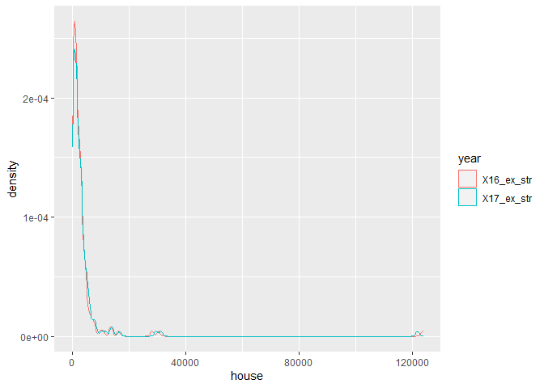
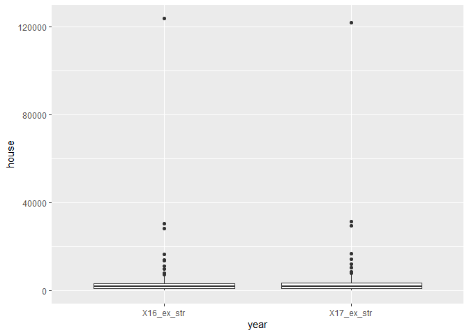
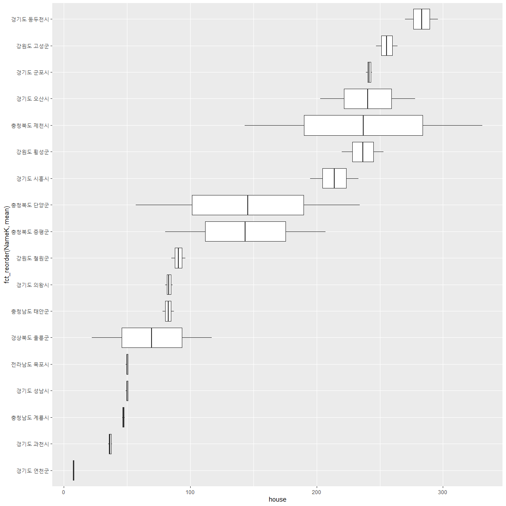
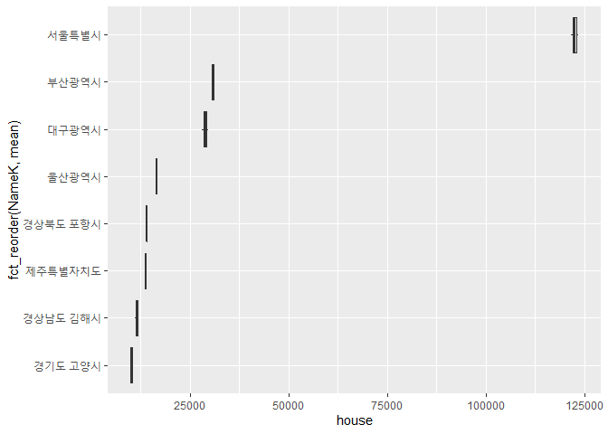
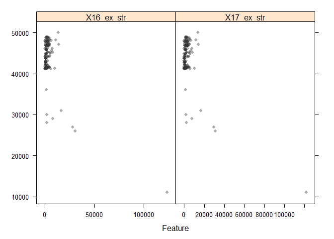
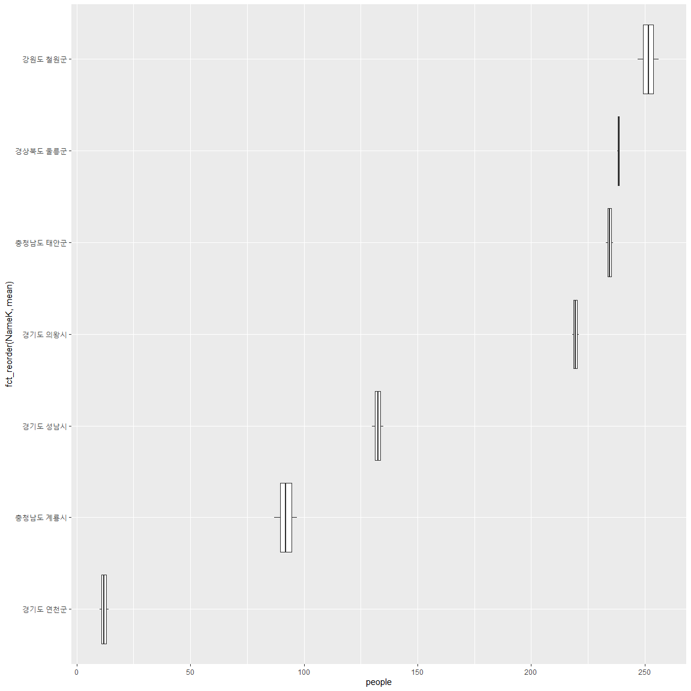
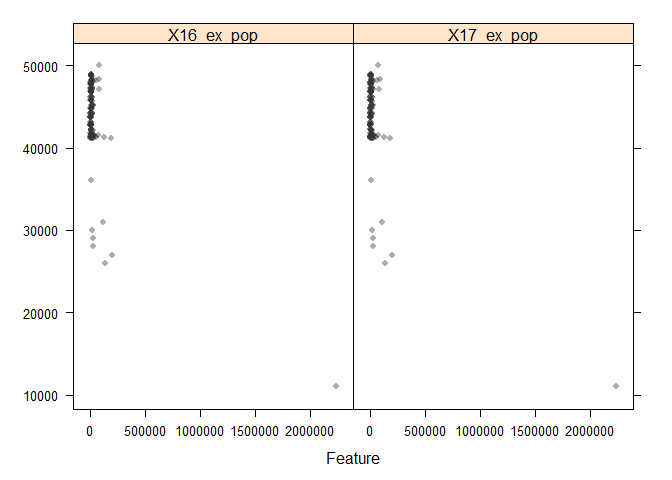
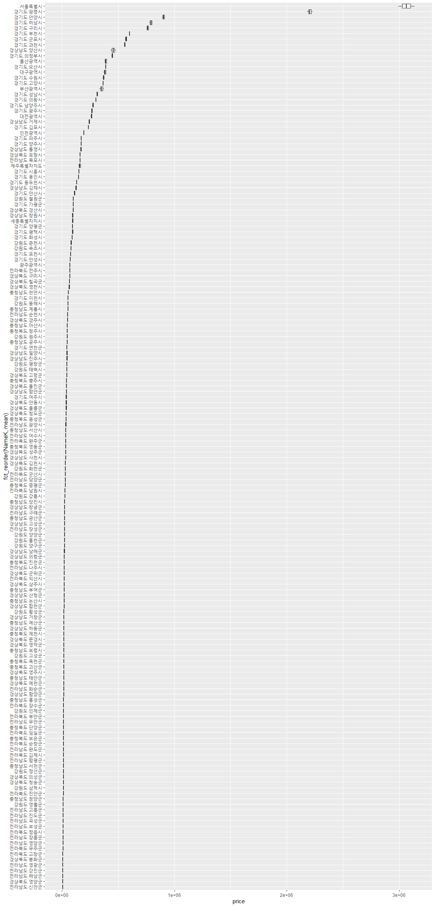
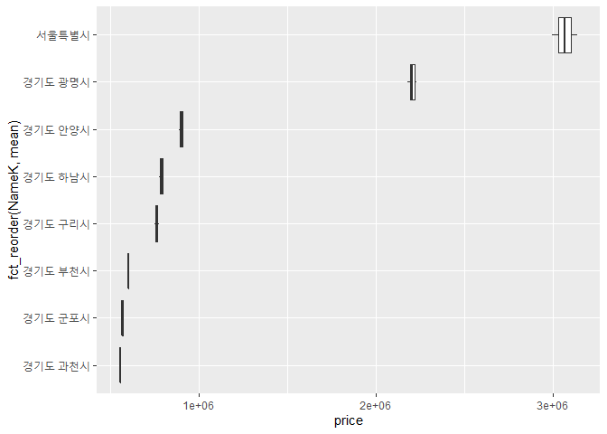
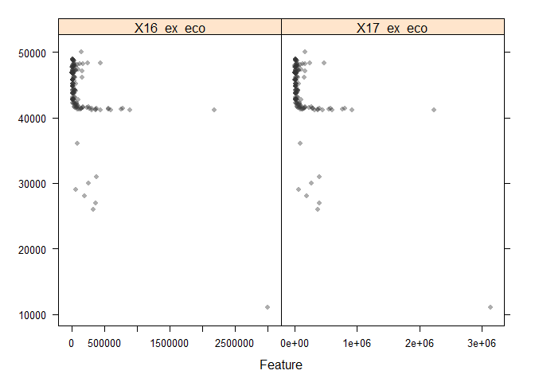

```r
library(tidyverse)
library(sf)
library(tmap)
Sys.setenv(Language="En")
library(caret)
library(knitr)
```

# 원본 데이터 읽기 / 특성 분석


```r
DB <- read.csv('input/exposure_db.csv')
head(DB)
```

```
##                   Name         NameK   SGG X16_ex_str X16_ex_pop X16_ex_eco
## 1 Gangwon Gangneung-si 강원도 강릉시 42150        725       1921    24636.6
## 2  Gangwon Goseong-gun 강원도 고성군 42820        247        488    15654.0
## 3   Gangwon Donghae-si 강원도 동해시 42170        523       8262    52747.7
## 4  Gangwon Samcheok-si 강원도 삼척시 42230        908       1850    11112.1
## 5    Gangwon Sokcho-si 강원도 속초시 42210        343       3131    77903.5
## 6   Gangwon Yanggu-gun 강원도 양구군 42800       1151       6276    21232.9
##   X17_ex_str X17_ex_pop X17_ex_eco
## 1        815       3777    26174.5
## 2        264        490    16331.1
## 3        590       8222    54345.4
## 4       1014       1880    11630.8
## 5        397       3117    81718.8
## 6       1317       6301    21965.7
```

## 총주택수 자료 특성(_ex_str)  

연도별 확률밀도함수
침수구역내의 주택수에 대한 분포를 보면 0-500채 사이가 가장 높다
 


```r
DB_s<- DB %>% 
  select(NameK, contains("str"))
DB_s_p <- DB_s %>%                           # pivoting
  pivot_longer(c("X16_ex_str", "X17_ex_str"),
               names_to = "year",
               values_to = "house")
DB_s_p %>% 
  ggplot()+
  geom_density(aes(x=house, y=..density.., color=year))
```

<!-- -->

```r
DB_s %>% 
  ggplot(aes(X16_ex_str))+
  geom_histogram(bins=200)
```

<!-- -->

outlier를 찾기 boxplot을 년도 별로 그려본다.  
최대값은 서울의 값이며, 큰 값들의 영향을 조금 줄이는 효과를 보기 위해 
z-score 보다는 min-max scaling(보통 normalizaiton이라고 하고,  
경우에 따라 standardization이라고도 함)를 사용


```r
DB_s_p %>%
  ggplot(aes(year, house))+
  geom_boxplot()
```

<!-- -->

침수구역내 총건축물수 


```r
DB_s_p %>% 
  group_by(NameK) %>% 
  mutate(mean=mean(house))%>% 
  ggplot(aes(x=fct_reorder(NameK, mean),
             y=house))+
  geom_boxplot()+
  coord_flip()
```

<!-- -->

총건축물수가 적은 지역에 대한 분포 비교


```r
DB_s_p %>% 
  group_by(NameK) %>% 
  mutate(mean=mean(house))%>%   
  filter(mean < 300) %>% 
  ggplot(aes(x=fct_reorder(NameK, mean),
             y=house))+
  geom_boxplot()+
  coord_flip()
```

<!-- -->

총건축물수가 많은 지역에 대한 분포 비교  
인천광역시의 경우 침수구역내 총주택수가 적다.
제주특별자치도의 경우 침수구역내 총주택수가 많은 편에 속한다.(소하천때문??)
인천광역시의 경우 총주택수 (16년 2065 , 17년 2373채, 차이 308채 )


```r
DB_s_p %>% 
  group_by(NameK) %>% 
  mutate(mean=mean(house))%>%   
  filter(mean > 10000) %>% 
  ggplot(aes(x=fct_reorder(NameK, mean),
             y=house))+
  geom_boxplot()+
  coord_flip()
```

<!-- -->

년도별 침수구역내 총주택수의 변화  

**총주택수가 2016년에 비해 2017년에 줄어든 것은 이지역의 재개발**  
**로 이해 단독주택이 아파트로 바뀌어서 여러 객체가 하나의 객체로**  
**인식된 것이 아닌지? check해볼 필요가 있다**  


```r
DB_s %>% 
  mutate(dif=(X17_ex_str - X16_ex_str)) %>% 
  filter(NameK == "인천광역시")
```

```
##        NameK X16_ex_str X17_ex_str dif
## 1 인천광역시       2065       2373 308
```

```r
DB_s_dif <- DB_s%>%
  mutate(dif=(X17_ex_str - X16_ex_str)) %>% 
  arrange(-dif)
knitr::kable(DB_s_dif[1:10, ])  # 침수구역내 총주택수가 늘어난 시군
```


NameK              X16_ex_str   X17_ex_str    dif
----------------  -----------  -----------  -----
대구광역시              28122        29531   1409
경상남도 김해시         11082        11875    793
부산광역시              30457        31226    769
전라남도 나주시          7148         7891    743
경기도 안성시            4853         5574    721
충청남도 부여군          5117         5768    651
경상북도 영천시          4749         5377    628
전라북도 전주시          4378         4991    613
경상남도 창녕군          4529         5128    599
경상남도 양산시          5061         5650    589

```r
knitr::kable(DB_s_dif[152:161, ])  # 침수구역내 총주택수가 줄어든 시군
```

      NameK              X16_ex_str   X17_ex_str     dif
----  ----------------  -----------  -----------  ------
152   충청북도 증평군           207           80    -127
153   충청북도 청주시           582          447    -135
154   충청북도 단양군           234           57    -177
155   충청북도 제천시           331          143    -188
156   충청북도 괴산군           587          101    -486
157   충청북도 옥천군           838          216    -622
158   충청북도 영동군          1480          659    -821
159   충청북도 음성군          1476          610    -866
160   충청북도 충주시          2964         2070    -894
161   서울특별시             123572       121676   -1896

lattice test


```r
regVar <- c("X16_ex_str", "X17_ex_str")
theme1 <- trellis.par.get()
theme1$plot.symbol$col = rgb(.2, .2, .2, .4)
theme1$plot.symbol$pch = 16
theme1$plot.line$col = rgb(1, 0, 0, .7)
theme1$plot.line$lwd <- 2
trellis.par.set(theme1)
featurePlot(x = DB[, regVar], 
            y = DB$SGG, 
            plot = "scatter", 
            layout = c(2, 1))
```

<!-- -->

## 총인구수 자료 특성(_ex_pop)  

연도별 확률밀도함수
침수구역내의 인구수에 대한 분포
 


```r
DB_p <- DB %>% 
  select(NameK, contains("pop"))
DB_p_p <- DB_p %>%                           # pivoting
  pivot_longer(c("X16_ex_pop", "X17_ex_pop"),
               names_to = "year",
               values_to = "people")
DB_p_p %>% 
  ggplot()+
  geom_density(aes(x=people, y=..density.., color=year))
```

<!-- -->

```r
DB_p %>% 
  ggplot(aes(X17_ex_pop))+
  geom_histogram(bins=200)
```

<!-- -->

침수구역내 총인구수 


```r
DB_p_p %>% 
  group_by(NameK) %>% 
  mutate(mean=mean(people))%>% 
  ggplot(aes(x=fct_reorder(NameK, mean),
             y=people))+
  geom_boxplot()+
  coord_flip()
```

<!-- -->

총인구수가 적은 지역에 대한 분포 비교


```r
DB_p_p %>% 
  group_by(NameK) %>% 
  mutate(mean=mean(people))%>%   
  filter(mean < 300) %>% 
  ggplot(aes(x=fct_reorder(NameK, mean),
             y=people))+
  geom_boxplot()+
  coord_flip()
```

<!-- -->

총인구수가 많은 지역에 대한 분포 비교  


```r
DB_p_p %>% 
  group_by(NameK) %>% 
  mutate(mean=mean(people))%>%   
  filter(mean > 100000) %>% 
  ggplot(aes(x=fct_reorder(NameK, mean),
             y=people))+
  geom_boxplot()+
  coord_flip()
```

<!-- -->

침수구역내 총인구수의 변화  
년도별 침수구역내 총인구수의 변화


```r
DB_p %>% 
  mutate(dif=(X17_ex_pop - X16_ex_pop)) %>% 
  filter(NameK == "서울특별시")
```

```
##        NameK X16_ex_pop X17_ex_pop  dif
## 1 서울특별시    2232135    2234686 2551
```

```r
DB_p_dif <- DB_p%>%
  mutate(dif=(X17_ex_pop - X16_ex_pop)) %>% 
  arrange(-dif)
knitr::kable(DB_p_dif[1:10, ])  # 침수구역내 총인구가 늘어난 시군
```


NameK              X16_ex_pop   X17_ex_pop    dif
----------------  -----------  -----------  -----
경상남도 김해시         52492        59241   6749
경상남도 양산시         78869        85180   6311
경기도 하남시           42058        47835   5777
경기도 화성시            9172        14688   5516
경상북도 경주시         18665        21654   2989
경기도 김포시           65355        68238   2883
서울특별시            2232135      2234686   2551
경기도 고양시          121590       123813   2223
강원도 강릉시            1921         3777   1856
경기도 이천시           19559        21316   1757

```r
knitr::kable(DB_p_dif[152:161, ])  # 침수구역내 총인구가 줄어든 시군
```

      NameK              X16_ex_pop   X17_ex_pop     dif
----  ----------------  -----------  -----------  ------
152   전라북도 남원시         19618        19284    -334
153   충청남도 공주시         10844        10428    -416
154   경상남도 거제시         17442        16945    -497
155   경상북도 구미시         16953        16429    -524
156   경기도 구리시           54580        53934    -646
157   전라남도 나주시         16601        15936    -665
158   울산광역시             110906       110044    -862
159   경상북도 포항시         79047        77208   -1839
160   부산광역시             135091       132977   -2114
161   경기도 광명시          183936       178982   -4954

lattice test


```r
regVar <- c("X16_ex_pop", "X17_ex_pop")
theme1 <- trellis.par.get()
theme1$plot.symbol$col = rgb(.2, .2, .2, .4)
theme1$plot.symbol$pch = 16
theme1$plot.line$col = rgb(1, 0, 0, .7)
theme1$plot.line$lwd <- 2
trellis.par.set(theme1)
featurePlot(x = DB[, regVar], 
            y = DB$SGG, 
            plot = "scatter", 
            layout = c(2, 1))
```

<!-- -->

## 평균공시지가 자료 특성(_ex_eco)  

연도별 확률밀도함수
침수구역내의 평균공시지가에 대한 분포
 


```r
DB_e <- DB %>% 
  select(NameK, contains("eco"))
DB_e_p <- DB_e %>%                           # pivoting
  pivot_longer(c("X16_ex_eco", "X17_ex_eco"),
               names_to = "year",
               values_to = "price")
DB_e_p %>% 
  ggplot()+
  geom_density(aes(x=price, y=..density.., color=year))
```

<!-- -->

```r
DB_e %>% 
  ggplot(aes(X16_ex_eco))+
  geom_histogram(bins=200)
```

<!-- -->

침수구역내 평균공시지가 


```r
DB_e_p %>% 
  group_by(NameK) %>% 
  mutate(mean=mean(price))%>% 
  ggplot(aes(x=fct_reorder(NameK, mean),
             y=price))+
  geom_boxplot()+
  coord_flip()
```

<!-- -->

평균공시지가 작은 지역에 대한 분포 비교


```r
DB_e_p %>% 
  group_by(NameK) %>% 
  mutate(mean=mean(price))%>%   
  filter(mean < 10000) %>%    # 만원
  ggplot(aes(x=fct_reorder(NameK, mean),
             y=price))+
  geom_boxplot()+
  coord_flip()
```

<!-- -->

평균공시지가가 큰 지역에 대한 분포 비교  


```r
DB_e_p %>% 
  group_by(NameK) %>% 
  mutate(mean=mean(price))%>%   
  filter(mean > 500000) %>%   # 50만원
  ggplot(aes(x=fct_reorder(NameK, mean),
             y=price))+
  geom_boxplot()+
  coord_flip()
```

<!-- -->

침수구역내 평균공시지가의 변화  
년도별 침수구역내 평균공시지가의 변화
  
**check할것-서울, 광명이 타 지역에 비해 너무 크다.?**  
**check할것-인천광역시의 공시지가가 떨어졌는지???**  


```r
DB_e %>% 
  mutate(dif=(X17_ex_eco - X16_ex_eco)) %>% 
  filter(NameK == "서울특별시")
```

```
##        NameK X16_ex_eco X17_ex_eco      dif
## 1 서울특별시    2993224    3137408 144183.5
```

```r
DB_e_dif <- DB_p%>%
  mutate(dif=(X17_ex_pop - X16_ex_pop)) %>% 
  arrange(-dif)
knitr::kable(DB_e_dif[1:10, ])  # 침수구역내 평균공시지가가 늘어난 시군
```


NameK              X16_ex_pop   X17_ex_pop    dif
----------------  -----------  -----------  -----
경상남도 김해시         52492        59241   6749
경상남도 양산시         78869        85180   6311
경기도 하남시           42058        47835   5777
경기도 화성시            9172        14688   5516
경상북도 경주시         18665        21654   2989
경기도 김포시           65355        68238   2883
서울특별시            2232135      2234686   2551
경기도 고양시          121590       123813   2223
강원도 강릉시            1921         3777   1856
경기도 이천시           19559        21316   1757

```r
knitr::kable(DB_e_dif[152:161, ])  # 침수구역내 평균공시지가가 줄어든 시군
```

      NameK              X16_ex_pop   X17_ex_pop     dif
----  ----------------  -----------  -----------  ------
152   전라북도 남원시         19618        19284    -334
153   충청남도 공주시         10844        10428    -416
154   경상남도 거제시         17442        16945    -497
155   경상북도 구미시         16953        16429    -524
156   경기도 구리시           54580        53934    -646
157   전라남도 나주시         16601        15936    -665
158   울산광역시             110906       110044    -862
159   경상북도 포항시         79047        77208   -1839
160   부산광역시             135091       132977   -2114
161   경기도 광명시          183936       178982   -4954

lattice test


```r
regVar <- c("X16_ex_eco", "X17_ex_eco")
theme1 <- trellis.par.get()
theme1$plot.symbol$col = rgb(.2, .2, .2, .4)
theme1$plot.symbol$pch = 16
theme1$plot.line$col = rgb(1, 0, 0, .7)
theme1$plot.line$lwd <- 2
trellis.par.set(theme1)
featurePlot(x = DB[, regVar], 
            y = DB$SGG, 
            plot = "scatter", 
            layout = c(2, 1))
```

<!-- -->

# Exposure 정규화(Normalization Function)함수 - log 정규화


```r
standard_log <- function(x){
  return((log(x,base=10)-min(log(x,base=10)))/(max(log(x,base=10))-min(log(x,base=10))))
}
```

# 161개 시군별 변화 Mapping 


```r
# 연도별 데이터 프레임에 정규화 적용
exposure <- as.data.frame(lapply(DB[,4:9],standard_log))
exposure <- cbind(DB[,1:3], exposure)
colnames(exposure)[4:9] <- c("X16_ex_str_log", "X16_ex_pop_log", "X16_ex_eco_log",
                             "X17_ex_str_log", "X17_ex_pop_log", "X17_ex_eco_log")


# 16년~17년 Exposure 지수 산정
ex_index_16 <- as.data.frame((rowSums(exposure[,4:6]))/3)
colnames(ex_index_16) <- c("X16_ex_index")
ex_index_17 <- as.data.frame((rowSums(exposure[,7:9]))/3)
colnames(ex_index_17) <- c("X17_ex_index")
exposure <- cbind(exposure, c(ex_index_16,ex_index_17))


# Exposure 지수 표준화 함수 설정
standard <- function(x){
  return((x-min(x))/(max(x)-min(x)))
}


# 연도별 Exposure 지수 표준화 산정
result <- as.data.frame(lapply(exposure[,10:11],standard))
colnames(result) <- c("X16_exposure", "X17_exposure")
result <- cbind(DB[,1:3], result)


# 시군 shp 파일 불러오기
library(sf)
analysis <- st_read("input/analysis.shp")
```

```
## Reading layer `analysis' from data source `C:\00_R\0_Git\KRM_inha\input\analysis.shp' using driver `ESRI Shapefile'
## Simple feature collection with 161 features and 3 fields
## geometry type:  MULTIPOLYGON
## dimension:      XY
## bbox:           xmin: 746109.3 ymin: 1458771 xmax: 1387956 ymax: 2068444
## epsg (SRID):    NA
## proj4string:    +proj=tmerc +lat_0=38 +lon_0=127.5 +k=0.9996 +x_0=1000000 +y_0=2000000 +ellps=GRS80 +units=m +no_defs
```

```r
# 폴리곤 에러 체크(기본 파일을 에러 수정한 파일로 변경하였음)
#st_is_valid(analysis)
#library(lwgeom)
#analysis <- st_make_valid(analysis)
st_is_valid(analysis)
```

```
##   [1] TRUE TRUE TRUE TRUE TRUE TRUE TRUE TRUE TRUE TRUE TRUE TRUE TRUE TRUE TRUE
##  [16] TRUE TRUE TRUE TRUE TRUE TRUE TRUE TRUE TRUE TRUE TRUE TRUE TRUE TRUE TRUE
##  [31] TRUE TRUE TRUE TRUE TRUE TRUE TRUE TRUE TRUE TRUE TRUE TRUE TRUE TRUE TRUE
##  [46] TRUE TRUE TRUE TRUE TRUE TRUE TRUE TRUE TRUE TRUE TRUE TRUE TRUE TRUE TRUE
##  [61] TRUE TRUE TRUE TRUE TRUE TRUE TRUE TRUE TRUE TRUE TRUE TRUE TRUE TRUE TRUE
##  [76] TRUE TRUE TRUE TRUE TRUE TRUE TRUE TRUE TRUE TRUE TRUE TRUE TRUE TRUE TRUE
##  [91] TRUE TRUE TRUE TRUE TRUE TRUE TRUE TRUE TRUE TRUE TRUE TRUE TRUE TRUE TRUE
## [106] TRUE TRUE TRUE TRUE TRUE TRUE TRUE TRUE TRUE TRUE TRUE TRUE TRUE TRUE TRUE
## [121] TRUE TRUE TRUE TRUE TRUE TRUE TRUE TRUE TRUE TRUE TRUE TRUE TRUE TRUE TRUE
## [136] TRUE TRUE TRUE TRUE TRUE TRUE TRUE TRUE TRUE TRUE TRUE TRUE TRUE TRUE TRUE
## [151] TRUE TRUE TRUE TRUE TRUE TRUE TRUE TRUE TRUE TRUE TRUE
```

```r
# shp파일에 연도별 Exposure 지수(표준화 적용) 추가
library(dplyr)
analysis <- right_join(analysis, result[,3:5])
```

```
## Joining, by = "SGG"
```

```r
# 폴리곤 단순화
library(tmap)
analysis_simp <- st_simplify(analysis, dTolerance = 50)
```

```r
# 결과 확인
tmap_mode("plot")
```

```
## tmap mode set to plotting
```

```r
breaks = c(0, 0.2, 0.4, 0.6, 0.8, 1)
facets=c("X16_exposure", "X17_exposure")
tm_shape(analysis_simp)+
  tm_polygons(facets,
              breaks=breaks,
              palette = c("green", "greenyellow", "yellow", "orange", "red"),
              legend.reverse = TRUE)+
  tm_facets(ncol = 2)+
  tm_layout(legend.position = c("right", "bottom"))+
  tm_compass(type = "rose", position = c("right", "top"), size = 2.5)+
  tm_scale_bar(breaks = c(0, 25, 50, 100, 150, 200), position = c("left", "bottom"))
```

<!-- -->

```r
# 결과값 저장
write.csv(result, 'output/exposure_result.csv', row.names = F)


# 열 명칭별 의미

# Name : 161개 시군별 영문명
# NameK : 161개 시군별 한글명
# SGG : 시군구 코드
# X16_ex_str : 16년도 총 건축물수(개)
# X17_ex_str : 17년도 총 건축물수(개)
# X16_ex_pop : 16년도 총 인구수(명)
# X17_ex_pop : 17년도 총 인구수(명)
# X16_ex_eco : 16년도 평균공시지가(원/m2)
# X17_ex_eco : 17년도 평균공시지가(원/m2)
# X16_ex_str_log : 16년도 총 건축물수(log 표준화 적용)
# X17_ex_str_log : 17년도 총 건축물수(log 표준화 적용)
# X16_ex_pop_log : 16년도 총 인구수(log 표준화 적용)
# X17_ex_pop_log : 17년도 총 인구수(log 표준화 적용)
# X16_ex_eco_log : 16년도 평균공시지가(log 표준화 적용)
# X17_ex_eco_log : 17년도 평균공시지가(log 표준화 적용)
# X16_ex_index : 16년도 Exposure 지수
# X17_ex_index : 17년도 Exposure 지수
# X16_exposure : 16년도 Exposure 지수(표준화 적용)
# X17_exposure : 17년도 Exposure 지수(표준화 적용)
```


---
title: "exposure_result.R"
author: "Kyungtak Kim"
date: "2020-03-31"
---

