Exposure - 총주택,총인구,평균공시지가
================
Kyungtak Kim
2020 3 26

``` r
library(tidyverse)
library(sf)
library(tmap)
Sys.setenv(Language="En")
library(caret)
library(knitr)
library(leaflet)
library(rgdal)
library(htmltools)
```

# 원본 데이터 읽기 / 특성 분석

``` r
DB <- read.csv('input/exposure_db.csv')
head(DB, 3)
```

    ##                   Name         NameK   SGG X16_ex_str X16_ex_pop X16_ex_eco
    ## 1 Gangwon Gangneung-si 강원도 강릉시 42150        725       1921    24636.6
    ## 2  Gangwon Goseong-gun 강원도 고성군 42820        247        488    15654.0
    ## 3   Gangwon Donghae-si 강원도 동해시 42170        523       8262    52747.7
    ##   X17_ex_str X17_ex_pop X17_ex_eco
    ## 1        815       3777    26174.5
    ## 2        264        490    16331.1
    ## 3        590       8222    54345.4

## 총주택수 자료 특성(\_ex\_str)  
연도별 확률밀도함수  
침수구역내의 주택수에 대한 분포를 보면 0-500채 사이가 가장 높다

``` r
DB_s<- DB %>% 
  select(NameK, SGG, contains("str"))
DB_s_p <- DB_s %>%                           # pivoting
  pivot_longer(c("X16_ex_str", "X17_ex_str"),
               names_to = "year",
               values_to = "house")
DB_s_p %>% 
  ggplot()+
  geom_density(aes(x=house, y=..density.., color=year))
```

<!-- -->

``` r
DB_s %>% 
  ggplot(aes(X16_ex_str))+
  geom_histogram(bins=200)
```

<!-- -->

outlier를 찾기 boxplot을 년도 별로 그려본다.  
최대값은 서울의 값이며, 큰 값들의 영향을 조금 줄이는 효과를 보기 위해  
z-score 보다는 min-max scaling(보통 normalizaiton이라고 하고,  
경우에 따라 standardization이라고도 함)를 사용

``` r
DB_s_p %>%
  ggplot(aes(year, house))+
  geom_boxplot()
```

<!-- -->

침수구역내 총건축물수

``` r
DB_s_p %>% 
  group_by(NameK) %>% 
  mutate(mean=mean(house))%>% 
  ggplot(aes(x=fct_reorder(NameK, mean),
             y=house))+
  geom_boxplot()+
  coord_flip()
```

<!-- -->

총건축물수가 적은 지역에 대한 분포 비교

``` r
DB_s_p %>% 
  group_by(NameK) %>% 
  mutate(mean=mean(house))%>%   
  filter(mean < 300) %>% 
  ggplot(aes(x=fct_reorder(NameK, mean),
             y=house))+
  geom_boxplot()+
  coord_flip()
```

<!-- -->

총건축물수가 많은 지역에 대한 분포 비교  
인천광역시의 경우 침수구역내 총주택수가 적다.  
제주특별자치도의 경우 침수구역내 총주택수가 많은 편에 속한다.(소하천때문??) 인천광역시의 경우 총주택수 (16년 2065 ,
17년 2373채, 차이 308채 )

``` r
DB_s_p %>% 
  group_by(NameK) %>% 
  mutate(mean=mean(house))%>%   
  filter(mean > 10000) %>% 
  ggplot(aes(x=fct_reorder(NameK, mean),
             y=house))+
  geom_boxplot()+
  coord_flip()
```

<!-- -->

년도별 침수구역내 총주택수의 변화

**총주택수가 2016년에 비해 2017년에 줄어든 것은 이지역의 재개발**  
**로 이해 단독주택이 아파트로 바뀌어서 여러 객체가 하나의 객체로**  
**인식된 것이 아닌지? check해볼 필요가 있다** \#’

``` r
DB_s %>% 
  mutate(dif=(X17_ex_str - X16_ex_str)) %>% 
  filter(NameK == "인천광역시")
```

    ##        NameK   SGG X16_ex_str X17_ex_str dif
    ## 1 인천광역시 28000       2065       2373 308

``` r
DB_s_dif <- DB_s%>%
  mutate(dif=(X17_ex_str - X16_ex_str)) %>% 
  arrange(-dif)
knitr::kable(DB_s_dif[1:10, ])  # 침수구역내 총주택수가 늘어난 시군
```

| NameK    |   SGG | X16\_ex\_str | X17\_ex\_str |  dif |
| :------- | ----: | -----------: | -----------: | ---: |
| 대구광역시    | 27000 |        28122 |        29531 | 1409 |
| 경상남도 김해시 | 48250 |        11082 |        11875 |  793 |
| 부산광역시    | 26000 |        30457 |        31226 |  769 |
| 전라남도 나주시 | 46170 |         7148 |         7891 |  743 |
| 경기도 안성시  | 41550 |         4853 |         5574 |  721 |
| 충청남도 부여군 | 44760 |         5117 |         5768 |  651 |
| 경상북도 영천시 | 47230 |         4749 |         5377 |  628 |
| 전라북도 전주시 | 45110 |         4378 |         4991 |  613 |
| 경상남도 창녕군 | 48740 |         4529 |         5128 |  599 |
| 경상남도 양산시 | 48330 |         5061 |         5650 |  589 |

``` r
knitr::kable(DB_s_dif[152:161, ])  # 침수구역내 총주택수가 줄어든 시군
```

|     | NameK    |   SGG | X16\_ex\_str | X17\_ex\_str |    dif |
| --- | :------- | ----: | -----------: | -----------: | -----: |
| 152 | 충청북도 증평군 | 43745 |          207 |           80 |  \-127 |
| 153 | 충청북도 청주시 | 43110 |          582 |          447 |  \-135 |
| 154 | 충청북도 단양군 | 43800 |          234 |           57 |  \-177 |
| 155 | 충청북도 제천시 | 43150 |          331 |          143 |  \-188 |
| 156 | 충청북도 괴산군 | 43760 |          587 |          101 |  \-486 |
| 157 | 충청북도 옥천군 | 43730 |          838 |          216 |  \-622 |
| 158 | 충청북도 영동군 | 43740 |         1480 |          659 |  \-821 |
| 159 | 충청북도 음성군 | 43770 |         1476 |          610 |  \-866 |
| 160 | 충청북도 충주시 | 43130 |         2964 |         2070 |  \-894 |
| 161 | 서울특별시    | 11000 |       123572 |       121676 | \-1896 |

``` r
DB_s_p %>% 
  group_by(year) %>% 
  ggplot(aes(house, SGG))+
  geom_point(aes(color=factor(SGG)))+
  facet_grid(. ~year)+
  theme(legend.position = "none")
```

<!-- -->

## 총인구수 자료 특성(\_ex\_pop)  
연도별 확률밀도함수  
침수구역내의 인구수에 대한 분포

``` r
DB_p <- DB %>% 
  select(NameK, SGG, contains("pop"))
DB_p_p <- DB_p %>%                           # pivoting
  pivot_longer(c("X16_ex_pop", "X17_ex_pop"),
               names_to = "year",
               values_to = "people")
DB_p_p %>% 
  ggplot()+
  geom_density(aes(x=people, y=..density.., color=year))
```

<!-- -->

``` r
DB_p %>% 
  ggplot(aes(X17_ex_pop))+
  geom_histogram(bins=200)
```

<!-- -->

침수구역내 총인구수

``` r
DB_p_p %>% 
  group_by(NameK) %>% 
  mutate(mean=mean(people))%>% 
  ggplot(aes(x=fct_reorder(NameK, mean),
             y=people))+
  geom_boxplot()+
  coord_flip()
```

<!-- -->

총인구수가 적은 지역에 대한 분포 비교

``` r
DB_p_p %>% 
  group_by(NameK) %>% 
  mutate(mean=mean(people))%>%   
  filter(mean < 300) %>% 
  ggplot(aes(x=fct_reorder(NameK, mean),
             y=people))+
  geom_boxplot()+
  coord_flip()
```

<!-- -->

총인구수가 많은 지역에 대한 분포 비교

``` r
DB_p_p %>% 
  group_by(NameK) %>% 
  mutate(mean=mean(people))%>%   
  filter(mean > 100000) %>% 
  ggplot(aes(x=fct_reorder(NameK, mean),
             y=people))+
  geom_boxplot()+
  coord_flip()
```

<!-- -->

침수구역내 총인구수의 변화  
년도별 침수구역내 총인구수의 변화

``` r
DB_p %>% 
  mutate(dif=(X17_ex_pop - X16_ex_pop)) %>% 
  filter(NameK == "서울특별시")
```

    ##        NameK   SGG X16_ex_pop X17_ex_pop  dif
    ## 1 서울특별시 11000    2232135    2234686 2551

``` r
DB_p_dif <- DB_p%>%
  mutate(dif=(X17_ex_pop - X16_ex_pop)) %>% 
  arrange(-dif)
knitr::kable(DB_p_dif[1:10, ])  # 침수구역내 총인구가 늘어난 시군
```

| NameK    |   SGG | X16\_ex\_pop | X17\_ex\_pop |  dif |
| :------- | ----: | -----------: | -----------: | ---: |
| 경상남도 김해시 | 48250 |        52492 |        59241 | 6749 |
| 경상남도 양산시 | 48330 |        78869 |        85180 | 6311 |
| 경기도 하남시  | 41450 |        42058 |        47835 | 5777 |
| 경기도 화성시  | 41590 |         9172 |        14688 | 5516 |
| 경상북도 경주시 | 47130 |        18665 |        21654 | 2989 |
| 경기도 김포시  | 41570 |        65355 |        68238 | 2883 |
| 서울특별시    | 11000 |      2232135 |      2234686 | 2551 |
| 경기도 고양시  | 41280 |       121590 |       123813 | 2223 |
| 강원도 강릉시  | 42150 |         1921 |         3777 | 1856 |
| 경기도 이천시  | 41500 |        19559 |        21316 | 1757 |

``` r
knitr::kable(DB_p_dif[152:161, ])  # 침수구역내 총인구가 줄어든 시군
```

|     | NameK    |   SGG | X16\_ex\_pop | X17\_ex\_pop |    dif |
| --- | :------- | ----: | -----------: | -----------: | -----: |
| 152 | 전라북도 남원시 | 45190 |        19618 |        19284 |  \-334 |
| 153 | 충청남도 공주시 | 44150 |        10844 |        10428 |  \-416 |
| 154 | 경상남도 거제시 | 48310 |        17442 |        16945 |  \-497 |
| 155 | 경상북도 구미시 | 47190 |        16953 |        16429 |  \-524 |
| 156 | 경기도 구리시  | 41310 |        54580 |        53934 |  \-646 |
| 157 | 전라남도 나주시 | 46170 |        16601 |        15936 |  \-665 |
| 158 | 울산광역시    | 31000 |       110906 |       110044 |  \-862 |
| 159 | 경상북도 포항시 | 47110 |        79047 |        77208 | \-1839 |
| 160 | 부산광역시    | 26000 |       135091 |       132977 | \-2114 |
| 161 | 경기도 광명시  | 41210 |       183936 |       178982 | \-4954 |

``` r
DB_p_p %>% 
  group_by(year) %>% 
  ggplot(aes(people, SGG))+
  geom_point(aes(color=factor(SGG)))+
  facet_grid(. ~year)+
  theme(legend.position = "none")
```

<!-- -->

## 평균공시지가 자료 특성(\_ex\_eco)  
연도별 확률밀도함수  
침수구역내의 평균공시지가에 대한 분포

``` r
DB_e <- DB %>% 
  select(NameK, SGG, contains("eco"))
DB_e_p <- DB_e %>%                           # pivoting
  pivot_longer(c("X16_ex_eco", "X17_ex_eco"),
               names_to = "year",
               values_to = "price")
DB_e_p %>% 
  ggplot()+
  geom_density(aes(x=price, y=..density.., color=year))
```

<!-- -->

``` r
DB_e %>% 
  ggplot(aes(X16_ex_eco))+
  geom_histogram(bins=200)
```

<!-- -->

침수구역내 평균공시지가

``` r
DB_e_p %>% 
  group_by(NameK) %>% 
  mutate(mean=mean(price))%>% 
  ggplot(aes(x=fct_reorder(NameK, mean),
             y=price))+
  geom_boxplot()+
  coord_flip()
```

<!-- -->

평균공시지가 작은 지역에 대한 분포 비교

``` r
DB_e_p %>% 
  group_by(NameK) %>% 
  mutate(mean=mean(price))%>%   
  filter(mean < 10000) %>%    # 만원
  ggplot(aes(x=fct_reorder(NameK, mean),
             y=price))+
  geom_boxplot()+
  coord_flip()
```

<!-- -->

평균공시지가가 큰 지역에 대한 분포 비교

``` r
DB_e_p %>% 
  group_by(NameK) %>% 
  mutate(mean=mean(price))%>%   
  filter(mean > 500000) %>%   # 50만원
  ggplot(aes(x=fct_reorder(NameK, mean),
             y=price))+
  geom_boxplot()+
  coord_flip()
```

<!-- -->

침수구역내 평균공시지가의 변화  
년도별 침수구역내 평균공시지가의 변화

**check할것-서울, 광명이 타 지역에 비해 너무 크다.?**  
**check할것-인천광역시의 공시지가가 떨어졌는지???**

``` r
DB_e %>% 
  mutate(dif=(X17_ex_eco - X16_ex_eco)) %>% 
  filter(NameK == "서울특별시")
```

    ##        NameK   SGG X16_ex_eco X17_ex_eco      dif
    ## 1 서울특별시 11000    2993224    3137408 144183.5

``` r
DB_e_dif <- DB_p%>%
  mutate(dif=(X17_ex_pop - X16_ex_pop)) %>% 
  arrange(-dif)
knitr::kable(DB_e_dif[1:10, ])  # 침수구역내 평균공시지가가 늘어난 시군
```

| NameK    |   SGG | X16\_ex\_pop | X17\_ex\_pop |  dif |
| :------- | ----: | -----------: | -----------: | ---: |
| 경상남도 김해시 | 48250 |        52492 |        59241 | 6749 |
| 경상남도 양산시 | 48330 |        78869 |        85180 | 6311 |
| 경기도 하남시  | 41450 |        42058 |        47835 | 5777 |
| 경기도 화성시  | 41590 |         9172 |        14688 | 5516 |
| 경상북도 경주시 | 47130 |        18665 |        21654 | 2989 |
| 경기도 김포시  | 41570 |        65355 |        68238 | 2883 |
| 서울특별시    | 11000 |      2232135 |      2234686 | 2551 |
| 경기도 고양시  | 41280 |       121590 |       123813 | 2223 |
| 강원도 강릉시  | 42150 |         1921 |         3777 | 1856 |
| 경기도 이천시  | 41500 |        19559 |        21316 | 1757 |

``` r
knitr::kable(DB_e_dif[152:161, ])  # 침수구역내 평균공시지가가 줄어든 시군
```

|     | NameK    |   SGG | X16\_ex\_pop | X17\_ex\_pop |    dif |
| --- | :------- | ----: | -----------: | -----------: | -----: |
| 152 | 전라북도 남원시 | 45190 |        19618 |        19284 |  \-334 |
| 153 | 충청남도 공주시 | 44150 |        10844 |        10428 |  \-416 |
| 154 | 경상남도 거제시 | 48310 |        17442 |        16945 |  \-497 |
| 155 | 경상북도 구미시 | 47190 |        16953 |        16429 |  \-524 |
| 156 | 경기도 구리시  | 41310 |        54580 |        53934 |  \-646 |
| 157 | 전라남도 나주시 | 46170 |        16601 |        15936 |  \-665 |
| 158 | 울산광역시    | 31000 |       110906 |       110044 |  \-862 |
| 159 | 경상북도 포항시 | 47110 |        79047 |        77208 | \-1839 |
| 160 | 부산광역시    | 26000 |       135091 |       132977 | \-2114 |
| 161 | 경기도 광명시  | 41210 |       183936 |       178982 | \-4954 |

``` r
DB_e_p %>% 
  group_by(year) %>% 
  ggplot(aes(price, SGG))+
  geom_point(aes(color=factor(SGG)))+
  facet_grid(. ~year)+
  theme(legend.position = "none")
```

<!-- -->

# Exposure 정규화(Normalization Function)함수 - log 정규화

``` r
standard_log <- function(x){
  return((log(x,base=10)-min(log(x,base=10)))/(max(log(x,base=10))-min(log(x,base=10))))
}
```

# 161개 시군별 변화 Mapping

``` r
# 연도별 데이터 프레임에 정규화 적용
exposure <- as.data.frame(lapply(DB[,4:9],
                                 standard_log))
exposure <- cbind(DB[,1:3],
                  exposure)
colnames(exposure)[4:9] <- c("X16_ex_str_log", "X16_ex_pop_log", "X16_ex_eco_log",
                             "X17_ex_str_log", "X17_ex_pop_log", "X17_ex_eco_log")

# 16년~17년 Exposure 지수 산정
ex_index_16 <- as.data.frame((rowSums(exposure[,4:6]))/3)
colnames(ex_index_16) <- c("X16_ex_index")
ex_index_17 <- as.data.frame((rowSums(exposure[,7:9]))/3)
colnames(ex_index_17) <- c("X17_ex_index")
exposure <- cbind(exposure, c(ex_index_16,ex_index_17))
```

# 최종 min-max 미포함 ———————————————————-

``` r
# 연도별 Exposure 지수 표준화 산정
result <- exposure[,10:11]
colnames(result) <- c("X16_exposure", "X17_exposure")
result <- cbind(DB[,1:3], result)
head(result,3)
```

    ##                   Name         NameK   SGG X16_exposure X17_exposure
    ## 1 Gangwon Gangneung-si 강원도 강릉시 42150    0.3831819    0.3984708
    ## 2  Gangwon Goseong-gun 강원도 고성군 42820    0.2857085    0.2779259
    ## 3   Gangwon Donghae-si 강원도 동해시 42170    0.4512852    0.4471901

``` r
summary(result)
```

    ##                     Name               NameK          SGG       
    ##  Busan                :  1   강원도 강릉시:  1   Min.   :11000  
    ##  Chungbuk Boeun-gun   :  1   강원도 고성군:  1   1st Qu.:42130  
    ##  Chungbuk Cheongju-si :  1   강원도 동해시:  1   Median :44800  
    ##  Chungbuk Chungju-si  :  1   강원도 삼척시:  1   Mean   :44074  
    ##  Chungbuk Danyang-gun :  1   강원도 속초시:  1   3rd Qu.:47130  
    ##  Chungbuk Eumseong-gun:  1   강원도 양구군:  1   Max.   :50000  
    ##  (Other)              :155   (Other)      :155                  
    ##   X16_exposure     X17_exposure   
    ##  Min.   :0.1139   Min.   :0.1103  
    ##  1st Qu.:0.3780   1st Qu.:0.3699  
    ##  Median :0.4350   Median :0.4257  
    ##  Mean   :0.4602   Mean   :0.4547  
    ##  3rd Qu.:0.5251   3rd Qu.:0.5242  
    ##  Max.   :1.0000   Max.   :1.0000  
    ## 

``` r
result_p_p <- result %>%                           # pivoting
  pivot_longer(c("X16_exposure", "X17_exposure"),
               names_to = "year",
               values_to = "exposure")
result_p_p %>% 
  ggplot()+
  geom_density(aes(x=exposure, y=..density.., color=year))
```

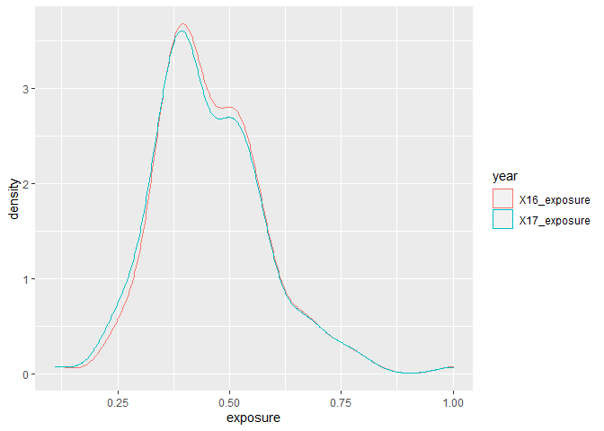<!-- -->

``` r
result %>% 
  ggplot(aes(X17_exposure))+
  geom_histogram(bins=100)
```

<!-- -->

``` r
result_p_p %>% 
  group_by(NameK) %>% 
  mutate(mean=mean(exposure))%>% 
  ggplot(aes(x=fct_reorder(NameK, mean),
             y=exposure))+
  geom_boxplot()+
  coord_flip()
```

<!-- -->

``` r
result_p_p %>% 
  group_by(NameK) %>% 
  mutate(mean=mean(exposure))%>%   
  filter(mean < 0.25) %>% 
  ggplot(aes(x=fct_reorder(NameK, mean),
             y=exposure))+
  geom_boxplot()+
  coord_flip()
```

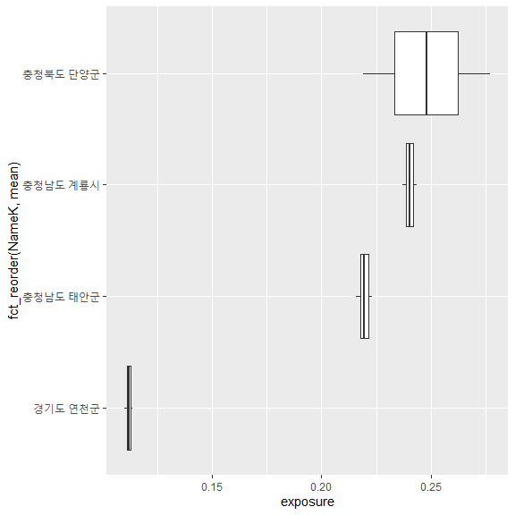<!-- -->

``` r
result_p_p %>% 
  group_by(NameK) %>% 
  mutate(mean=mean(exposure))%>%   
  filter(mean > 0.75) %>% 
  ggplot(aes(x=fct_reorder(NameK, mean),
             y=exposure))+
  geom_boxplot()+
  coord_flip()
```

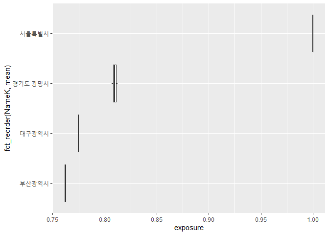<!-- -->

``` r
result %>% 
  mutate(dif=(X17_exposure - X16_exposure)) %>% 
  filter(NameK == "서울특별시")
```

    ##    Name      NameK   SGG X16_exposure X17_exposure dif
    ## 1 Seoul 서울특별시 11000            1            1   0

``` r
result_p_dif <- result%>%
  mutate(dif=(X17_exposure - X16_exposure)) %>% 
  arrange(-dif)
knitr::kable(result_p_dif[1:10, ])  
```

| Name                   | NameK    |   SGG | X16\_exposure | X17\_exposure |       dif |
| :--------------------- | :------- | ----: | ------------: | ------------: | --------: |
| Gyeongbuk Ulleung-gun  | 경상북도 울릉군 | 47940 |     0.2339534 |     0.2664548 | 0.0325014 |
| Gangwon Gangneung-si   | 강원도 강릉시  | 42150 |     0.3831819 |     0.3984708 | 0.0152889 |
| Gyeonggi Hwaseong-si   | 경기도 화성시  | 41590 |     0.5353951 |     0.5442367 | 0.0088417 |
| Gyeonggi Hanam-si      | 경기도 하남시  | 41450 |     0.6557634 |     0.6633824 | 0.0076190 |
| Gyeongnam Yangsan-si   | 경상남도 양산시 | 48330 |     0.6996525 |     0.7043994 | 0.0047470 |
| Gyeongbuk Yecheon-gun  | 경상북도 예천군 | 47900 |     0.3903841 |     0.3948508 | 0.0044667 |
| Gyeongnam Gimhae-si    | 경상남도 김해시 | 48250 |     0.6476845 |     0.6516926 | 0.0040081 |
| Jeju                   | 제주특별자치도  | 50000 |     0.6752925 |     0.6781870 | 0.0028945 |
| Gyeongbuk Gyeongsan-si | 경상북도 경산시 | 47290 |     0.5512430 |     0.5538982 | 0.0026551 |
| Jeonbuk Gunsan-si      | 전라북도 군산시 | 45130 |     0.4734653 |     0.4758394 | 0.0023741 |

``` r
knitr::kable(result_p_dif[152:161, ]) 
```

|     | Name                     | NameK    |   SGG | X16\_exposure | X17\_exposure |         dif |
| --- | :----------------------- | :------- | ----: | ------------: | ------------: | ----------: |
| 152 | Jeonnam Yeongam-gun      | 전라남도 영암군 | 46830 |     0.4147374 |     0.3976299 | \-0.0171075 |
| 153 | Chungbuk Cheongju-si     | 충청북도 청주시 | 43110 |     0.4132090 |     0.3952126 | \-0.0179964 |
| 154 | Chungbuk Chungju-si      | 충청북도 충주시 | 43130 |     0.4935869 |     0.4714521 | \-0.0221348 |
| 155 | Chungbuk Yeongdong-gun   | 충청북도 영동군 | 43740 |     0.4427295 |     0.4070912 | \-0.0356383 |
| 156 | Chungbuk Eumseong-gun    | 충청북도 음성군 | 43770 |     0.4477142 |     0.4092363 | \-0.0384779 |
| 157 | Chungbuk Jecheon-si      | 충청북도 제천시 | 43150 |     0.2936915 |     0.2543385 | \-0.0393529 |
| 158 | Chungbuk Jeungpyeong-gun | 충청북도 증평군 | 43745 |     0.3619522 |     0.3200214 | \-0.0419308 |
| 159 | Chungbuk Okcheon-gun     | 충청북도 옥천군 | 43730 |     0.3529203 |     0.2970018 | \-0.0559185 |
| 160 | Chungbuk Danyang-gun     | 충청북도 단양군 | 43800 |     0.2767764 |     0.2188660 | \-0.0579104 |
| 161 | Chungbuk Goesan-gun      | 충청북도 괴산군 | 43760 |     0.3333601 |     0.2638048 | \-0.0695553 |

``` r
result_p_p %>% 
  group_by(year) %>% 
  ggplot(aes(exposure, SGG))+
  geom_point(aes(color=factor(SGG)))+
  facet_grid(. ~year)+
  theme(legend.position = "none")
```

<!-- -->

# Mapping

``` r
# 시군 shp 파일 불러오기
library(sf)
analysis <- st_read("input/analysis.shp")
```

    ## Reading layer `analysis' from data source `C:\00_R\0_Git\KRM_inha\input\analysis.shp' using driver `ESRI Shapefile'
    ## Simple feature collection with 161 features and 3 fields
    ## geometry type:  MULTIPOLYGON
    ## dimension:      XY
    ## bbox:           xmin: 746109.3 ymin: 1458771 xmax: 1387956 ymax: 2068444
    ## proj4string:    +proj=tmerc +lat_0=38 +lon_0=127.5 +k=0.9996 +x_0=1000000 +y_0=2000000 +ellps=GRS80 +units=m +no_defs

``` r
# 폴리곤 에러 체크(기본 파일을 에러 수정한 파일로 변경하였음)
#st_is_valid(analysis)
#library(lwgeom)
#analysis <- st_make_valid(analysis)
st_is_valid(analysis)
```

    ##   [1] TRUE TRUE TRUE TRUE TRUE TRUE TRUE TRUE TRUE TRUE TRUE TRUE TRUE TRUE TRUE
    ##  [16] TRUE TRUE TRUE TRUE TRUE TRUE TRUE TRUE TRUE TRUE TRUE TRUE TRUE TRUE TRUE
    ##  [31] TRUE TRUE TRUE TRUE TRUE TRUE TRUE TRUE TRUE TRUE TRUE TRUE TRUE TRUE TRUE
    ##  [46] TRUE TRUE TRUE TRUE TRUE TRUE TRUE TRUE TRUE TRUE TRUE TRUE TRUE TRUE TRUE
    ##  [61] TRUE TRUE TRUE TRUE TRUE TRUE TRUE TRUE TRUE TRUE TRUE TRUE TRUE TRUE TRUE
    ##  [76] TRUE TRUE TRUE TRUE TRUE TRUE TRUE TRUE TRUE TRUE TRUE TRUE TRUE TRUE TRUE
    ##  [91] TRUE TRUE TRUE TRUE TRUE TRUE TRUE TRUE TRUE TRUE TRUE TRUE TRUE TRUE TRUE
    ## [106] TRUE TRUE TRUE TRUE TRUE TRUE TRUE TRUE TRUE TRUE TRUE TRUE TRUE TRUE TRUE
    ## [121] TRUE TRUE TRUE TRUE TRUE TRUE TRUE TRUE TRUE TRUE TRUE TRUE TRUE TRUE TRUE
    ## [136] TRUE TRUE TRUE TRUE TRUE TRUE TRUE TRUE TRUE TRUE TRUE TRUE TRUE TRUE TRUE
    ## [151] TRUE TRUE TRUE TRUE TRUE TRUE TRUE TRUE TRUE TRUE TRUE

``` r
# shp파일에 연도별 Exposure 지수(표준화 적용) 추가
library(dplyr)
analysis <- right_join(analysis, result[,3:5])
```

    ## Joining, by = "SGG"

``` r
# 폴리곤 단순화
library(tmap)
analysis_simp <- st_simplify(analysis, dTolerance = 50)
```

``` r
# 결과 확인
tmap_mode("plot")
```

    ## tmap mode set to plotting

``` r
breaks = c(0, 0.2, 0.4, 0.6, 0.8, 1)
facets=c("X16_exposure", "X17_exposure")
tm_shape(analysis_simp)+
  tm_polygons(facets,
              breaks=breaks,
              palette = c("green", "greenyellow", "yellow", "orange", "red"),
              legend.reverse = TRUE)+
  tm_facets(ncol = 2)+
  tm_layout(legend.position = c("right", "bottom"))+
  tm_compass(type = "rose",
             position = c("right", "top"),
             size = 2.5)+
  tm_scale_bar(breaks = c(0, 25, 50, 100, 150, 200),
               position = c("left", "bottom"))
```

<!-- -->

``` r
######################
#library(leaflet)
#library(rgdal)
#library(htmltools)
```

``` r
a <- st_transform(analysis_simp, 4326)
pal <- colorBin(
  palette=c("green", "greenyellow", "yellow", "orange", "red"),
  domain=NULL,
  bins = c(0, .2, .4, .6, 0.8, 1),
  pretty = FALSE)

leaflet(a) %>% 
  setView(lng = 128, lat = 35.9, zoom = 7) %>% 
  # base groups
  addPolygons(color = ~pal(X16_exposure),
              weight = 1,
              smoothFactor = 0.5,
              opacity = 1.0,
              fillOpacity = 0.5,
              label = ~htmlEscape(NameK),
              popup = ~htmlEscape(X16_exposure),
              highlightOptions = highlightOptions(color = "white",
                                                  weight = 2,
                                                  bringToFront = TRUE),
              group="Exposure 2016") %>% 
  addPolygons(color = ~pal(X17_exposure),
              weight = 1,
              smoothFactor = 0.5,
              opacity = 1.0,
              fillOpacity = 0.5,
              label = ~htmlEscape(NameK),
              popup = ~htmlEscape(X17_exposure),
              highlightOptions = highlightOptions(color = "white",
                                                  weight = 2,
                                                  bringToFront = TRUE),
              group="Exposure 2017") %>% 
  #overlay groups
  addProviderTiles(providers$Esri.WorldStreetMap,
                   group="Esri") %>%  
  addProviderTiles(providers$CartoDB.Positron,
                   group="CartoDB") %>%  
  addLegend("bottomright",
            pal = pal,
            values = ~X17_exposure,
            title = "Exposure Index",
            labFormat = labelFormat(digits=10),
            opacity = 1) %>% 
  hideGroup("CartoDB") %>% 
  #Layer controls
  addLayersControl(baseGroups = c("Exposure 2016", "Exposure 2017"),
                   overlayGroups = c("Esri", "CartoDB"),
                   options=layersControlOptions(collapsed=FALSE))
```

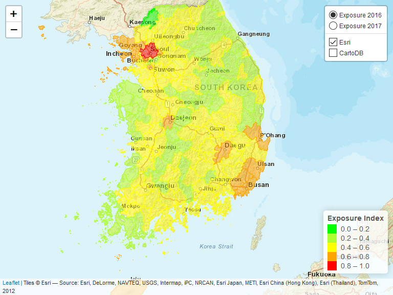<!-- -->

# 결과값 저장

``` r
write.csv(result, 'output/exposure_result1.csv', row.names = F)
```

# 최종 min-max 포함 ———————————————————–

## 년도별 Expsoure 지수를 다시 min-max scaling 적용

Exposure 지수 표준화 함수 설정

``` r
standard <- function(x){
  return((x-min(x))/(max(x)-min(x)))
}

# 연도별 Exposure 지수 표준화 산정
result <- as.data.frame(lapply(exposure[,10:11],
                               standard))
colnames(result) <- c("X16_exposure", "X17_exposure")
result <- cbind(DB[,1:3],
                result)
head(result,3)
```

    ##                   Name         NameK   SGG X16_exposure X17_exposure
    ## 1 Gangwon Gangneung-si 강원도 강릉시 42150    0.3038772    0.3239064
    ## 2  Gangwon Goseong-gun 강원도 고성군 42820    0.1938716    0.1884191
    ## 3   Gangwon Donghae-si 강원도 동해시 42170    0.3807366    0.3786649

## 표준화된 Exposure 지수의 특성 분석

연도별 확률밀도함수  
\*\* 표준화후에 정규분포에 가깝게 변동을 확인함\*\*

``` r
result_p_p <- result %>%                           # pivoting
  pivot_longer(c("X16_exposure", "X17_exposure"),
               names_to = "year",
               values_to = "exposure")
result_p_p %>% 
  ggplot()+
  geom_density(aes(x=exposure, y=..density.., color=year))
```

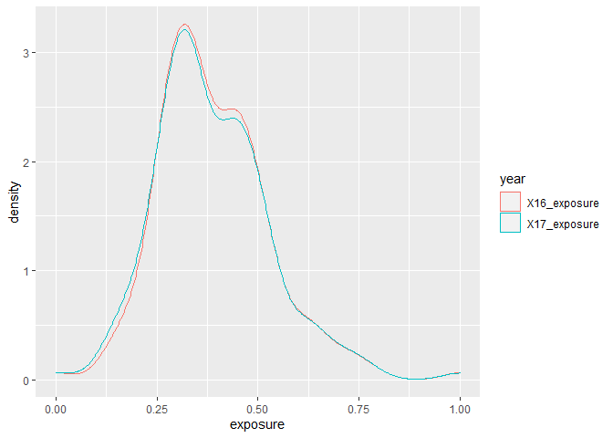<!-- -->

``` r
result %>% 
  ggplot(aes(X17_exposure))+
  geom_histogram(bins=100)
```

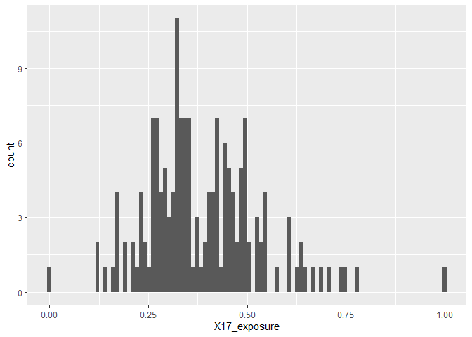<!-- -->

``` r
result_p_p %>% 
  group_by(NameK) %>% 
  mutate(mean=mean(exposure))%>% 
  ggplot(aes(x=fct_reorder(NameK, mean),
             y=exposure))+
  geom_boxplot()+
  coord_flip()
```

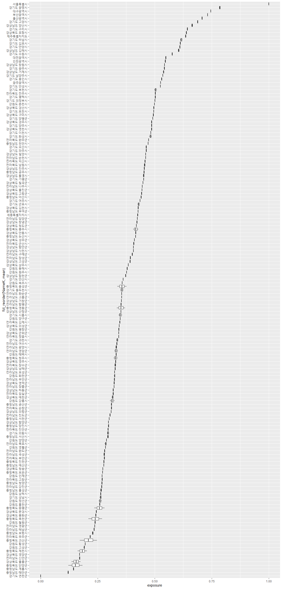<!-- -->

**연천군의 exposure값이 0 인것은?**

``` r
result_p_p %>% 
  group_by(NameK) %>% 
  mutate(mean=mean(exposure))%>%   
  filter(mean < 0.25) %>% 
  ggplot(aes(x=fct_reorder(NameK, mean),
             y=exposure))+
  geom_boxplot()+
  coord_flip()
```

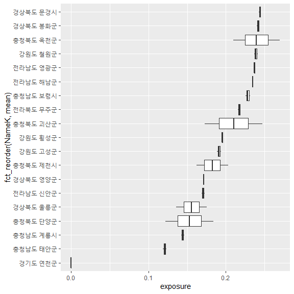<!-- -->

``` r
result_p_p %>% 
  group_by(NameK) %>% 
  mutate(mean=mean(exposure))%>%   
  filter(mean > 0.75) %>% 
  ggplot(aes(x=fct_reorder(NameK, mean),
             y=exposure))+
  geom_boxplot()+
  coord_flip()
```

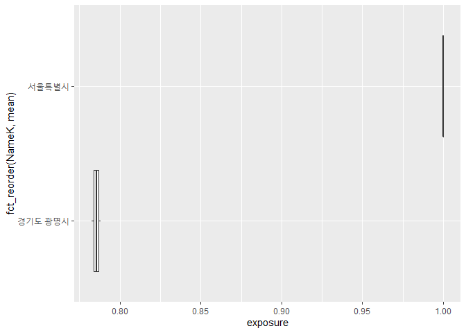<!-- -->

``` r
result %>% 
  mutate(dif=(X17_exposure - X16_exposure)) %>% 
  filter(NameK == "서울특별시")
```

    ##    Name      NameK   SGG X16_exposure X17_exposure dif
    ## 1 Seoul 서울특별시 11000            1            1   0

``` r
result_p_dif <- result%>%
  mutate(dif=(X17_exposure - X16_exposure)) %>% 
  arrange(-dif)
knitr::kable(result_p_dif[1:10, ])  # 침수구역내 총인구가 늘어난 시군
```

| Name                   | NameK    |   SGG | X16\_exposure | X17\_exposure |       dif |
| :--------------------- | :------- | ----: | ------------: | ------------: | --------: |
| Gyeongbuk Ulleung-gun  | 경상북도 울릉군 | 47940 |     0.1354623 |     0.1755259 | 0.0400637 |
| Gangwon Gangneung-si   | 강원도 강릉시  | 42150 |     0.3038772 |     0.3239064 | 0.0200292 |
| Gyeonggi Hwaseong-si   | 경기도 화성시  | 41590 |     0.4756605 |     0.4877412 | 0.0120807 |
| Gyeonggi Hanam-si      | 경기도 하남시  | 41450 |     0.6115047 |     0.6216559 | 0.0101513 |
| Gyeongbuk Yecheon-gun  | 경상북도 예천군 | 47900 |     0.3120054 |     0.3198377 | 0.0078323 |
| Gyeongnam Yangsan-si   | 경상남도 양산시 | 48330 |     0.6610366 |     0.6677574 | 0.0067208 |
| Gyeongnam Gimhae-si    | 경상남도 김해시 | 48250 |     0.6023870 |     0.6085171 | 0.0061301 |
| Jeonbuk Gunsan-si      | 전라북도 군산시 | 45130 |     0.4057684 |     0.4108655 | 0.0050971 |
| Gyeongbuk Gyeongsan-si | 경상북도 경산시 | 47290 |     0.4935461 |     0.4986002 | 0.0050542 |
| Jeju                   | 제주특별자치도  | 50000 |     0.6335447 |     0.6382957 | 0.0047510 |

``` r
knitr::kable(result_p_dif[152:161, ])  # 침수구역내 총인구가 줄어든 시군
```

|     | Name                     | NameK    |   SGG | X16\_exposure | X17\_exposure |         dif |
| --- | :----------------------- | :------- | ----: | ------------: | ------------: | ----------: |
| 152 | Jeonnam Yeongam-gun      | 전라남도 영암군 | 46830 |     0.3394898 |     0.3229613 | \-0.0165285 |
| 153 | Chungbuk Cheongju-si     | 충청북도 청주시 | 43110 |     0.3377649 |     0.3202443 | \-0.0175206 |
| 154 | Chungbuk Chungju-si      | 충청북도 충주시 | 43130 |     0.4284770 |     0.4059343 | \-0.0225427 |
| 155 | Chungbuk Yeongdong-gun   | 충청북도 영동군 | 43740 |     0.3710808 |     0.3335953 | \-0.0374855 |
| 156 | Chungbuk Eumseong-gun    | 충청북도 음성군 | 43770 |     0.3767064 |     0.3360063 | \-0.0407001 |
| 157 | Chungbuk Jecheon-si      | 충청북도 제천시 | 43150 |     0.2028809 |     0.1619078 | \-0.0409731 |
| 158 | Chungbuk Jeungpyeong-gun | 충청북도 증평군 | 43745 |     0.2799180 |     0.2357326 | \-0.0441854 |
| 159 | Chungbuk Okcheon-gun     | 충청북도 옥천군 | 43730 |     0.2697248 |     0.2098595 | \-0.0598653 |
| 160 | Chungbuk Danyang-gun     | 충청북도 단양군 | 43800 |     0.1837911 |     0.1220382 | \-0.0617529 |
| 161 | Chungbuk Goesan-gun      | 충청북도 괴산군 | 43760 |     0.2476498 |     0.1725475 | \-0.0751023 |

``` r
result_p_p %>% 
  group_by(year) %>% 
  ggplot(aes(exposure, SGG))+
  geom_point(aes(color=factor(SGG)))+
  facet_grid(. ~year)+
  theme(legend.position = "none")
```

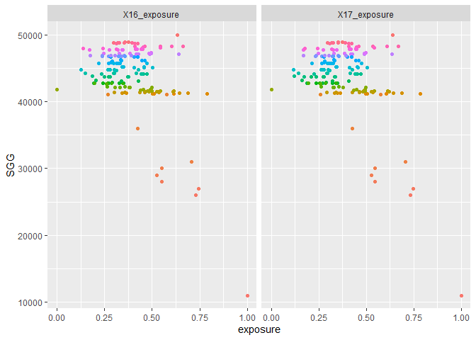<!-- -->

# Mapping

``` r
# 시군 shp 파일 불러오기
library(sf)
analysis <- st_read("input/analysis.shp")
```

    ## Reading layer `analysis' from data source `C:\00_R\0_Git\KRM_inha\input\analysis.shp' using driver `ESRI Shapefile'
    ## Simple feature collection with 161 features and 3 fields
    ## geometry type:  MULTIPOLYGON
    ## dimension:      XY
    ## bbox:           xmin: 746109.3 ymin: 1458771 xmax: 1387956 ymax: 2068444
    ## proj4string:    +proj=tmerc +lat_0=38 +lon_0=127.5 +k=0.9996 +x_0=1000000 +y_0=2000000 +ellps=GRS80 +units=m +no_defs

``` r
# 폴리곤 에러 체크(기본 파일을 에러 수정한 파일로 변경하였음)
#st_is_valid(analysis)
#library(lwgeom)
#analysis <- st_make_valid(analysis)
st_is_valid(analysis)
```

    ##   [1] TRUE TRUE TRUE TRUE TRUE TRUE TRUE TRUE TRUE TRUE TRUE TRUE TRUE TRUE TRUE
    ##  [16] TRUE TRUE TRUE TRUE TRUE TRUE TRUE TRUE TRUE TRUE TRUE TRUE TRUE TRUE TRUE
    ##  [31] TRUE TRUE TRUE TRUE TRUE TRUE TRUE TRUE TRUE TRUE TRUE TRUE TRUE TRUE TRUE
    ##  [46] TRUE TRUE TRUE TRUE TRUE TRUE TRUE TRUE TRUE TRUE TRUE TRUE TRUE TRUE TRUE
    ##  [61] TRUE TRUE TRUE TRUE TRUE TRUE TRUE TRUE TRUE TRUE TRUE TRUE TRUE TRUE TRUE
    ##  [76] TRUE TRUE TRUE TRUE TRUE TRUE TRUE TRUE TRUE TRUE TRUE TRUE TRUE TRUE TRUE
    ##  [91] TRUE TRUE TRUE TRUE TRUE TRUE TRUE TRUE TRUE TRUE TRUE TRUE TRUE TRUE TRUE
    ## [106] TRUE TRUE TRUE TRUE TRUE TRUE TRUE TRUE TRUE TRUE TRUE TRUE TRUE TRUE TRUE
    ## [121] TRUE TRUE TRUE TRUE TRUE TRUE TRUE TRUE TRUE TRUE TRUE TRUE TRUE TRUE TRUE
    ## [136] TRUE TRUE TRUE TRUE TRUE TRUE TRUE TRUE TRUE TRUE TRUE TRUE TRUE TRUE TRUE
    ## [151] TRUE TRUE TRUE TRUE TRUE TRUE TRUE TRUE TRUE TRUE TRUE

``` r
# shp파일에 연도별 Exposure 지수(표준화 적용) 추가
library(dplyr)
analysis <- right_join(analysis, result[,3:5])
```

    ## Joining, by = "SGG"

``` r
# 폴리곤 단순화
library(tmap)
analysis_simp <- st_simplify(analysis, dTolerance = 50)
```

``` r
# 결과 확인
tmap_mode("plot")
```

    ## tmap mode set to plotting

``` r
breaks = c(0, 0.2, 0.4, 0.6, 0.8, 1)
facets=c("X16_exposure", "X17_exposure")
tm_shape(analysis_simp)+
  tm_polygons(facets,
              breaks=breaks,
              palette = c("green", "greenyellow", "yellow", "orange", "red"),
              legend.reverse = TRUE)+
  tm_facets(ncol = 2)+
  tm_layout(legend.position = c("right", "bottom"))+
  tm_compass(type = "rose",
             position = c("right", "top"),
             size = 2.5)+
  tm_scale_bar(breaks = c(0, 25, 50, 100, 150, 200),
               position = c("left", "bottom"))
```

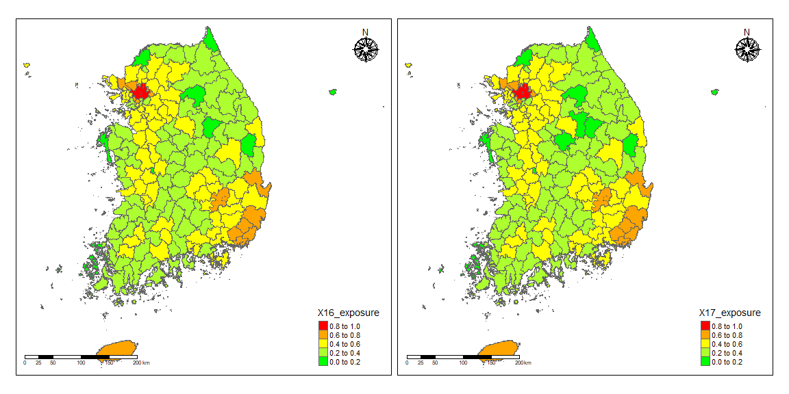<!-- -->

``` r
######################
#library(leaflet)
#library(rgdal)
#library(htmltools)
```

``` r
a <- st_transform(analysis_simp, 4326)
pal <- colorBin(
  palette=c("green", "greenyellow", "yellow", "orange", "red"),
  domain=NULL,
  bins = c(0, .2, .4, .6, 0.8, 1),
  pretty = FALSE)

leaflet(a) %>% 
  setView(lng = 128, lat = 35.9, zoom = 7) %>% 
  # base groups
  addPolygons(color = ~pal(X16_exposure),
              weight = 1,
              smoothFactor = 0.5,
              opacity = 1.0,
              fillOpacity = 0.5,
              label = ~htmlEscape(NameK),
              popup = ~htmlEscape(X16_exposure),
              highlightOptions = highlightOptions(color = "white",
                                                  weight = 2,
                                                  bringToFront = TRUE),
              group="Exposure 2016") %>% 
  addPolygons(color = ~pal(X17_exposure),
              weight = 1,
              smoothFactor = 0.5,
              opacity = 1.0,
              fillOpacity = 0.5,
              label = ~htmlEscape(NameK),
              popup = ~htmlEscape(X17_exposure),
              highlightOptions = highlightOptions(color = "white",
                                                  weight = 2,
                                                  bringToFront = TRUE),
              group="Exposure 2017") %>% 
  #overlay groups
  addProviderTiles(providers$Esri.WorldStreetMap,
                   group="Esri") %>%  
  addProviderTiles(providers$CartoDB.Positron,
                   group="CartoDB") %>%  
  addLegend("bottomright",
            pal = pal,
            values = ~X17_exposure,
            title = "Exposure Index",
            labFormat = labelFormat(digits=10),
            opacity = 1) %>% 
  hideGroup("CartoDB") %>% 
  #Layer controls
  addLayersControl(baseGroups = c("Exposure 2016", "Exposure 2017"),
                   overlayGroups = c("Esri", "CartoDB"),
                   options=layersControlOptions(collapsed=FALSE))
```

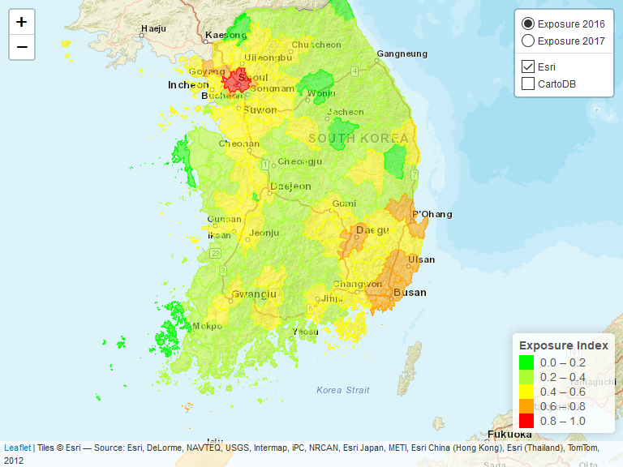<!-- -->

``` r
#############################
```

# 결과값 저장

``` r
write.csv(result, 'output/exposure_result.csv', row.names = F)


# 열 명칭별 의미

# Name : 161개 시군별 영문명
# NameK : 161개 시군별 한글명
# SGG : 시군구 코드
# X16_ex_str : 16년도 총 건축물수(개)
# X17_ex_str : 17년도 총 건축물수(개)
# X16_ex_pop : 16년도 총 인구수(명)
# X17_ex_pop : 17년도 총 인구수(명)
# X16_ex_eco : 16년도 평균공시지가(원/m2)
# X17_ex_eco : 17년도 평균공시지가(원/m2)
# X16_ex_str_log : 16년도 총 건축물수(log 표준화 적용)
# X17_ex_str_log : 17년도 총 건축물수(log 표준화 적용)
# X16_ex_pop_log : 16년도 총 인구수(log 표준화 적용)
# X17_ex_pop_log : 17년도 총 인구수(log 표준화 적용)
# X16_ex_eco_log : 16년도 평균공시지가(log 표준화 적용)
# X17_ex_eco_log : 17년도 평균공시지가(log 표준화 적용)
# X16_ex_index : 16년도 Exposure 지수
# X17_ex_index : 17년도 Exposure 지수
# X16_exposure : 16년도 Exposure 지수(표준화 적용)
# X17_exposure : 17년도 Exposure 지수(표준화 적용)
```
