Qualitative Risk Analysis \_ Inha
================
Kyungtak Kim
2020 3 26

``` r
# 패키지 설치
#install.packages("sf")
#install.packages("tmap")
#install.packages("dplyr")
```

``` r
library(tidyverse)
library(sf)
library(tmap)
Sys.setenv(Language="En")
library(caret)
library(knitr)
library(leaflet)
library(rgdal)
library(htmltools)
```

# RISK = f(Hazard, Exposure, Vulnerability, Capacity)

``` r
# 원본 데이터 읽기
hazard <- read.csv('output/hazard_result.csv')
exposure <- read.csv('output/exposure_result.csv')
vulnerability <- read.csv('output/vulnerability_result.csv')
capacity <- read.csv('output/capacity_result.csv')


#데이터 결합
DB <- cbind(hazard, c(exposure[,4:5],vulnerability[,4:5],capacity[,4:6]))
head(DB, 3)
```

    ##                   Name         NameK   SGG X16_hazard X17_hazard X18_hazard
    ## 1 Gangwon Gangneung-si 강원도 강릉시 42150  1.0000000  1.0000000  1.0000000
    ## 2  Gangwon Goseong-gun 강원도 고성군 42820  0.5264574  0.5463284  0.6153013
    ## 3   Gangwon Donghae-si 강원도 동해시 42170  0.6123409  0.6041215  0.5936511
    ##   X16_exposure X17_exposure X16_vulnerability X17_vulnerability X16_capacity
    ## 1    0.3038772    0.3239064         0.5435461         0.4354101    0.7983780
    ## 2    0.1938716    0.1884191         0.6601949         0.6438191    0.7478007
    ## 3    0.3807366    0.3786649         0.3719887         0.3689875    0.7751020
    ##   X17_capacity X18_capacity
    ## 1    0.8558765    0.8870795
    ## 2    0.8281501    0.9009704
    ## 3    0.8444816    0.8442552

# RISK 계산

``` r
# 16년~17년 홍수피해위험지수 산정
result_index_16 <- as.data.frame((rowSums(DB[,c("X16_hazard","X16_exposure","X16_vulnerability","X16_capacity")]))/4)
colnames(result_index_16) <- c("X16_result_index")
result_index_17 <- as.data.frame((rowSums(DB[,c("X17_hazard","X17_exposure","X17_vulnerability","X17_capacity")]))/4)
colnames(result_index_17) <- c("X17_result_index")
result_index <- cbind(DB[,1:3], c(result_index_16,result_index_17))

# 홍수피해위험지수 표준화 함수 설정
standard <- function(x){
  return((x-min(x))/(max(x)-min(x)))
}

# 연도별 데이터 프레임에 표준화 적용
result <- as.data.frame(lapply(result_index[,4:5],standard))
colnames(result) <- c("X16_result", "X17_result")
result <- cbind(DB[,1:3], result)
head(result, 3)
```

    ##                   Name         NameK   SGG X16_result X17_result
    ## 1 Gangwon Gangneung-si 강원도 강릉시 42150  0.8100104  0.9003977
    ## 2  Gangwon Goseong-gun 강원도 고성군 42820  0.4881184  0.6160862
    ## 3   Gangwon Donghae-si 강원도 동해시 42170  0.4954857  0.6088050

연도별 확률밀도함수

``` r
result_p <- result %>% 
  select(-Name)
head(result_p, 3)
```

    ##           NameK   SGG X16_result X17_result
    ## 1 강원도 강릉시 42150  0.8100104  0.9003977
    ## 2 강원도 고성군 42820  0.4881184  0.6160862
    ## 3 강원도 동해시 42170  0.4954857  0.6088050

``` r
result_p_p <- result_p %>%                           # pivoting
  pivot_longer(c("X16_result", "X17_result"),
               names_to = "year",
               values_to = "result")
result_p_p %>% 
  ggplot()+
  geom_density(aes(x=result, y=..density.., color=year))
```

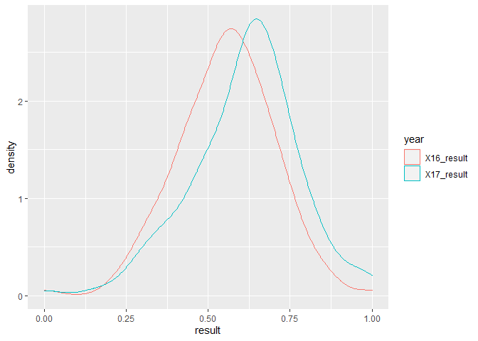<!-- -->

``` r
result_p %>% 
  ggplot(aes(X17_result))+
  geom_histogram(bins=100)
```

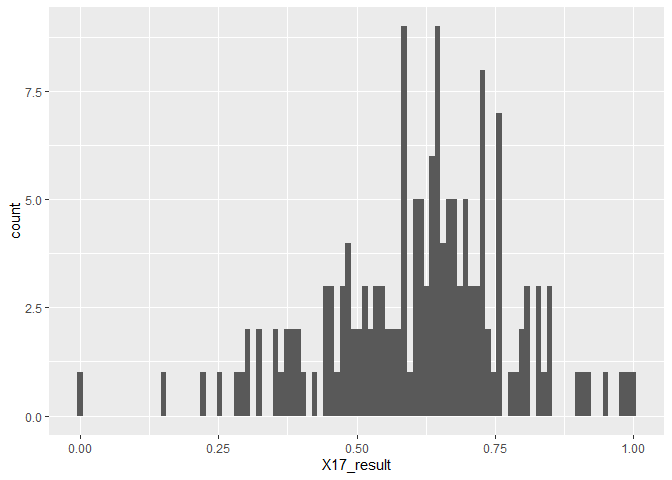<!-- -->

``` r
result_p_p %>% 
  group_by(NameK) %>% 
  mutate(mean=mean(result))%>% 
  ggplot(aes(x=fct_reorder(NameK, mean),
             y=result))+
  geom_boxplot()+
  coord_flip()
```

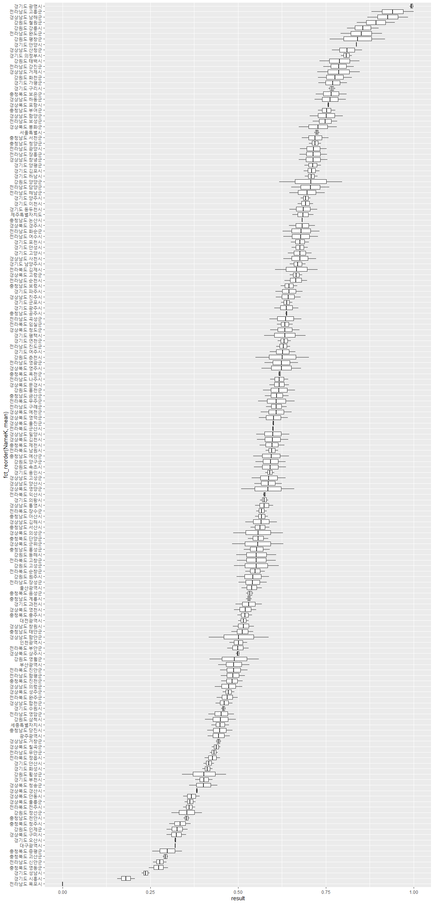<!-- -->

``` r
result_p_p %>% 
  group_by(NameK) %>% 
  mutate(mean=mean(result))%>%   
  filter(mean < 0.35) %>%            #35% 이하
  ggplot(aes(x=fct_reorder(NameK, mean),
             y=result))+
  geom_boxplot()+
  coord_flip()
```

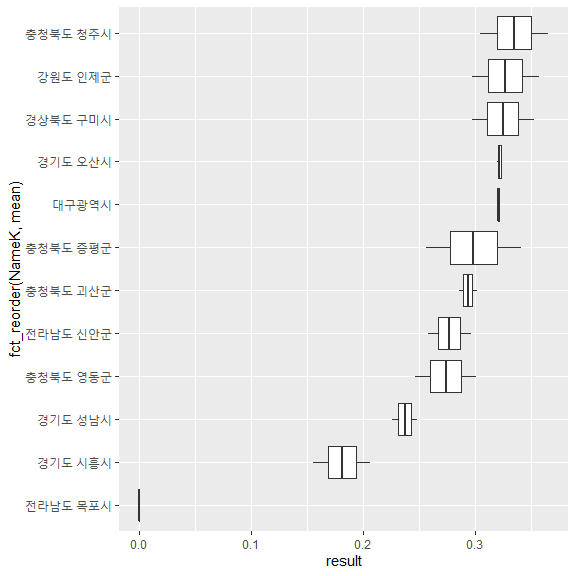<!-- -->

``` r
result_p_p %>% 
  group_by(NameK) %>% 
  mutate(mean=mean(result))%>%   
  filter(mean > 0.75) %>%            #75% 이상
  ggplot(aes(x=fct_reorder(NameK, mean),
             y=result))+
  geom_boxplot()+
  coord_flip()
```

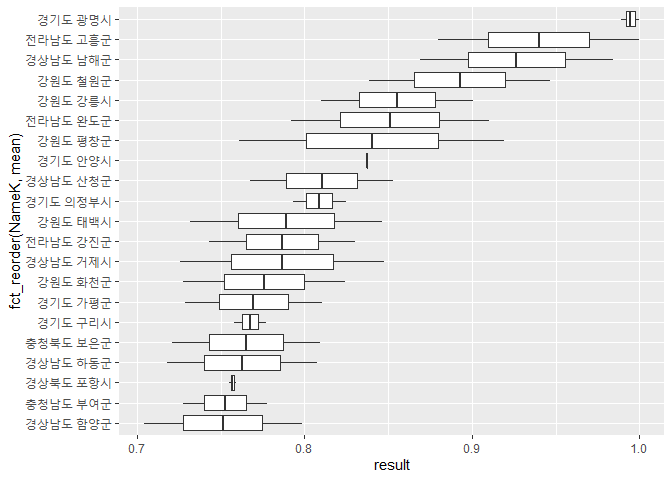<!-- -->

``` r
result_p %>% 
  mutate(dif=(X17_result - X16_result)) %>% 
  filter(NameK == "서울특별시")
```

    ##        NameK   SGG X16_result X17_result        dif
    ## 1 서울특별시 11000  0.7166389  0.7321177 0.01547886

``` r
result_p_dif <- result_p%>%
  mutate(dif=(X17_result - X16_result)) %>% 
  arrange(-dif)
knitr::kable(result_p_dif[1:10, ])  # 침수구역내 총인구가 늘어난 시군
```

| NameK    |   SGG | X16\_result | X17\_result |       dif |
| :------- | ----: | ----------: | ----------: | --------: |
| 강원도 양양군  | 42830 |   0.6178257 |   0.7966093 | 0.1787836 |
| 경상남도 함안군 | 48730 |   0.4164833 |   0.5869667 | 0.1704833 |
| 강원도 평창군  | 42760 |   0.7611326 |   0.9193971 | 0.1582644 |
| 강원도 춘천시  | 42110 |   0.5502588 |   0.7025579 | 0.1522991 |
| 경상북도 영양군 | 47760 |   0.5093570 |   0.6605020 | 0.1511450 |
| 경상북도 군위군 | 47720 |   0.4829632 |   0.6289233 | 0.1459600 |
| 강원도 영월군  | 42750 |   0.4185902 |   0.5598876 | 0.1412974 |
| 경상북도 의성군 | 47730 |   0.4869166 |   0.6280056 | 0.1410890 |
| 강원도 고성군  | 42820 |   0.4881184 |   0.6160862 | 0.1279678 |
| 강원도 횡성군  | 42730 |   0.3402637 |   0.4658988 | 0.1256351 |

``` r
knitr::kable(result_p_dif[152:161, ])  # 침수구역내 총인구가 줄어든 시군
```

|     | NameK    |   SGG | X16\_result | X17\_result |         dif |
| --- | :------- | ----: | ----------: | ----------: | ----------: |
| 152 | 경기도 안산시  | 41270 |   0.4316604 |   0.4016536 | \-0.0300069 |
| 153 | 충청남도 청양군 | 44790 |   0.7362989 |   0.7017132 | \-0.0345857 |
| 154 | 경기도 연천군  | 41800 |   0.6509595 |   0.6125975 | \-0.0383620 |
| 155 | 경기도 부천시  | 41190 |   0.4278185 |   0.3781803 | \-0.0496382 |
| 156 | 충청남도 부여군 | 44760 |   0.7773486 |   0.7275116 | \-0.0498370 |
| 157 | 인천광역시    | 28000 |   0.5263018 |   0.4756885 | \-0.0506133 |
| 158 | 경기도 시흥시  | 41390 |   0.2061888 |   0.1555098 | \-0.0506790 |
| 159 | 충청북도 청주시 | 43110 |   0.3649189 |   0.3043571 | \-0.0605618 |
| 160 | 경기도 고양시  | 41280 |   0.7098045 |   0.6421808 | \-0.0676237 |
| 161 | 충청북도 증평군 | 43745 |   0.3408069 |   0.2562014 | \-0.0846056 |

``` r
result_p_p %>% 
  group_by(year) %>% 
  ggplot(aes(result, SGG))+
  geom_point(aes(color=factor(SGG)))+
  facet_grid(. ~year)+
  theme(legend.position = "none")
```

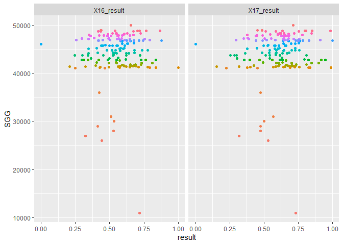<!-- -->

# RISK \~ f(Hazard, Exposure, VUlnerability, Capacity) 분석

## RISK \~ Hazard

``` r
result_p <- result %>% 
  pivot_longer(c("X16_result","X17_result"), names_to = "year", values_to = "risk")
hazard_p <- hazard %>% 
  pivot_longer(c("X16_hazard", "X17_hazard"), names_to = "year", values_to = "hazard")
hazard_path <- cbind(result_p, hazard_p[,6])

hazard_path %>% 
  group_by(NameK) %>% 
  filter(str_detect(NameK, "^강원") ) %>% 
  ggplot(aes(risk, hazard,col=NameK))+
  geom_path(arrow=arrow(angle=10,
                      ends="last",
                      type="closed",
                      length = unit(0.15, "inches")),
          show.legend = F)+
  geom_point(size=2, alpha=0.4, show.legend = F)+
  geom_vline(xintercept = 0.5, alpha=0.3)+
  geom_hline(yintercept = 0.5, alpha=0.3)+
  labs(x="RISK", y="Hazard")+
  directlabels::geom_dl(aes(label=NameK),
                        method = list("first.points",rot=45), 
                        position = "identity",
                        alpha=0.3)+
  scale_x_continuous(limits = c(0,1))+
  scale_y_continuous(limits = c(0,1))
```

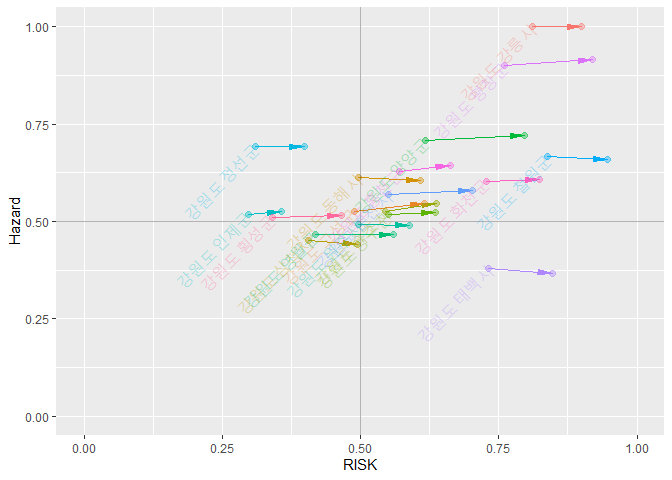<!-- -->

## RISK \~ Exposure

``` r
exposure_p <- exposure %>% 
  pivot_longer(c("X16_exposure", "X17_exposure"), names_to = "year", values_to = "exposure")
exposure_path <- cbind(result_p, exposure_p[,5])

exposure_path %>% 
  group_by(NameK) %>% 
  filter(str_detect(NameK, "^강원") ) %>% 
  ggplot(aes(risk, exposure,col=NameK))+
  geom_path(arrow=arrow(angle=10,
                        ends="last",
                        type="closed",
                        length = unit(0.15, "inches")),
            show.legend = F)+
  geom_point(size=2, alpha=0.4, show.legend = F)+
  geom_vline(xintercept = 0.5, alpha=0.3)+
  geom_hline(yintercept = 0.5, alpha=0.3)+
  labs(x="RISK", y="Exposure")+
  directlabels::geom_dl(aes(label=NameK),
                        method = list("first.points",rot=45), 
                        position = "identity",
                        alpha=0.3)+
  scale_x_continuous(limits = c(0,1))+
  scale_y_continuous(limits = c(0,1))
```

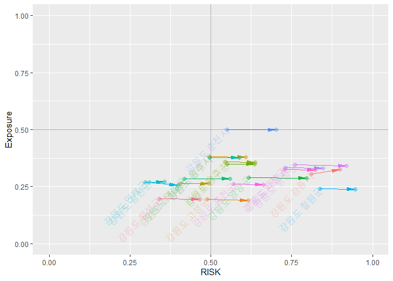<!-- -->

## RISK \~ Vulnerability

``` r
vulnerability_p <- vulnerability %>% 
  pivot_longer(c("X16_vulnerability", "X17_vulnerability"), names_to = "year", values_to = "vulnerability")
vulnerability_path <- cbind(result_p, vulnerability_p[,5])

vulnerability_path %>% 
  group_by(NameK) %>% 
  filter(str_detect(NameK, "^강원") ) %>% 
  ggplot(aes(risk, vulnerability,col=NameK))+
  geom_path(arrow=arrow(angle=10,
                        ends="last",
                        type="closed",
                        length = unit(0.15, "inches")),
            show.legend = F)+
  geom_point(size=2, alpha=0.4, show.legend = F)+
  geom_vline(xintercept = 0.5, alpha=0.3)+
  geom_hline(yintercept = 0.5, alpha=0.3)+
  labs(x="RISK", y="Vulnerability")+
  directlabels::geom_dl(aes(label=NameK),
                        method = list("first.points",rot=45), 
                        position = "identity",
                        alpha=0.3)+
  scale_x_continuous(limits = c(0,1))+
  scale_y_continuous(limits = c(0,1))
```

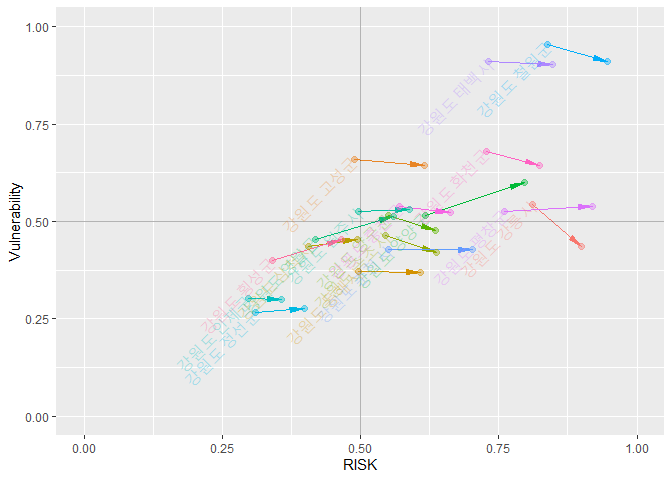<!-- -->

## RISK \~ Capacity

``` r
capacity_p <- capacity %>% 
  pivot_longer(c("X16_capacity", "X17_capacity"), names_to = "year", values_to = "capacity")
capacity_path <- cbind(result_p, capacity_p[,6])

capacity_path %>% 
  group_by(NameK) %>% 
  filter(str_detect(NameK, "^강원") ) %>% 
  ggplot(aes(risk, capacity, col=NameK))+
  geom_path(arrow=arrow(angle=10,
                        ends="last",
                        type="closed",
                        length = unit(0.15, "inches")),
            show.legend = F)+
  geom_point(size=2, alpha=0.4, show.legend = F)+
  geom_vline(xintercept = 0.5, alpha=0.3)+
  geom_hline(yintercept = 0.5, alpha=0.3)+
  labs(x="RISK", y="Capacity")+
  directlabels::geom_dl(aes(label=NameK),
                        method = list("first.points",rot=45), 
                        position = "identity",
                        alpha=0.3)+
  scale_x_continuous(limits = c(0,1))+
  scale_y_continuous(limits = c(0,1))
```

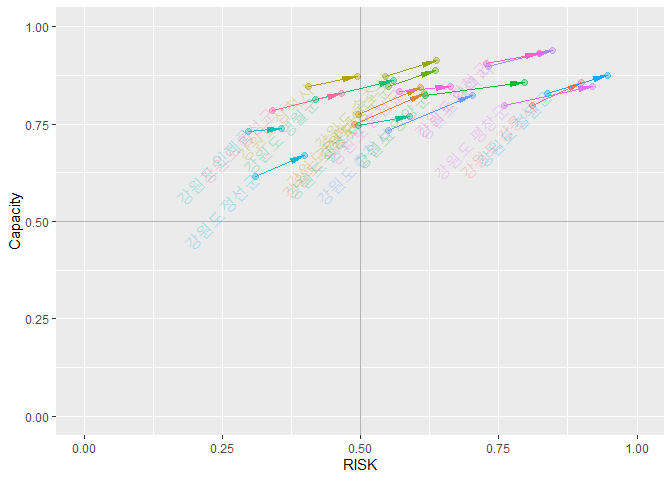<!-- -->

# Mapping

시군 shp 파일 불러오기

``` r
analysis <- st_read("input/analysis.shp")
```

    ## Reading layer `analysis' from data source `C:\00_R\0_Git\KRM_inha\input\analysis.shp' using driver `ESRI Shapefile'
    ## Simple feature collection with 161 features and 3 fields
    ## geometry type:  MULTIPOLYGON
    ## dimension:      XY
    ## bbox:           xmin: 746109.3 ymin: 1458771 xmax: 1387956 ymax: 2068444
    ## proj4string:    +proj=tmerc +lat_0=38 +lon_0=127.5 +k=0.9996 +x_0=1000000 +y_0=2000000 +ellps=GRS80 +units=m +no_defs

``` r
# 폴리곤 에러 체크(기본 파일을 에러 수정한 파일로 변경하였음)
#st_is_valid(analysis)
#library(lwgeom)
#analysis <- st_make_valid(analysis)
st_is_valid(analysis)
```

    ##   [1] TRUE TRUE TRUE TRUE TRUE TRUE TRUE TRUE TRUE TRUE TRUE TRUE TRUE TRUE TRUE
    ##  [16] TRUE TRUE TRUE TRUE TRUE TRUE TRUE TRUE TRUE TRUE TRUE TRUE TRUE TRUE TRUE
    ##  [31] TRUE TRUE TRUE TRUE TRUE TRUE TRUE TRUE TRUE TRUE TRUE TRUE TRUE TRUE TRUE
    ##  [46] TRUE TRUE TRUE TRUE TRUE TRUE TRUE TRUE TRUE TRUE TRUE TRUE TRUE TRUE TRUE
    ##  [61] TRUE TRUE TRUE TRUE TRUE TRUE TRUE TRUE TRUE TRUE TRUE TRUE TRUE TRUE TRUE
    ##  [76] TRUE TRUE TRUE TRUE TRUE TRUE TRUE TRUE TRUE TRUE TRUE TRUE TRUE TRUE TRUE
    ##  [91] TRUE TRUE TRUE TRUE TRUE TRUE TRUE TRUE TRUE TRUE TRUE TRUE TRUE TRUE TRUE
    ## [106] TRUE TRUE TRUE TRUE TRUE TRUE TRUE TRUE TRUE TRUE TRUE TRUE TRUE TRUE TRUE
    ## [121] TRUE TRUE TRUE TRUE TRUE TRUE TRUE TRUE TRUE TRUE TRUE TRUE TRUE TRUE TRUE
    ## [136] TRUE TRUE TRUE TRUE TRUE TRUE TRUE TRUE TRUE TRUE TRUE TRUE TRUE TRUE TRUE
    ## [151] TRUE TRUE TRUE TRUE TRUE TRUE TRUE TRUE TRUE TRUE TRUE

``` r
# shp파일에 연도별 홍수피해위험지수(표준화 적용) 추가
analysis <- right_join(analysis, result[,3:5])
```

    ## Joining, by = "SGG"

``` r
# 폴리곤 단순화
analysis_simp <- st_simplify(analysis, dTolerance = 50)

# 결과 확인
tmap_mode("plot")
```

    ## tmap mode set to plotting

``` r
breaks = c(0, 0.2, 0.4, 0.6, 0.8, 1)
facets=c("X16_result", "X17_result")
tm_shape(analysis_simp)+
  tm_polygons(facets,
              breaks=breaks,
              palette = c("green", "greenyellow", "yellow", "orange", "red"),
              legend.reverse = TRUE)+
  tm_facets(ncol = 2)+
  tm_layout(legend.position = c("right", "bottom"))+
  tm_compass(type = "rose",
             position = c("right", "top"),
             size = 2.0)+
  tm_scale_bar(breaks = c(0, 25, 50, 100, 150, 200),
               position = c("left", "bottom"))
```

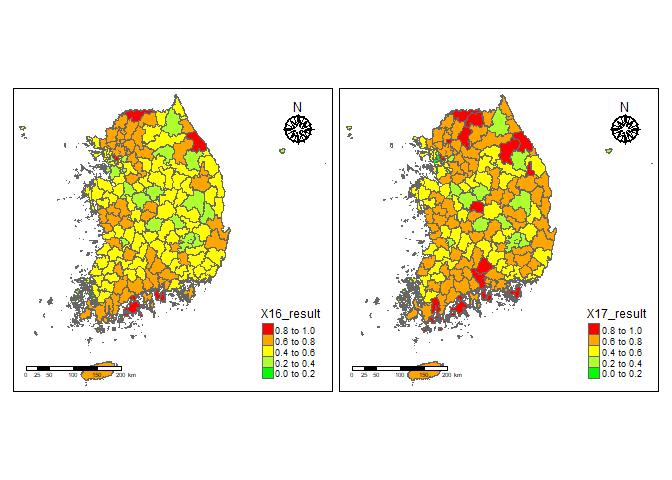<!-- -->

``` r
######################
#library(leaflet)
#library(rgdal)
#library(htmltools)
```

``` r
a <- st_transform(analysis_simp, 4326)
pal <- colorBin(
  palette=c("green", "greenyellow", "yellow", "orange", "red"),
  domain=NULL,
  bins = c(0, .2, .4, .6, 0.8, 1),
  pretty = FALSE)

leaflet(a) %>% 
  setView(lng = 128, lat = 35.9, zoom = 7) %>% 
  # base groups
  addPolygons(color = ~pal(X16_result),
              weight = 1,
              smoothFactor = 0.5,
              opacity = 1.0,
              fillOpacity = 0.5,
              label = ~htmlEscape(NameK),
              popup = ~htmlEscape(X16_result),
              highlightOptions = highlightOptions(color = "white",
                                                  weight = 2,
                                                  bringToFront = TRUE),
              group="result 2016") %>% 
  addPolygons(color = ~pal(X17_result),
              weight = 1,
              smoothFactor = 0.5,
              opacity = 1.0,
              fillOpacity = 0.5,
              label = ~htmlEscape(NameK),
              popup = ~htmlEscape(X17_result),
              highlightOptions = highlightOptions(color = "white",
                                                  weight = 2,
                                                  bringToFront = TRUE),
              group="result 2017") %>% 
  #overlay groups
  addProviderTiles(providers$Esri.WorldStreetMap,
                   group="Esri") %>%  
  addProviderTiles(providers$CartoDB.Positron,
                   group="CartoDB") %>%  
  addLegend("bottomright",
            pal = pal,
            values = ~X17_result,
            title = "RISK Index",
            labFormat = labelFormat(digits=10),
            opacity = 1) %>% 
  hideGroup("CartoDB") %>% 
  #Layer controls
  addLayersControl(baseGroups = c("result 2016", "result 2017"),
                   overlayGroups = c("Esri", "CartoDB"),
                   options=layersControlOptions(collapsed=FALSE))
```

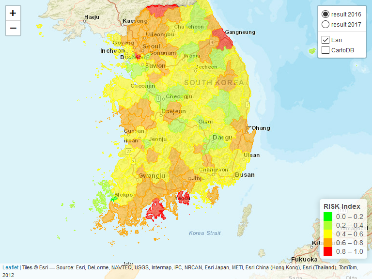<!-- -->

``` r
#############################
```

# 결과값 저장

``` r
write.csv(result, 'output/final_result.csv')


# 열 명칭별 의미

# Name : 161개 시군별 영문명
# NameK : 161개 시군별 한글명
# SGG : 시군구 코드
# X16_hazard : 16년도 hazard 지수(표준화 적용)
# X17_hazard : 17년도 hazard 지수(표준화 적용)
# X18_hazard : 18년도 hazard 지수(표준화 적용)
# X16_exposure : 16년도 Exposure 지수(표준화 적용)
# X17_exposure : 17년도 Exposure 지수(표준화 적용)
# X16_vulnerability : 16년도 Vulnerability 지수(표준화 적용)
# X17_vulnerability : 17년도 Vulnerability 지수(표준화 적용)
# X16_capacity : 16년도 Capacity 지수(표준화 적용)
# X17_capacity : 17년도 Capacity 지수(표준화 적용)
# X18_capacity : 18년도 Capacity 지수(표준화 적용)
# X16_result_index : 16년도 홍수피해위험지수
# X17_result_index : 17년도 홍수피해위험지수
# X16_result : 16년도 홍수피해위험지수(표준화 적용)
# X17_result : 17년도 홍수피해위험지수(표준화 적용)
```
