Qualitative Risk Analysis \_ Inha
================
Kyungtak Kim
2020 3 26

``` r
# 패키지 설치
#install.packages("sf")
#install.packages("tmap")
#install.packages("dplyr")
```

``` r
library(tidyverse)
library(sf)
library(tmap)
Sys.setenv(Language="En")
library(caret)
library(knitr)
library(leaflet)
library(rgdal)
library(htmltools)
```

# 최종 min-max 미포함 ———————————————————-

# RISK = f(Hazard, Exposure, Vulnerability, Capacity)

``` r
# 원본 데이터 읽기
hazard <- read.csv('output/hazard_result.csv')
exposure <- read.csv('output/exposure_result1.csv')
vulnerability <- read.csv('output/vulnerability_result1.csv')
capacity <- read.csv('output/capacity_result1.csv')


#데이터 결합
DB <- cbind(hazard, c(exposure[,4:5],vulnerability[,4:5],capacity[,4:6]))
head(DB, 3)
```

    ##                   Name         NameK   SGG X16_hazard X17_hazard X18_hazard
    ## 1 Gangwon Gangneung-si 강원도 강릉시 42150  1.0000000  1.0000000  1.0000000
    ## 2  Gangwon Goseong-gun 강원도 고성군 42820  0.5264574  0.5463284  0.6153013
    ## 3   Gangwon Donghae-si 강원도 동해시 42170  0.6123409  0.6041215  0.5936511
    ##   X16_exposure X17_exposure X16_vulnerability X17_vulnerability X16_capacity
    ## 1    0.3831819    0.3984708         0.4554924         0.4406811    0.8239609
    ## 2    0.2857085    0.2779259         0.5397817         0.6225125    0.7889338
    ## 3    0.4512852    0.4471901         0.3315268         0.3827292    0.8078412
    ##   X17_capacity X18_capacity
    ## 1    0.8623345    0.8698801
    ## 2    0.8425940    0.8798479
    ## 3    0.8542216    0.8391500

``` r
summary(DB)
```

    ##                     Name               NameK          SGG       
    ##  Busan                :  1   강원도 강릉시:  1   Min.   :11000  
    ##  Chungbuk Boeun-gun   :  1   강원도 고성군:  1   1st Qu.:42130  
    ##  Chungbuk Cheongju-si :  1   강원도 동해시:  1   Median :44800  
    ##  Chungbuk Chungju-si  :  1   강원도 삼척시:  1   Mean   :44074  
    ##  Chungbuk Danyang-gun :  1   강원도 속초시:  1   3rd Qu.:47130  
    ##  Chungbuk Eumseong-gun:  1   강원도 양구군:  1   Max.   :50000  
    ##  (Other)              :155   (Other)      :155                  
    ##    X16_hazard       X17_hazard       X18_hazard      X16_exposure   
    ##  Min.   :0.0000   Min.   :0.0000   Min.   :0.0000   Min.   :0.1139  
    ##  1st Qu.:0.3315   1st Qu.:0.3045   1st Qu.:0.3383   1st Qu.:0.3780  
    ##  Median :0.4577   Median :0.4459   Median :0.4473   Median :0.4350  
    ##  Mean   :0.4726   Mean   :0.4633   Mean   :0.4756   Mean   :0.4602  
    ##  3rd Qu.:0.6327   3rd Qu.:0.6444   3rd Qu.:0.6497   3rd Qu.:0.5251  
    ##  Max.   :1.0000   Max.   :1.0000   Max.   :1.0000   Max.   :1.0000  
    ##                                                                     
    ##   X17_exposure    X16_vulnerability X17_vulnerability  X16_capacity   
    ##  Min.   :0.1103   Min.   :0.06273   Min.   :0.0608    Min.   :0.2710  
    ##  1st Qu.:0.3699   1st Qu.:0.42145   1st Qu.:0.4626    1st Qu.:0.7473  
    ##  Median :0.4257   Median :0.52796   Median :0.6058    Median :0.8024  
    ##  Mean   :0.4547   Mean   :0.51666   Mean   :0.5942    Mean   :0.7855  
    ##  3rd Qu.:0.5242   3rd Qu.:0.64094   3rd Qu.:0.7394    3rd Qu.:0.8420  
    ##  Max.   :1.0000   Max.   :0.78532   Max.   :0.9333    Max.   :0.9636  
    ##                                                                       
    ##   X17_capacity     X18_capacity   
    ##  Min.   :0.2530   Min.   :0.2333  
    ##  1st Qu.:0.7335   1st Qu.:0.7173  
    ##  Median :0.8066   Median :0.7941  
    ##  Mean   :0.7788   Mean   :0.7696  
    ##  3rd Qu.:0.8542   3rd Qu.:0.8443  
    ##  Max.   :0.9649   Max.   :0.9509  
    ## 

# RISK 계산

``` r
# 16년~17년 홍수피해위험지수 산정
result_index_16 <- as.data.frame((rowSums(DB[,c("X16_hazard","X16_exposure","X16_vulnerability","X16_capacity")]))/4)
colnames(result_index_16) <- c("X16_result_index")
result_index_17 <- as.data.frame((rowSums(DB[,c("X17_hazard","X17_exposure","X17_vulnerability","X17_capacity")]))/4)
colnames(result_index_17) <- c("X17_result_index")
result_index <- cbind(DB[,1:3], c(result_index_16,result_index_17))
summary(result_index)
```

    ##                     Name               NameK          SGG       
    ##  Busan                :  1   강원도 강릉시:  1   Min.   :11000  
    ##  Chungbuk Boeun-gun   :  1   강원도 고성군:  1   1st Qu.:42130  
    ##  Chungbuk Cheongju-si :  1   강원도 동해시:  1   Median :44800  
    ##  Chungbuk Chungju-si  :  1   강원도 삼척시:  1   Mean   :44074  
    ##  Chungbuk Danyang-gun :  1   강원도 속초시:  1   3rd Qu.:47130  
    ##  Chungbuk Eumseong-gun:  1   강원도 양구군:  1   Max.   :50000  
    ##  (Other)              :155   (Other)      :155                  
    ##  X16_result_index X17_result_index
    ##  Min.   :0.3647   Min.   :0.3680  
    ##  1st Qu.:0.5234   1st Qu.:0.5421  
    ##  Median :0.5572   Median :0.5733  
    ##  Mean   :0.5587   Mean   :0.5728  
    ##  3rd Qu.:0.5927   3rd Qu.:0.6076  
    ##  Max.   :0.7314   Max.   :0.7096  
    ## 

``` r
# 연도별 데이터 프레임에 표준화 적용 안함.
result <- result_index[,4:5]
colnames(result) <- c("X16_result", "X17_result")
result <- cbind(DB[,1:3], result)
head(result, 3)
```

    ##                   Name         NameK   SGG X16_result X17_result
    ## 1 Gangwon Gangneung-si 강원도 강릉시 42150  0.6656588  0.6753716
    ## 2  Gangwon Goseong-gun 강원도 고성군 42820  0.5352204  0.5723402
    ## 3   Gangwon Donghae-si 강원도 동해시 42170  0.5507485  0.5720656

``` r
summary(result)
```

    ##                     Name               NameK          SGG       
    ##  Busan                :  1   강원도 강릉시:  1   Min.   :11000  
    ##  Chungbuk Boeun-gun   :  1   강원도 고성군:  1   1st Qu.:42130  
    ##  Chungbuk Cheongju-si :  1   강원도 동해시:  1   Median :44800  
    ##  Chungbuk Chungju-si  :  1   강원도 삼척시:  1   Mean   :44074  
    ##  Chungbuk Danyang-gun :  1   강원도 속초시:  1   3rd Qu.:47130  
    ##  Chungbuk Eumseong-gun:  1   강원도 양구군:  1   Max.   :50000  
    ##  (Other)              :155   (Other)      :155                  
    ##    X16_result       X17_result    
    ##  Min.   :0.3647   Min.   :0.3680  
    ##  1st Qu.:0.5234   1st Qu.:0.5421  
    ##  Median :0.5572   Median :0.5733  
    ##  Mean   :0.5587   Mean   :0.5728  
    ##  3rd Qu.:0.5927   3rd Qu.:0.6076  
    ##  Max.   :0.7314   Max.   :0.7096  
    ## 

연도별 확률밀도함수

``` r
result_p <- result %>% 
  select(-Name)
head(result_p, 3)
```

    ##           NameK   SGG X16_result X17_result
    ## 1 강원도 강릉시 42150  0.6656588  0.6753716
    ## 2 강원도 고성군 42820  0.5352204  0.5723402
    ## 3 강원도 동해시 42170  0.5507485  0.5720656

``` r
result_p_p <- result_p %>%                           # pivoting
  pivot_longer(c("X16_result", "X17_result"),
               names_to = "year",
               values_to = "result")
result_p_p %>% 
  ggplot()+
  geom_density(aes(x=result, y=..density.., color=year))
```

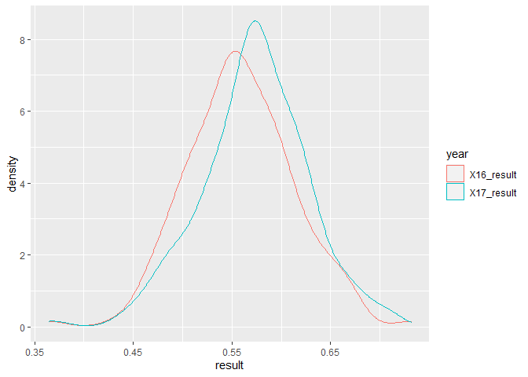<!-- -->

``` r
result_p %>% 
  ggplot(aes(X17_result))+
  geom_histogram(bins=100)
```

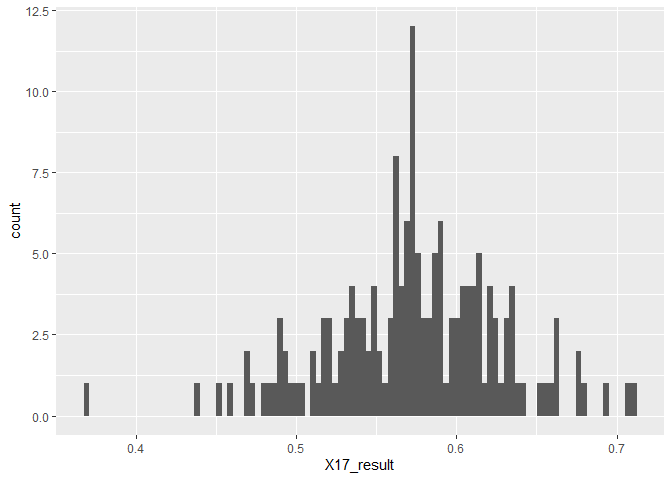<!-- -->

``` r
result_p_p %>% 
  group_by(NameK) %>% 
  mutate(mean=mean(result))%>% 
  ggplot(aes(x=fct_reorder(NameK, mean),
             y=result))+
  geom_boxplot()+
  coord_flip()
```

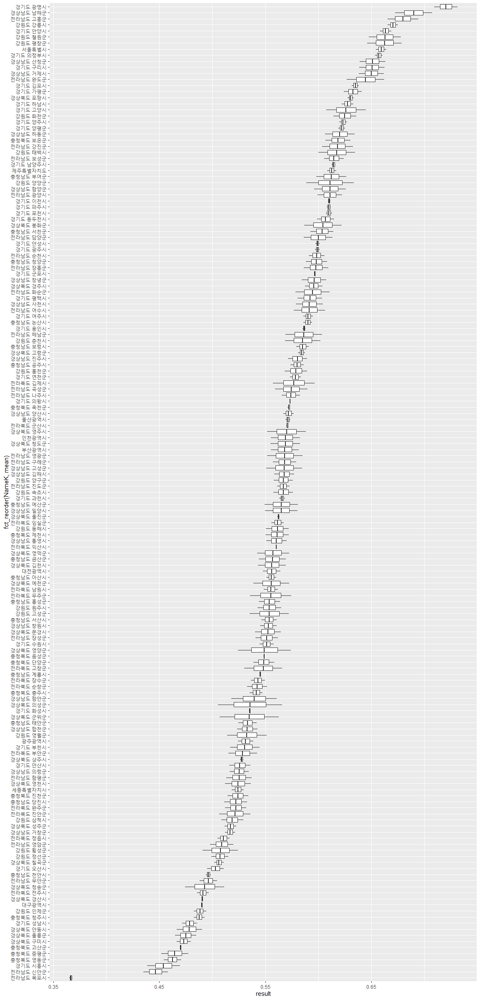<!-- -->

``` r
result_p_p %>% 
  group_by(NameK) %>% 
  mutate(mean=mean(result))%>%   
  filter(mean < 0.50) %>%            #35% 이하
  ggplot(aes(x=fct_reorder(NameK, mean),
             y=result))+
  geom_boxplot()+
  coord_flip()
```

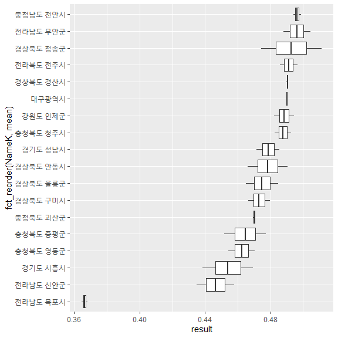<!-- -->

``` r
result_p_p %>% 
  group_by(NameK) %>% 
  mutate(mean=mean(result))%>%   
  filter(mean > 0.65) %>%            #75% 이상
  ggplot(aes(x=fct_reorder(NameK, mean),
             y=result))+
  geom_boxplot()+
  coord_flip()
```

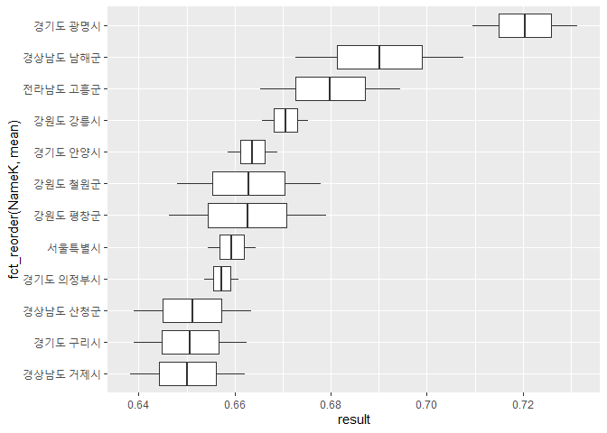<!-- -->

``` r
result_p %>% 
  mutate(dif=(X17_result - X16_result)) %>% 
  filter(NameK == "서울특별시")
```

    ##        NameK   SGG X16_result X17_result          dif
    ## 1 서울특별시 11000  0.6643211  0.6544628 -0.009858286

``` r
result_p_dif <- result_p%>%
  mutate(dif=(X17_result - X16_result)) %>% 
  arrange(-dif)
knitr::kable(result_p_dif[1:10, ])  # 침수구역내 총인구가 늘어난 시군
```

| NameK    |   SGG | X16\_result | X17\_result |       dif |
| :------- | ----: | ----------: | ----------: | --------: |
| 경상북도 의성군 | 47730 |   0.5051737 |   0.5659529 | 0.0607792 |
| 경상북도 군위군 | 47720 |   0.5068604 |   0.5629650 | 0.0561046 |
| 경상북도 영양군 | 47760 |   0.5241817 |   0.5741851 | 0.0500034 |
| 강원도 양양군  | 42830 |   0.5887911 |   0.6337451 | 0.0449539 |
| 경상남도 함안군 | 48730 |   0.5180657 |   0.5609636 | 0.0428978 |
| 전라북도 김제시 | 45210 |   0.5571666 |   0.5966482 | 0.0394817 |
| 전라북도 무주군 | 45730 |   0.5355678 |   0.5747079 | 0.0391401 |
| 강원도 영월군  | 42750 |   0.5140177 |   0.5512494 | 0.0372317 |
| 강원도 고성군  | 42820 |   0.5352204 |   0.5723402 | 0.0371198 |
| 경상북도 청송군 | 47750 |   0.4742046 |   0.5112493 | 0.0370447 |

``` r
knitr::kable(result_p_dif[152:161, ])  # 침수구역내 총인구가 줄어든 시군
```

|     | NameK    |   SGG | X16\_result | X17\_result |         dif |
| --- | :------- | ----: | ----------: | ----------: | ----------: |
| 152 | 충청남도 청양군 | 44790 |   0.6083092 |   0.5883044 | \-0.0200048 |
| 153 | 경기도 안산시  | 41270 |   0.5360644 |   0.5158596 | \-0.0202047 |
| 154 | 경기도 광명시  | 41210 |   0.7314263 |   0.7096085 | \-0.0218178 |
| 155 | 경기도 구리시  | 41310 |   0.6625731 |   0.6389009 | \-0.0236722 |
| 156 | 충청북도 증평군 | 43745 |   0.4773235 |   0.4517235 | \-0.0256000 |
| 157 | 인천광역시    | 28000 |   0.5826775 |   0.5552402 | \-0.0274373 |
| 158 | 경기도 부천시  | 41190 |   0.5446228 |   0.5165721 | \-0.0280507 |
| 159 | 충청남도 부여군 | 44760 |   0.6264178 |   0.5982938 | \-0.0281239 |
| 160 | 경기도 시흥시  | 41390 |   0.4693302 |   0.4386111 | \-0.0307191 |
| 161 | 경기도 고양시  | 41280 |   0.6448897 |   0.6076294 | \-0.0372603 |

``` r
result_p_p %>% 
  group_by(year) %>% 
  ggplot(aes(result, SGG))+
  geom_point(aes(color=factor(SGG)))+
  facet_grid(. ~year)+
  theme(legend.position = "none")
```

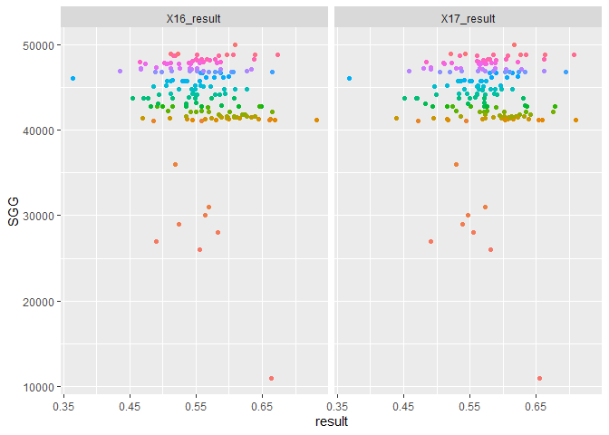<!-- -->

# RISK \~ f(Hazard, Exposure, VUlnerability, Capacity) 분석

## RISK \~ Hazard

``` r
result_p <- result %>% 
  pivot_longer(c("X16_result","X17_result"), names_to = "year", values_to = "risk")
hazard_p <- hazard %>% 
  pivot_longer(c("X16_hazard", "X17_hazard"), names_to = "year", values_to = "hazard")
hazard_path <- cbind(result_p, hazard_p[,6])

hazard_path %>% 
  group_by(NameK) %>% 
  filter(str_detect(NameK, "^강원") ) %>% 
  ggplot(aes(risk, hazard,col=NameK))+
  geom_path(arrow=arrow(angle=10,
                        ends="last",
                        type="closed",
                        length = unit(0.15, "inches")),
            show.legend = F)+
  geom_point(size=2, alpha=0.4, show.legend = F)+
  geom_vline(xintercept = 0.5, alpha=0.3)+
  geom_hline(yintercept = 0.5, alpha=0.3)+
  labs(x="RISK", y="Hazard")+
  directlabels::geom_dl(aes(label=NameK),
                        method = list("first.points",rot=45), 
                        position = "identity",
                        alpha=0.3)+
  scale_x_continuous(limits = c(0,1))+
  scale_y_continuous(limits = c(0,1))
```

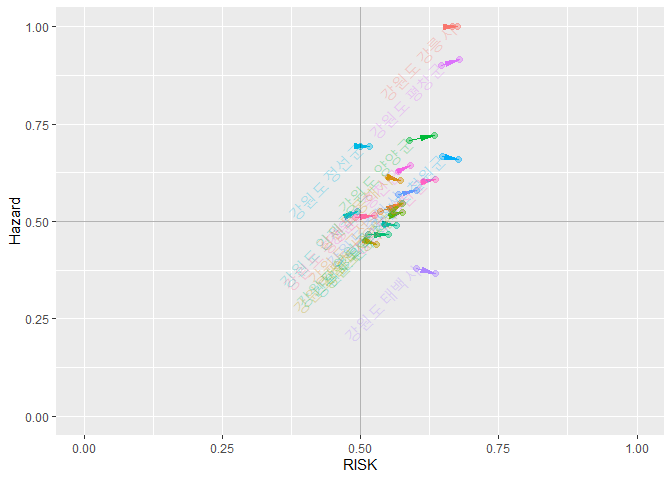<!-- -->

## RISK \~ Exposure

``` r
exposure_p <- exposure %>% 
  pivot_longer(c("X16_exposure", "X17_exposure"), names_to = "year", values_to = "exposure")
exposure_path <- cbind(result_p, exposure_p[,5])

exposure_path %>% 
  group_by(NameK) %>% 
  filter(str_detect(NameK, "^강원") ) %>% 
  ggplot(aes(risk, exposure,col=NameK))+
  geom_path(arrow=arrow(angle=10,
                        ends="last",
                        type="closed",
                        length = unit(0.15, "inches")),
            show.legend = F)+
  geom_point(size=2, alpha=0.4, show.legend = F)+
  geom_vline(xintercept = 0.5, alpha=0.3)+
  geom_hline(yintercept = 0.5, alpha=0.3)+
  labs(x="RISK", y="Exposure")+
  directlabels::geom_dl(aes(label=NameK),
                        method = list("first.points",rot=45), 
                        position = "identity",
                        alpha=0.3)+
  scale_x_continuous(limits = c(0,1))+
  scale_y_continuous(limits = c(0,1))
```

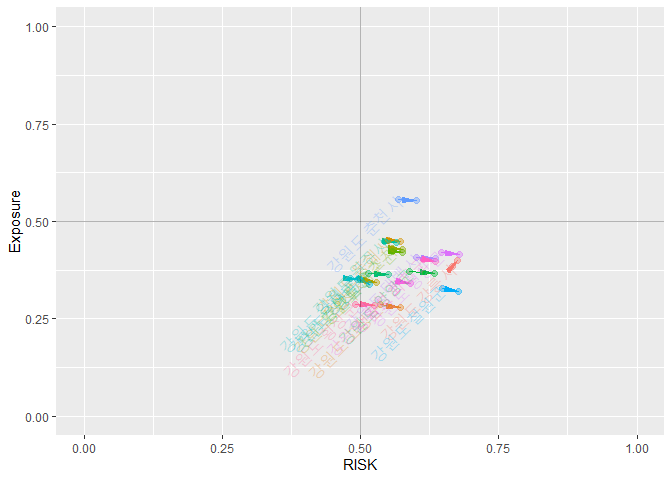<!-- -->

## RISK \~ Vulnerability

``` r
vulnerability_p <- vulnerability %>% 
  pivot_longer(c("X16_vulnerability", "X17_vulnerability"), names_to = "year", values_to = "vulnerability")
vulnerability_path <- cbind(result_p, vulnerability_p[,5])

vulnerability_path %>% 
  group_by(NameK) %>% 
  filter(str_detect(NameK, "^강원") ) %>% 
  ggplot(aes(risk, vulnerability,col=NameK))+
  geom_path(arrow=arrow(angle=10,
                        ends="last",
                        type="closed",
                        length = unit(0.15, "inches")),
            show.legend = F)+
  geom_point(size=2, alpha=0.4, show.legend = F)+
  geom_vline(xintercept = 0.5, alpha=0.3)+
  geom_hline(yintercept = 0.5, alpha=0.3)+
  labs(x="RISK", y="Vulnerability")+
  directlabels::geom_dl(aes(label=NameK),
                        method = list("first.points",rot=45), 
                        position = "identity",
                        alpha=0.3)+
  scale_x_continuous(limits = c(0,1))+
  scale_y_continuous(limits = c(0,1))
```

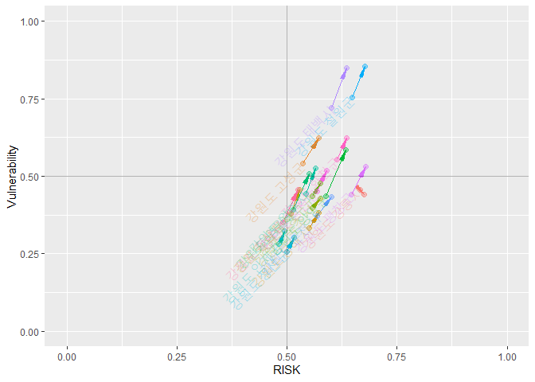<!-- -->

## RISK \~ Capacity

``` r
capacity_p <- capacity %>% 
  pivot_longer(c("X16_capacity", "X17_capacity"), names_to = "year", values_to = "capacity")
capacity_path <- cbind(result_p, capacity_p[,6])

capacity_path %>% 
  group_by(NameK) %>% 
  filter(str_detect(NameK, "^강원") ) %>% 
  ggplot(aes(risk, capacity, col=NameK))+
  geom_path(arrow=arrow(angle=10,
                        ends="last",
                        type="closed",
                        length = unit(0.15, "inches")),
            show.legend = F)+
  geom_point(size=2, alpha=0.4, show.legend = F)+
  geom_vline(xintercept = 0.5, alpha=0.3)+
  geom_hline(yintercept = 0.5, alpha=0.3)+
  labs(x="RISK", y="Capacity")+
  directlabels::geom_dl(aes(label=NameK),
                        method = list("first.points",rot=45), 
                        position = "identity",
                        alpha=0.3)+
  scale_x_continuous(limits = c(0,1))+
  scale_y_continuous(limits = c(0,1))
```

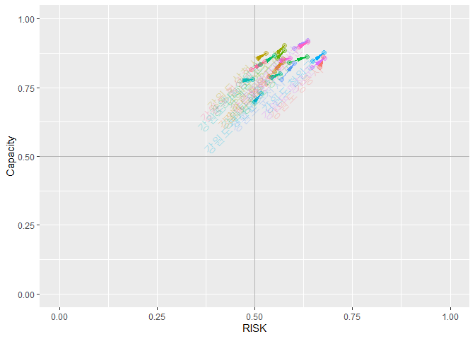<!-- -->

# Mapping

시군 shp 파일 불러오기

``` r
analysis <- st_read("input/analysis.shp")
```

    ## Reading layer `analysis' from data source `C:\00_R\0_Git\KRM_inha\input\analysis.shp' using driver `ESRI Shapefile'
    ## Simple feature collection with 161 features and 3 fields
    ## geometry type:  MULTIPOLYGON
    ## dimension:      XY
    ## bbox:           xmin: 746109.3 ymin: 1458771 xmax: 1387956 ymax: 2068444
    ## proj4string:    +proj=tmerc +lat_0=38 +lon_0=127.5 +k=0.9996 +x_0=1000000 +y_0=2000000 +ellps=GRS80 +units=m +no_defs

``` r
# 폴리곤 에러 체크(기본 파일을 에러 수정한 파일로 변경하였음)
#st_is_valid(analysis)
#library(lwgeom)
#analysis <- st_make_valid(analysis)
st_is_valid(analysis)
```

    ##   [1] TRUE TRUE TRUE TRUE TRUE TRUE TRUE TRUE TRUE TRUE TRUE TRUE TRUE TRUE TRUE
    ##  [16] TRUE TRUE TRUE TRUE TRUE TRUE TRUE TRUE TRUE TRUE TRUE TRUE TRUE TRUE TRUE
    ##  [31] TRUE TRUE TRUE TRUE TRUE TRUE TRUE TRUE TRUE TRUE TRUE TRUE TRUE TRUE TRUE
    ##  [46] TRUE TRUE TRUE TRUE TRUE TRUE TRUE TRUE TRUE TRUE TRUE TRUE TRUE TRUE TRUE
    ##  [61] TRUE TRUE TRUE TRUE TRUE TRUE TRUE TRUE TRUE TRUE TRUE TRUE TRUE TRUE TRUE
    ##  [76] TRUE TRUE TRUE TRUE TRUE TRUE TRUE TRUE TRUE TRUE TRUE TRUE TRUE TRUE TRUE
    ##  [91] TRUE TRUE TRUE TRUE TRUE TRUE TRUE TRUE TRUE TRUE TRUE TRUE TRUE TRUE TRUE
    ## [106] TRUE TRUE TRUE TRUE TRUE TRUE TRUE TRUE TRUE TRUE TRUE TRUE TRUE TRUE TRUE
    ## [121] TRUE TRUE TRUE TRUE TRUE TRUE TRUE TRUE TRUE TRUE TRUE TRUE TRUE TRUE TRUE
    ## [136] TRUE TRUE TRUE TRUE TRUE TRUE TRUE TRUE TRUE TRUE TRUE TRUE TRUE TRUE TRUE
    ## [151] TRUE TRUE TRUE TRUE TRUE TRUE TRUE TRUE TRUE TRUE TRUE

``` r
# shp파일에 연도별 홍수피해위험지수(표준화 적용) 추가
analysis <- right_join(analysis, result[,3:5])
```

    ## Joining, by = "SGG"

``` r
# 폴리곤 단순화
analysis_simp <- st_simplify(analysis, dTolerance = 50)

# 결과 확인
tmap_mode("plot")
```

    ## tmap mode set to plotting

``` r
breaks = c(0, 0.2, 0.4, 0.6, 0.8, 1)
facets=c("X16_result", "X17_result")
tm_shape(analysis_simp)+
  tm_polygons(facets,
              breaks=breaks,
              palette = c("green", "greenyellow", "yellow", "orange", "red"),
              legend.reverse = TRUE)+
  tm_facets(ncol = 2)+
  tm_layout(legend.position = c("right", "bottom"))+
  tm_compass(type = "rose",
             position = c("right", "top"),
             size = 2.0)+
  tm_scale_bar(breaks = c(0, 25, 50, 100, 150, 200),
               position = c("left", "bottom"))
```

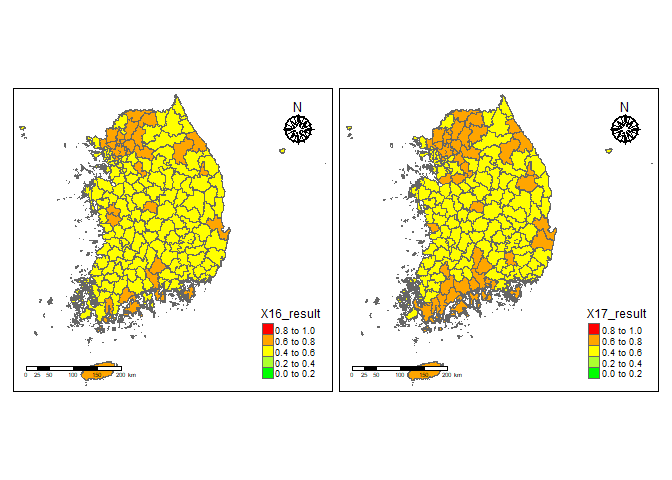<!-- -->

``` r
######################
#library(leaflet)
#library(rgdal)
#library(htmltools)
```

``` r
a <- st_transform(analysis_simp, 4326)
pal <- colorBin(
  palette=c("green", "greenyellow", "yellow", "orange", "red"),
  domain=NULL,
  bins = c(0, 0.2, 0.4, 0.6, 0.8, 1),
  pretty = FALSE)

leaflet(a) %>% 
  setView(lng = 128, lat = 35.9, zoom = 7) %>% 
  # base groups
  addPolygons(color = ~pal(X16_result),
              weight = 1,
              smoothFactor = 0.5,
              opacity = 1.0,
              fillOpacity = 0.5,
              label = ~htmlEscape(NameK),
              popup = ~htmlEscape(X16_result),
              highlightOptions = highlightOptions(color = "white",
                                                  weight = 2,
                                                  bringToFront = TRUE),
              group="result 2016") %>% 
  addPolygons(color = ~pal(X17_result),
              weight = 1,
              smoothFactor = 0.5,
              opacity = 1.0,
              fillOpacity = 0.5,
              label = ~htmlEscape(NameK),
              popup = ~htmlEscape(X17_result),
              highlightOptions = highlightOptions(color = "white",
                                                  weight = 2,
                                                  bringToFront = TRUE),
              group="result 2017") %>% 
  #overlay groups
  addProviderTiles(providers$Esri.WorldStreetMap,
                   group="Esri") %>%  
  addProviderTiles(providers$CartoDB.Positron,
                   group="CartoDB") %>%  
  addLegend("bottomright",
            pal = pal,
            values = ~X17_result,
            title = "RISK Index",
            labFormat = labelFormat(digits=10),
            opacity = 1) %>% 
  hideGroup("CartoDB") %>% 
  #Layer controls
  addLayersControl(baseGroups = c("result 2016", "result 2017"),
                   overlayGroups = c("Esri", "CartoDB"),
                   options=layersControlOptions(collapsed=FALSE))
```

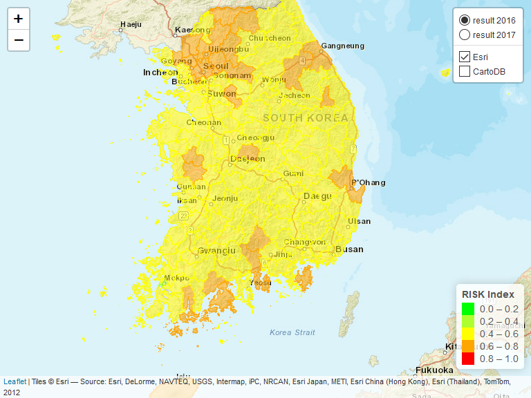<!-- -->

# 결과값 저장

``` r
write.csv(result, 'output/final_result1.csv')
```

# 최종 min-max 미포함(2)———————————————

## Hazard, Exposure, Vulnerability, Capacity는 최종 min-max 시행

# RISK = f(Hazard, Exposure, Vulnerability, Capacity)

``` r
# 원본 데이터 읽기
hazard <- read.csv('output/hazard_result.csv')
exposure <- read.csv('output/exposure_result.csv')
vulnerability <- read.csv('output/vulnerability_result.csv')
capacity <- read.csv('output/capacity_result.csv')


#데이터 결합
DB <- cbind(hazard, c(exposure[,4:5],vulnerability[,4:5],capacity[,4:6]))
head(DB, 3)
```

    ##                   Name         NameK   SGG X16_hazard X17_hazard X18_hazard
    ## 1 Gangwon Gangneung-si 강원도 강릉시 42150  1.0000000  1.0000000  1.0000000
    ## 2  Gangwon Goseong-gun 강원도 고성군 42820  0.5264574  0.5463284  0.6153013
    ## 3   Gangwon Donghae-si 강원도 동해시 42170  0.6123409  0.6041215  0.5936511
    ##   X16_exposure X17_exposure X16_vulnerability X17_vulnerability X16_capacity
    ## 1    0.3038772    0.3239064         0.5435461         0.4354101    0.7983780
    ## 2    0.1938716    0.1884191         0.6601949         0.6438191    0.7478007
    ## 3    0.3807366    0.3786649         0.3719887         0.3689875    0.7751020
    ##   X17_capacity X18_capacity
    ## 1    0.8558765    0.8870795
    ## 2    0.8281501    0.9009704
    ## 3    0.8444816    0.8442552

``` r
summary(DB)
```

    ##                     Name               NameK          SGG       
    ##  Busan                :  1   강원도 강릉시:  1   Min.   :11000  
    ##  Chungbuk Boeun-gun   :  1   강원도 고성군:  1   1st Qu.:42130  
    ##  Chungbuk Cheongju-si :  1   강원도 동해시:  1   Median :44800  
    ##  Chungbuk Chungju-si  :  1   강원도 삼척시:  1   Mean   :44074  
    ##  Chungbuk Danyang-gun :  1   강원도 속초시:  1   3rd Qu.:47130  
    ##  Chungbuk Eumseong-gun:  1   강원도 양구군:  1   Max.   :50000  
    ##  (Other)              :155   (Other)      :155                  
    ##    X16_hazard       X17_hazard       X18_hazard      X16_exposure   
    ##  Min.   :0.0000   Min.   :0.0000   Min.   :0.0000   Min.   :0.0000  
    ##  1st Qu.:0.3315   1st Qu.:0.3045   1st Qu.:0.3383   1st Qu.:0.2980  
    ##  Median :0.4577   Median :0.4459   Median :0.4473   Median :0.3624  
    ##  Mean   :0.4726   Mean   :0.4633   Mean   :0.4756   Mean   :0.3908  
    ##  3rd Qu.:0.6327   3rd Qu.:0.6444   3rd Qu.:0.6497   3rd Qu.:0.4641  
    ##  Max.   :1.0000   Max.   :1.0000   Max.   :1.0000   Max.   :1.0000  
    ##                                                                     
    ##   X17_exposure    X16_vulnerability X17_vulnerability  X16_capacity   
    ##  Min.   :0.0000   Min.   :0.0000    Min.   :0.0000    Min.   :0.0000  
    ##  1st Qu.:0.2917   1st Qu.:0.4964    1st Qu.:0.4605    1st Qu.:0.6876  
    ##  Median :0.3545   Median :0.6438    Median :0.6247    Median :0.7672  
    ##  Mean   :0.3871   Mean   :0.6282    Mean   :0.6114    Mean   :0.7428  
    ##  3rd Qu.:0.4652   3rd Qu.:0.8002    3rd Qu.:0.7778    3rd Qu.:0.8245  
    ##  Max.   :1.0000   Max.   :1.0000    Max.   :1.0000    Max.   :1.0000  
    ##                                                                       
    ##   X17_capacity     X18_capacity   
    ##  Min.   :0.0000   Min.   :0.0000  
    ##  1st Qu.:0.6749   1st Qu.:0.6745  
    ##  Median :0.7776   Median :0.7814  
    ##  Mean   :0.7386   Mean   :0.7474  
    ##  3rd Qu.:0.8445   3rd Qu.:0.8514  
    ##  Max.   :1.0000   Max.   :1.0000  
    ## 

# RISK 계산

``` r
# 16년~17년 홍수피해위험지수 산정
result_index_16 <- as.data.frame((rowSums(DB[,c("X16_hazard","X16_exposure","X16_vulnerability","X16_capacity")]))/4)
colnames(result_index_16) <- c("X16_result_index")
result_index_17 <- as.data.frame((rowSums(DB[,c("X17_hazard","X17_exposure","X17_vulnerability","X17_capacity")]))/4)
colnames(result_index_17) <- c("X17_result_index")
result_index <- cbind(DB[,1:3], c(result_index_16,result_index_17))
summary(result_index)
```

    ##                     Name               NameK          SGG       
    ##  Busan                :  1   강원도 강릉시:  1   Min.   :11000  
    ##  Chungbuk Boeun-gun   :  1   강원도 고성군:  1   1st Qu.:42130  
    ##  Chungbuk Cheongju-si :  1   강원도 동해시:  1   Median :44800  
    ##  Chungbuk Chungju-si  :  1   강원도 삼척시:  1   Mean   :44074  
    ##  Chungbuk Danyang-gun :  1   강원도 속초시:  1   3rd Qu.:47130  
    ##  Chungbuk Eumseong-gun:  1   강원도 양구군:  1   Max.   :50000  
    ##  (Other)              :155   (Other)      :155                  
    ##  X16_result_index X17_result_index
    ##  Min.   :0.3359   Min.   :0.3304  
    ##  1st Qu.:0.5177   1st Qu.:0.5147  
    ##  Median :0.5607   Median :0.5585  
    ##  Mean   :0.5586   Mean   :0.5501  
    ##  3rd Qu.:0.5972   3rd Qu.:0.5872  
    ##  Max.   :0.7378   Max.   :0.6896  
    ## 

``` r
# 연도별 데이터 프레임에 표준화 적용 안함.
result <- result_index[,4:5]
colnames(result) <- c("X16_result", "X17_result")
result <- cbind(DB[,1:3], result)
head(result, 3)
```

    ##                   Name         NameK   SGG X16_result X17_result
    ## 1 Gangwon Gangneung-si 강원도 강릉시 42150  0.6614503  0.6537982
    ## 2  Gangwon Goseong-gun 강원도 고성군 42820  0.5320812  0.5516792
    ## 3   Gangwon Donghae-si 강원도 동해시 42170  0.5350421  0.5490639

``` r
summary(result)
```

    ##                     Name               NameK          SGG       
    ##  Busan                :  1   강원도 강릉시:  1   Min.   :11000  
    ##  Chungbuk Boeun-gun   :  1   강원도 고성군:  1   1st Qu.:42130  
    ##  Chungbuk Cheongju-si :  1   강원도 동해시:  1   Median :44800  
    ##  Chungbuk Chungju-si  :  1   강원도 삼척시:  1   Mean   :44074  
    ##  Chungbuk Danyang-gun :  1   강원도 속초시:  1   3rd Qu.:47130  
    ##  Chungbuk Eumseong-gun:  1   강원도 양구군:  1   Max.   :50000  
    ##  (Other)              :155   (Other)      :155                  
    ##    X16_result       X17_result    
    ##  Min.   :0.3359   Min.   :0.3304  
    ##  1st Qu.:0.5177   1st Qu.:0.5147  
    ##  Median :0.5607   Median :0.5585  
    ##  Mean   :0.5586   Mean   :0.5501  
    ##  3rd Qu.:0.5972   3rd Qu.:0.5872  
    ##  Max.   :0.7378   Max.   :0.6896  
    ## 

연도별 확률밀도함수

``` r
result_p <- result %>% 
  select(-Name)
head(result_p, 3)
```

    ##           NameK   SGG X16_result X17_result
    ## 1 강원도 강릉시 42150  0.6614503  0.6537982
    ## 2 강원도 고성군 42820  0.5320812  0.5516792
    ## 3 강원도 동해시 42170  0.5350421  0.5490639

``` r
result_p_p <- result_p %>%                           # pivoting
  pivot_longer(c("X16_result", "X17_result"),
               names_to = "year",
               values_to = "result")
result_p_p %>% 
  ggplot()+
  geom_density(aes(x=result, y=..density.., color=year))
```

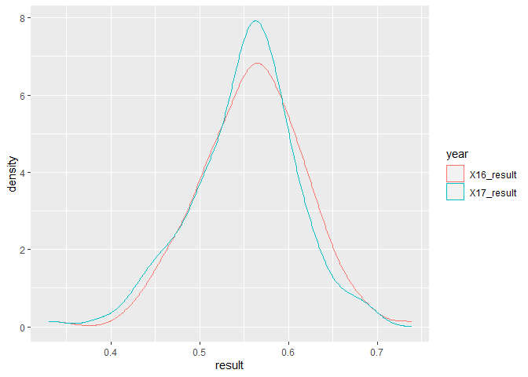<!-- -->

``` r
result_p %>% 
  ggplot(aes(X17_result))+
  geom_histogram(bins=100)
```

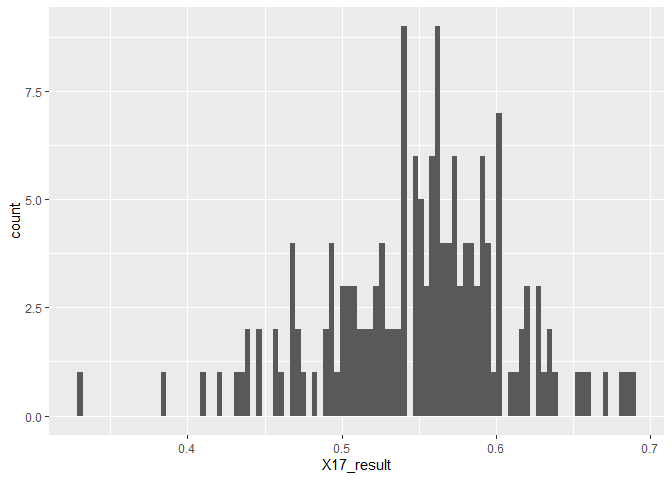<!-- -->

``` r
result_p_p %>% 
  group_by(NameK) %>% 
  mutate(mean=mean(result))%>% 
  ggplot(aes(x=fct_reorder(NameK, mean),
             y=result))+
  geom_boxplot()+
  coord_flip()
```

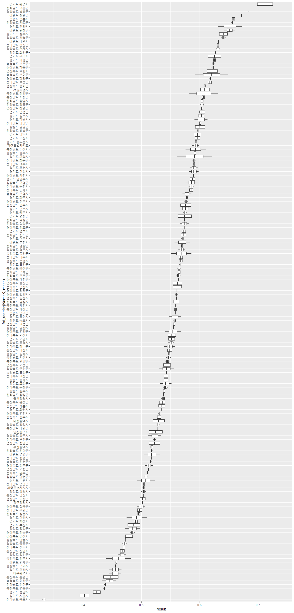<!-- -->

``` r
result_p_p %>% 
  group_by(NameK) %>% 
  mutate(mean=mean(result))%>%   
  filter(mean < 0.50) %>%            #35% 이하
  ggplot(aes(x=fct_reorder(NameK, mean),
             y=result))+
  geom_boxplot()+
  coord_flip()
```

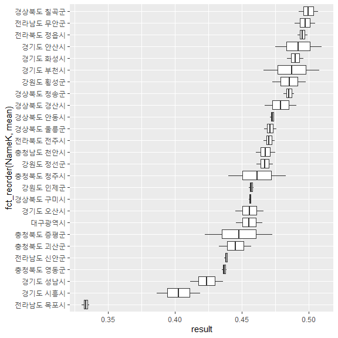<!-- -->

``` r
result_p_p %>% 
  group_by(NameK) %>% 
  mutate(mean=mean(result))%>%   
  filter(mean > 0.65) %>%            #75% 이상
  ggplot(aes(x=fct_reorder(NameK, mean),
             y=result))+
  geom_boxplot()+
  coord_flip()
```

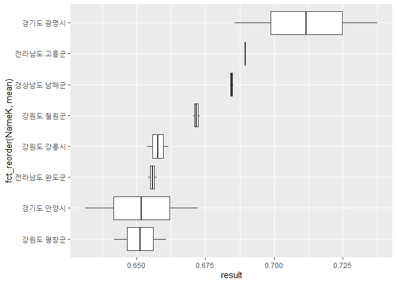<!-- -->

``` r
result_p %>% 
  mutate(dif=(X17_result - X16_result)) %>% 
  filter(NameK == "서울특별시")
```

    ##        NameK   SGG X16_result X17_result        dif
    ## 1 서울특별시 11000  0.6239241  0.5933554 -0.0305687

``` r
result_p_dif <- result_p%>%
  mutate(dif=(X17_result - X16_result)) %>% 
  arrange(-dif)
knitr::kable(result_p_dif[1:10, ])  # 침수구역내 총인구가 늘어난 시군
```

| NameK    |   SGG | X16\_result | X17\_result |       dif |
| :------- | ----: | ----------: | ----------: | --------: |
| 경상남도 함안군 | 48730 |   0.5032908 |   0.5412200 | 0.0379292 |
| 강원도 양양군  | 42830 |   0.5842108 |   0.6165195 | 0.0323087 |
| 강원도 영월군  | 42750 |   0.5041376 |   0.5314937 | 0.0273561 |
| 경상북도 영양군 | 47760 |   0.5406170 |   0.5676324 | 0.0270154 |
| 경상북도 군위군 | 47720 |   0.5300093 |   0.5562900 | 0.0262807 |
| 강원도 춘천시  | 42110 |   0.5570555 |   0.5827381 | 0.0256826 |
| 강원도 횡성군  | 42730 |   0.4726579 |   0.4977348 | 0.0250768 |
| 경상북도 의성군 | 47730 |   0.5315981 |   0.5559604 | 0.0243622 |
| 강원도 고성군  | 42820 |   0.5320812 |   0.5516792 | 0.0195980 |
| 강원도 평창군  | 42760 |   0.6418062 |   0.6606224 | 0.0188162 |

``` r
knitr::kable(result_p_dif[152:161, ])  # 침수구역내 총인구가 줄어든 시군
```

|     | NameK    |   SGG | X16\_result | X17\_result |         dif |
| --- | :------- | ----: | ----------: | ----------: | ----------: |
| 152 | 경기도 부천시  | 41190 |   0.5078465 |   0.4662280 | \-0.0416184 |
| 153 | 충청북도 청주시 | 43110 |   0.4825669 |   0.4397122 | \-0.0428548 |
| 154 | 경기도 구리시  | 41310 |   0.6481129 |   0.6026685 | \-0.0454445 |
| 155 | 인천광역시    | 28000 |   0.5474271 |   0.5012511 | \-0.0461761 |
| 156 | 경기도 연천군  | 41800 |   0.5975274 |   0.5504261 | \-0.0471013 |
| 157 | 충청남도 청양군 | 44790 |   0.6318255 |   0.5824347 | \-0.0493908 |
| 158 | 충청북도 증평군 | 43745 |   0.4728763 |   0.4224156 | \-0.0504607 |
| 159 | 경기도 광명시  | 41210 |   0.7378076 |   0.6856452 | \-0.0521624 |
| 160 | 충청남도 부여군 | 44760 |   0.6483235 |   0.5917009 | \-0.0566225 |
| 161 | 경기도 고양시  | 41280 |   0.6211773 |   0.5610518 | \-0.0601255 |

``` r
result_p_p %>% 
  group_by(year) %>% 
  ggplot(aes(result, SGG))+
  geom_point(aes(color=factor(SGG)))+
  facet_grid(. ~year)+
  theme(legend.position = "none")
```

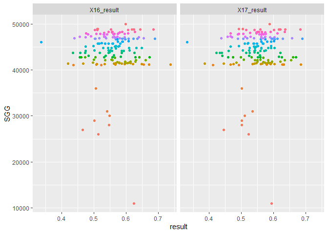<!-- -->

# RISK \~ f(Hazard, Exposure, VUlnerability, Capacity) 분석

## RISK \~ Hazard

``` r
result_p <- result %>% 
  pivot_longer(c("X16_result","X17_result"), names_to = "year", values_to = "risk")
hazard_p <- hazard %>% 
  pivot_longer(c("X16_hazard", "X17_hazard"), names_to = "year", values_to = "hazard")
hazard_path <- cbind(result_p, hazard_p[,6])

hazard_path %>% 
  group_by(NameK) %>% 
  filter(str_detect(NameK, "^강원") ) %>% 
  ggplot(aes(risk, hazard,col=NameK))+
  geom_path(arrow=arrow(angle=10,
                        ends="last",
                        type="closed",
                        length = unit(0.15, "inches")),
            show.legend = F)+
  geom_point(size=2, alpha=0.4, show.legend = F)+
  geom_vline(xintercept = 0.5, alpha=0.3)+
  geom_hline(yintercept = 0.5, alpha=0.3)+
  labs(x="RISK", y="Hazard")+
  directlabels::geom_dl(aes(label=NameK),
                        method = list("first.points",rot=45), 
                        position = "identity",
                        alpha=0.3)+
  scale_x_continuous(limits = c(0,1))+
  scale_y_continuous(limits = c(0,1))
```

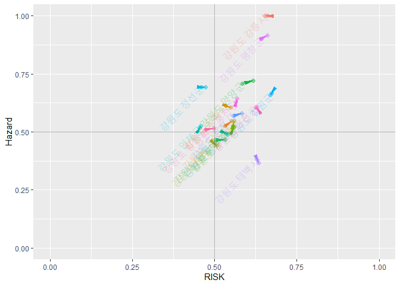<!-- -->

## RISK \~ Exposure

``` r
exposure_p <- exposure %>% 
  pivot_longer(c("X16_exposure", "X17_exposure"), names_to = "year", values_to = "exposure")
exposure_path <- cbind(result_p, exposure_p[,5])

exposure_path %>% 
  group_by(NameK) %>% 
  filter(str_detect(NameK, "^강원") ) %>% 
  ggplot(aes(risk, exposure,col=NameK))+
  geom_path(arrow=arrow(angle=10,
                        ends="last",
                        type="closed",
                        length = unit(0.15, "inches")),
            show.legend = F)+
  geom_point(size=2, alpha=0.4, show.legend = F)+
  geom_vline(xintercept = 0.5, alpha=0.3)+
  geom_hline(yintercept = 0.5, alpha=0.3)+
  labs(x="RISK", y="Exposure")+
  directlabels::geom_dl(aes(label=NameK),
                        method = list("first.points",rot=45), 
                        position = "identity",
                        alpha=0.3)+
  scale_x_continuous(limits = c(0,1))+
  scale_y_continuous(limits = c(0,1))
```

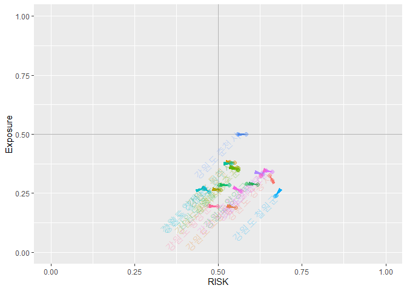<!-- -->

## RISK \~ Vulnerability

``` r
vulnerability_p <- vulnerability %>% 
  pivot_longer(c("X16_vulnerability", "X17_vulnerability"), names_to = "year", values_to = "vulnerability")
vulnerability_path <- cbind(result_p, vulnerability_p[,5])

vulnerability_path %>% 
  group_by(NameK) %>% 
  filter(str_detect(NameK, "^강원") ) %>% 
  ggplot(aes(risk, vulnerability,col=NameK))+
  geom_path(arrow=arrow(angle=10,
                        ends="last",
                        type="closed",
                        length = unit(0.15, "inches")),
            show.legend = F)+
  geom_point(size=2, alpha=0.4, show.legend = F)+
  geom_vline(xintercept = 0.5, alpha=0.3)+
  geom_hline(yintercept = 0.5, alpha=0.3)+
  labs(x="RISK", y="Vulnerability")+
  directlabels::geom_dl(aes(label=NameK),
                        method = list("first.points",rot=45), 
                        position = "identity",
                        alpha=0.3)+
  scale_x_continuous(limits = c(0,1))+
  scale_y_continuous(limits = c(0,1))
```

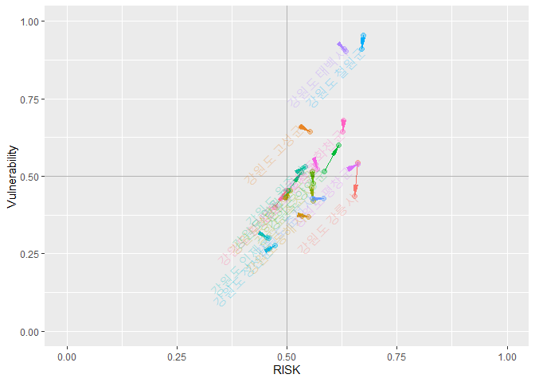<!-- -->

## RISK \~ Capacity

``` r
capacity_p <- capacity %>% 
  pivot_longer(c("X16_capacity", "X17_capacity"), names_to = "year", values_to = "capacity")
capacity_path <- cbind(result_p, capacity_p[,6])

capacity_path %>% 
  group_by(NameK) %>% 
  filter(str_detect(NameK, "^강원") ) %>% 
  ggplot(aes(risk, capacity, col=NameK))+
  geom_path(arrow=arrow(angle=10,
                        ends="last",
                        type="closed",
                        length = unit(0.15, "inches")),
            show.legend = F)+
  geom_point(size=2, alpha=0.4, show.legend = F)+
  geom_vline(xintercept = 0.5, alpha=0.3)+
  geom_hline(yintercept = 0.5, alpha=0.3)+
  labs(x="RISK", y="Capacity")+
  directlabels::geom_dl(aes(label=NameK),
                        method = list("first.points",rot=45), 
                        position = "identity",
                        alpha=0.3)+
  scale_x_continuous(limits = c(0,1))+
  scale_y_continuous(limits = c(0,1))
```

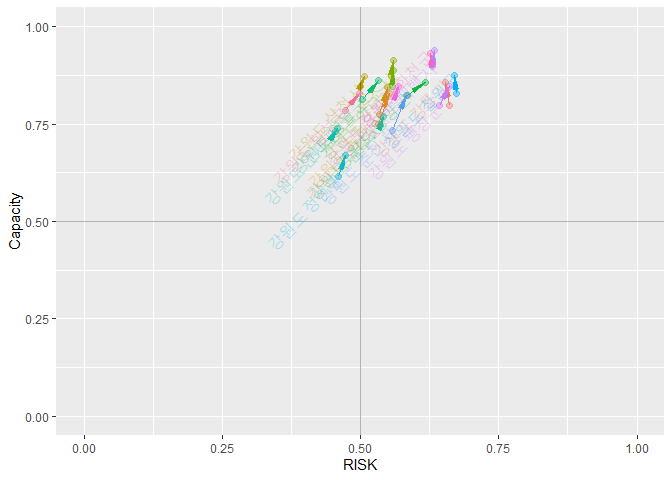<!-- -->

# Mapping

시군 shp 파일 불러오기

``` r
analysis <- st_read("input/analysis.shp")
```

    ## Reading layer `analysis' from data source `C:\00_R\0_Git\KRM_inha\input\analysis.shp' using driver `ESRI Shapefile'
    ## Simple feature collection with 161 features and 3 fields
    ## geometry type:  MULTIPOLYGON
    ## dimension:      XY
    ## bbox:           xmin: 746109.3 ymin: 1458771 xmax: 1387956 ymax: 2068444
    ## proj4string:    +proj=tmerc +lat_0=38 +lon_0=127.5 +k=0.9996 +x_0=1000000 +y_0=2000000 +ellps=GRS80 +units=m +no_defs

``` r
# 폴리곤 에러 체크(기본 파일을 에러 수정한 파일로 변경하였음)
#st_is_valid(analysis)
#library(lwgeom)
#analysis <- st_make_valid(analysis)
st_is_valid(analysis)
```

    ##   [1] TRUE TRUE TRUE TRUE TRUE TRUE TRUE TRUE TRUE TRUE TRUE TRUE TRUE TRUE TRUE
    ##  [16] TRUE TRUE TRUE TRUE TRUE TRUE TRUE TRUE TRUE TRUE TRUE TRUE TRUE TRUE TRUE
    ##  [31] TRUE TRUE TRUE TRUE TRUE TRUE TRUE TRUE TRUE TRUE TRUE TRUE TRUE TRUE TRUE
    ##  [46] TRUE TRUE TRUE TRUE TRUE TRUE TRUE TRUE TRUE TRUE TRUE TRUE TRUE TRUE TRUE
    ##  [61] TRUE TRUE TRUE TRUE TRUE TRUE TRUE TRUE TRUE TRUE TRUE TRUE TRUE TRUE TRUE
    ##  [76] TRUE TRUE TRUE TRUE TRUE TRUE TRUE TRUE TRUE TRUE TRUE TRUE TRUE TRUE TRUE
    ##  [91] TRUE TRUE TRUE TRUE TRUE TRUE TRUE TRUE TRUE TRUE TRUE TRUE TRUE TRUE TRUE
    ## [106] TRUE TRUE TRUE TRUE TRUE TRUE TRUE TRUE TRUE TRUE TRUE TRUE TRUE TRUE TRUE
    ## [121] TRUE TRUE TRUE TRUE TRUE TRUE TRUE TRUE TRUE TRUE TRUE TRUE TRUE TRUE TRUE
    ## [136] TRUE TRUE TRUE TRUE TRUE TRUE TRUE TRUE TRUE TRUE TRUE TRUE TRUE TRUE TRUE
    ## [151] TRUE TRUE TRUE TRUE TRUE TRUE TRUE TRUE TRUE TRUE TRUE

``` r
# shp파일에 연도별 홍수피해위험지수(표준화 적용) 추가
analysis <- right_join(analysis, result[,3:5])
```

    ## Joining, by = "SGG"

``` r
# 폴리곤 단순화
analysis_simp <- st_simplify(analysis, dTolerance = 50)

# 결과 확인
tmap_mode("plot")
```

    ## tmap mode set to plotting

``` r
breaks = c(0, 0.2, 0.4, 0.6, 0.8, 1)
facets=c("X16_result", "X17_result")
tm_shape(analysis_simp)+
  tm_polygons(facets,
              breaks=breaks,
              palette = c("green", "greenyellow", "yellow", "orange", "red"),
              legend.reverse = TRUE)+
  tm_facets(ncol = 2)+
  tm_layout(legend.position = c("right", "bottom"))+
  tm_compass(type = "rose",
             position = c("right", "top"),
             size = 2.0)+
  tm_scale_bar(breaks = c(0, 25, 50, 100, 150, 200),
               position = c("left", "bottom"))
```

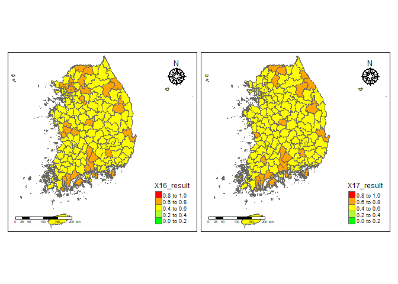<!-- -->

``` r
######################
#library(leaflet)
#library(rgdal)
#library(htmltools)
```

``` r
a <- st_transform(analysis_simp, 4326)
pal <- colorBin(
  palette=c("green", "greenyellow", "yellow", "orange", "red"),
  domain=NULL,
  bins = c(0, 0.2, 0.4, 0.6, 0.8, 1),
  pretty = FALSE)

leaflet(a) %>% 
  setView(lng = 128, lat = 35.9, zoom = 7) %>% 
  # base groups
  addPolygons(color = ~pal(X16_result),
              weight = 1,
              smoothFactor = 0.5,
              opacity = 1.0,
              fillOpacity = 0.5,
              label = ~htmlEscape(NameK),
              popup = ~htmlEscape(X16_result),
              highlightOptions = highlightOptions(color = "white",
                                                  weight = 2,
                                                  bringToFront = TRUE),
              group="result 2016") %>% 
  addPolygons(color = ~pal(X17_result),
              weight = 1,
              smoothFactor = 0.5,
              opacity = 1.0,
              fillOpacity = 0.5,
              label = ~htmlEscape(NameK),
              popup = ~htmlEscape(X17_result),
              highlightOptions = highlightOptions(color = "white",
                                                  weight = 2,
                                                  bringToFront = TRUE),
              group="result 2017") %>% 
  #overlay groups
  addProviderTiles(providers$Esri.WorldStreetMap,
                   group="Esri") %>%  
  addProviderTiles(providers$CartoDB.Positron,
                   group="CartoDB") %>%  
  addLegend("bottomright",
            pal = pal,
            values = ~X17_result,
            title = "RISK Index",
            labFormat = labelFormat(digits=10),
            opacity = 1) %>% 
  hideGroup("CartoDB") %>% 
  #Layer controls
  addLayersControl(baseGroups = c("result 2016", "result 2017"),
                   overlayGroups = c("Esri", "CartoDB"),
                   options=layersControlOptions(collapsed=FALSE))
```

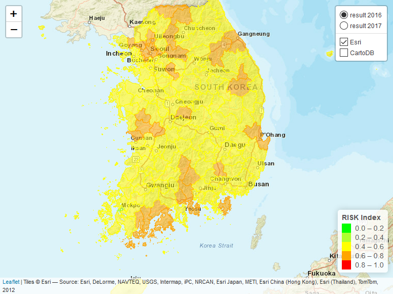<!-- -->

# 결과값 저장

``` r
write.csv(result, 'output/final_result2.csv')


# 열 명칭별 의미

# Name : 161개 시군별 영문명
# NameK : 161개 시군별 한글명
# SGG : 시군구 코드
# X16_hazard : 16년도 hazard 지수(표준화 적용)
# X17_hazard : 17년도 hazard 지수(표준화 적용)
# X18_hazard : 18년도 hazard 지수(표준화 적용)
# X16_exposure : 16년도 Exposure 지수(표준화 적용)
# X17_exposure : 17년도 Exposure 지수(표준화 적용)
# X16_vulnerability : 16년도 Vulnerability 지수(표준화 적용)
# X17_vulnerability : 17년도 Vulnerability 지수(표준화 적용)
# X16_capacity : 16년도 Capacity 지수(표준화 적용)
# X17_capacity : 17년도 Capacity 지수(표준화 적용)
# X18_capacity : 18년도 Capacity 지수(표준화 적용)
# X16_result_index : 16년도 홍수피해위험지수
# X17_result_index : 17년도 홍수피해위험지수
# X16_result : 16년도 홍수피해위험지수(표준화 적용)
# X17_result : 17년도 홍수피해위험지수(표준화 적용)
```
