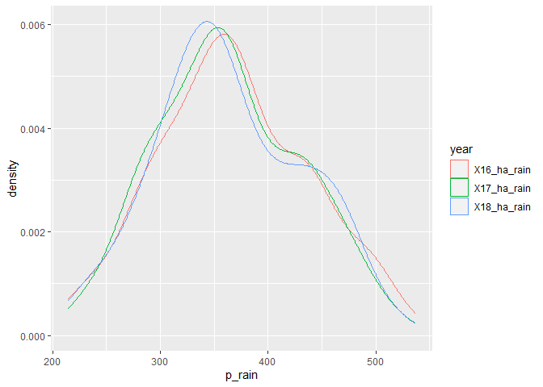
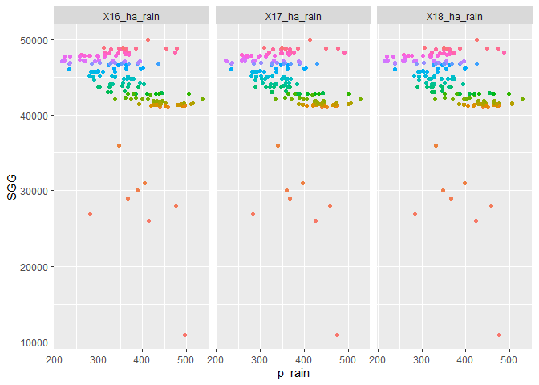
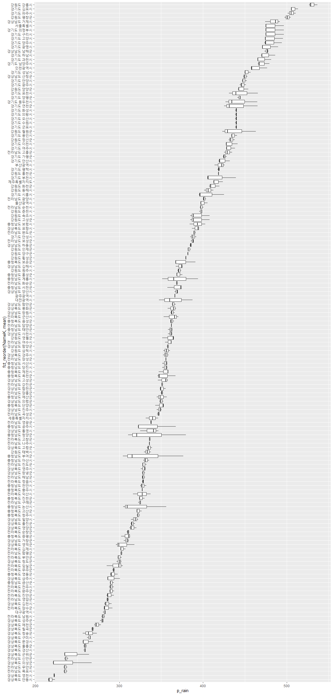
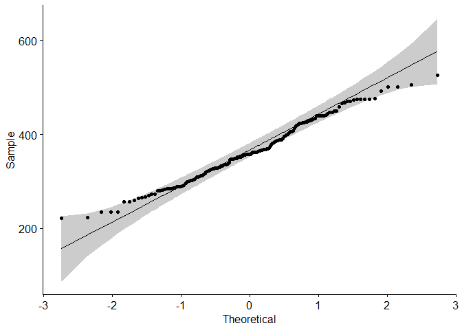
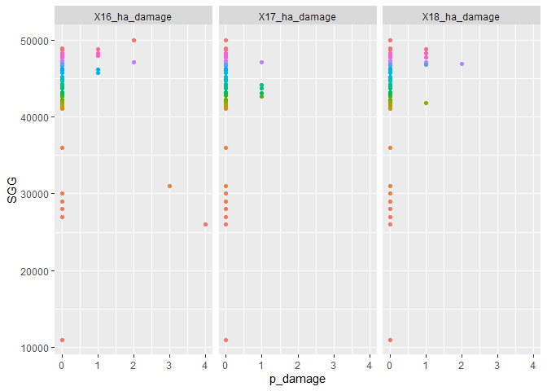
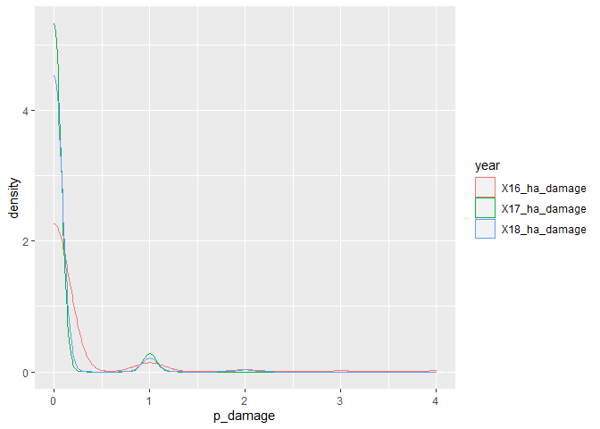
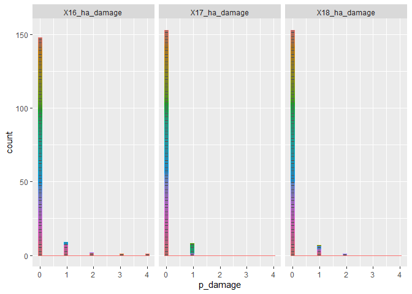
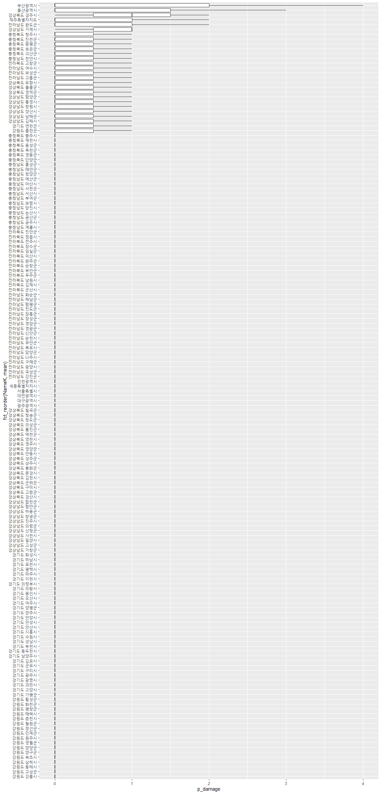
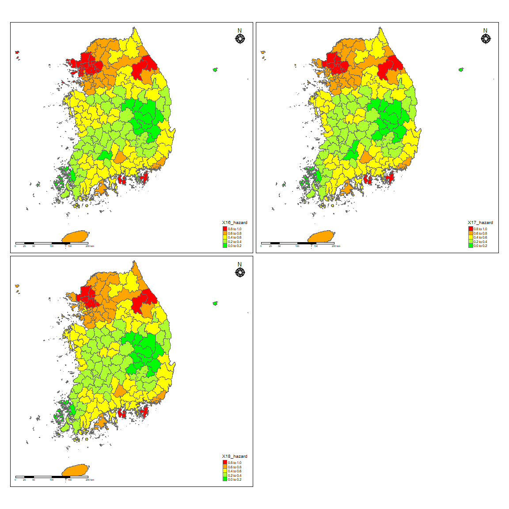
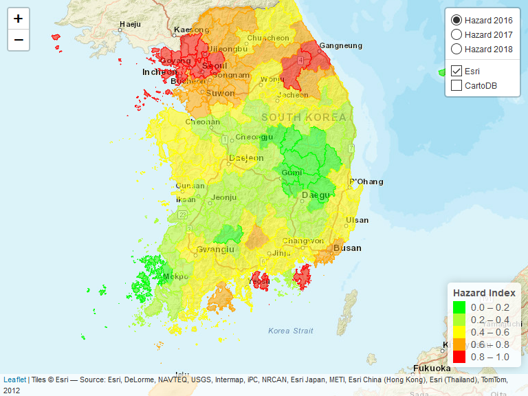

Hazard-확률강우량
================
Kyungtak Kim
2020 3 26

``` r
library(tidyverse)
library(sf)
library(tmap)
Sys.setenv(Language="En")
library(caret)
library(leaflet)
library(rgdal)
library(htmltools)
#install.packages("ggpubr")
library(ggpubr)
```

# 원본 데이터 읽기 / 특성 분석

``` r
DB <- read.csv('input/hazard_db.csv')
head(DB, 3)
```

    ##                   Name         NameK   SGG X16_ha_rain X17_ha_rain X18_ha_rain
    ## 1 Gangwon Gangneung-si 강원도 강릉시 42150    536.5288    526.7586    528.8285
    ## 2  Gangwon Goseong-gun 강원도 고성군 42820    384.9000    388.6000    408.0000
    ## 3   Gangwon Donghae-si 강원도 동해시 42170    412.4000    406.2000    401.2000
    ##   X16_ha_damage X17_ha_damage X18_ha_damage
    ## 1             0             0             0
    ## 2             0             0             0
    ## 3             0             0             0

## 확률강우량 자료(최근 30년간의 자료 이용)에 대한 분석

연도별 확률밀도함수를 보면…..

``` r
DB_h<- DB %>% 
  select(NameK, SGG, contains("rain"))
DB_h_p <- DB_h %>%                           # pivoting
  pivot_longer(c("X16_ha_rain", "X17_ha_rain", "X18_ha_rain"),
               names_to = "year",
               values_to = "p_rain")
DB_h_p %>% 
  ggplot()+
  geom_density(aes(x=p_rain, y=..density.., color=year))
```

<!-- -->

SGG는 시군 고유번호로 지역별 대략적인 분포를 알 수 있다.

``` r
DB_h_p %>% 
  group_by(year) %>% 
  ggplot(aes(p_rain, SGG))+
  geom_point(aes(color=factor(SGG)))+
  facet_grid(. ~year)+
  theme(legend.position = "none")
```

<!-- -->

각 시군별 16-18년사이의 확률강우량의 변화를 보면 충청남도 지역의 일부 지역이 변화가 가장 심하다.

``` r
DB_h_p %>% 
  group_by(NameK) %>% 
  mutate(mean=mean(p_rain))%>% 
  ggplot(aes(x=fct_reorder(NameK, mean),
             y=p_rain))+
  geom_boxplot()+
  coord_flip()
```

<!-- -->

정규성(Normality test)  
\*\* shapiro-wilk normality test\*\*  
\*\* p-value가 모두 0.05 보다 크게 나오므로 정규분포를 따른다고 볼 수 있다\*\*

``` r
ggqqplot(DB$X16_ha_rain)
```

<!-- -->

``` r
shapiro.test(DB$X16_ha_rain)
```

    ## 
    ##  Shapiro-Wilk normality test
    ## 
    ## data:  DB$X16_ha_rain
    ## W = 0.98744, p-value = 0.1582

``` r
ggqqplot(DB$X17_ha_rain)
```

<!-- -->

``` r
shapiro.test(DB$X17_ha_rain)
```

    ## 
    ##  Shapiro-Wilk normality test
    ## 
    ## data:  DB$X17_ha_rain
    ## W = 0.98613, p-value = 0.1097

``` r
ggqqplot(DB$X18_ha_rain)
```

<!-- -->

``` r
shapiro.test(DB$X18_ha_rain)
```

    ## 
    ##  Shapiro-Wilk normality test
    ## 
    ## data:  DB$X18_ha_rain
    ## W = 0.98404, p-value = 0.06099

## 우심피해횟수 자료에 대한 분석

``` r
DB_h<- DB %>% 
  select(NameK, SGG, contains("damage"))
DB_h_p <- DB_h %>%                           # pivoting
  pivot_longer(c("X16_ha_damage", "X17_ha_damage", "X18_ha_damage"),
               names_to = "year",
               values_to = "p_damage")
DB_h_p %>% 
  ggplot()+
  geom_density(aes(x=p_damage, y=..density.., color=year))
```

<!-- -->

``` r
DB_h_p %>% 
  ggplot(aes(p_damage))+
  geom_histogram(aes(color=factor(SGG)))+
  facet_grid(.~year)+
  theme(legend.position = "none")
```

    ## `stat_bin()` using `bins = 30`. Pick better value with `binwidth`.

<!-- -->

``` r
DB_h_p %>% 
  group_by(year) %>% 
  ggplot(aes(p_damage, SGG))+
  geom_point(aes(color=factor(SGG)))+
  facet_grid(. ~year)+
  theme(legend.position = "none")
```

<!-- -->

각 시군별 16-18년사이의 확률강우량의 변화를 보면 충청남도 지역의 일부 지역이 변화가 가장 심하다.

``` r
DB_h_p %>% 
  group_by(NameK) %>% 
  mutate(mean=mean(p_damage))%>% 
  ggplot(aes(x=fct_reorder(NameK, mean),
             y=p_damage))+
  geom_boxplot()+
  coord_flip()
```

<!-- -->

# 확률강우량 정규화(Normalization Function)함수

## \[주\] 위 우심피해횟수는 일단 사용하지 않는다.

``` r
standard <- function(x){
  return((x-min(x))/(max(x)-min(x)))
}
```

# 161개 시군별 변화 Mapping

``` r
# 연도별 데이터 프레임에 정규화 적용
result <- as.data.frame(lapply(DB[,4:6],standard))
colnames(result) <- c("X16_hazard", "X17_hazard", "X18_hazard")
result <- cbind(DB[,1:3], result)

# 시군 shp 파일 불러오기
analysis <- st_read("input/analysis.shp")
```

    ## Reading layer `analysis' from data source `C:\00_R\0_Git\KRM_inha\input\analysis.shp' using driver `ESRI Shapefile'
    ## Simple feature collection with 161 features and 3 fields
    ## geometry type:  MULTIPOLYGON
    ## dimension:      XY
    ## bbox:           xmin: 746109.3 ymin: 1458771 xmax: 1387956 ymax: 2068444
    ## proj4string:    +proj=tmerc +lat_0=38 +lon_0=127.5 +k=0.9996 +x_0=1000000 +y_0=2000000 +ellps=GRS80 +units=m +no_defs

``` r
# 폴리곤 에러 체크(기본 파일을 에러 수정한 파일로 변경하였음)
#st_is_valid(analysis)
#library(lwgeom)
#analysis <- st_make_valid(analysis)
#st_is_valid(analysis)

# shp파일에 연도별 hazard 지수(표준화 적용) 추가
analysis <- right_join(analysis, result[,3:6])
```

    ## Joining, by = "SGG"

``` r
# 폴리곤 단순화
analysis_simp <- st_simplify(analysis, dTolerance = 50)
```

``` r
# 결과 확인
tmap_mode("plot")
```

    ## tmap mode set to plotting

``` r
breaks = c(0, 0.2, 0.4, 0.6, 0.8, 1)
facets=c("X16_hazard", "X17_hazard", "X18_hazard")
tm_shape(analysis_simp)+
  tm_polygons(facets,
              breaks=breaks,
              palette = c("green", "greenyellow", "yellow", "orange", "red"),
              legend.reverse = TRUE)+
  tm_layout(legend.position = c("right", "bottom"))+
  tm_compass(type = "rose",
             position = c("right", "top"),
             size = 1.5)+
  tm_scale_bar(breaks = c(0, 25, 50, 100, 150, 200),
               position = c("left", "bottom"))+
  tm_facets(nrow=2)
```

<!-- -->

``` r
###################
```

leaflet test

``` r
a <- st_transform(analysis_simp, 4326)
pal <- colorBin(palette=c("green", "greenyellow", "yellow", "orange", "red"),
                domain=NULL,
                bins = c(0, .2, .4, .6, 0.8, 1),
                pretty = FALSE)

leaflet(a) %>% 
  setView(lng = 128, lat = 35.9, zoom = 7) %>% 
  # base groups
  addPolygons(color = ~pal(X16_hazard),
              weight = 1,
              smoothFactor = 0.5,
              opacity = 1.0,
              fillOpacity = 0.5,
              label = ~htmlEscape(NameK),
              popup = ~htmlEscape(X16_hazard),
              highlightOptions = highlightOptions(color = "white",
                                                  weight = 2,
                                                  bringToFront = TRUE),
              group="Hazard 2016") %>% 
  addPolygons(color = ~pal(X17_hazard),
              weight = 1,
              smoothFactor = 0.5,
              opacity = 1.0,
              fillOpacity = 0.5,
              label = ~htmlEscape(NameK),
              popup = ~htmlEscape(X17_hazard),
              highlightOptions = highlightOptions(color = "white",
                                                  weight = 2,
                                                  bringToFront = TRUE),
              group="Hazard 2017") %>%
  addPolygons(color = ~pal(X18_hazard),
              weight = 1,
              smoothFactor = 0.5,
              opacity = 1.0,
              fillOpacity = 0.5,
              label = ~htmlEscape(NameK),
              popup = ~htmlEscape(X18_hazard),
              highlightOptions = highlightOptions(color = "white",
                                                  weight = 2,
                                                  bringToFront = TRUE),
              group="Hazard 2018") %>%
  # overlay groups
  addProviderTiles(providers$Esri.WorldStreetMap,
                   group="Esri") %>%  #CartoDB.Positron
  addProviderTiles(providers$CartoDB.Positron,
                   group="CartoDB") %>%  
  addLegend("bottomright",
            pal = pal,
            values = ~X16_hazard,
            title = "Hazard Index",
            labFormat = labelFormat(digits=10),
            opacity = 1) %>% 
  hideGroup("CartoDB") %>% 
  #Layer controls
  addLayersControl(baseGroups = c("Hazard 2016", "Hazard 2017", "Hazard 2018"),
                   overlayGroups = c("Esri", "CartoDB"),
                   options=layersControlOptions(collapsed=FALSE))
```

<!-- -->

``` r
##############
```

# 결과값 저장

``` r
write.csv(result, 'output/hazard_result.csv', row.names = F)

# 열 명칭별 의미

# Name : 161개 시군별 영문명
# NameK : 161개 시군별 한글명
# SGG : 시군구 코드
# X16_ha_pro : 16년도 확률강우량(mm)
# X17_ha_pro : 17년도 확률강우량(mm)
# X18_ha_pro : 18년도 확률강우량(mm)
# X16_hazard : 16년도 hazard 지수(표준화 적용)
# X17_hazard : 17년도 hazard 지수(표준화 적용)
# X18_hazard : 18년도 hazard 지수(표준화 적용)
```
