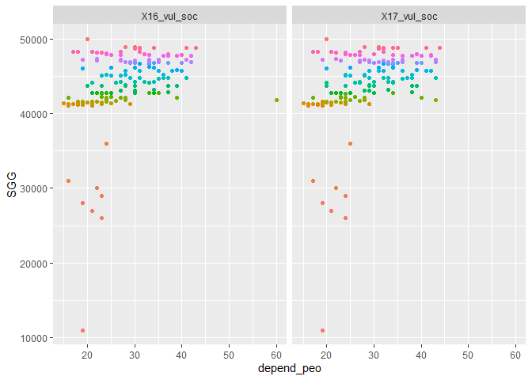

Vulnerability - 노후건축물비율, 의존인구비율
================
Kyungtak Kim
2020 3 26

``` r
# 패키지 설치
#install.packages("sf")
#install.packages("tmap")
#install.packages("dplyr")
```

``` r
library(tidyverse)
library(sf)
library(tmap)
Sys.setenv(Language="En")
library(caret)
library(knitr)
library(leaflet)
library(rgdal)
library(htmltools)
#install.packages("ggpubr")
library(ggpubr)
```

# 원본 데이터 읽기

``` r
DB <- read.csv('input/vulnerability_db.csv')
head(DB,3)
```

    ##                   Name         NameK   SGG X16_vul_phy X16_vul_soc X17_vul_phy
    ## 1 Gangwon Gangneung-si 강원도 강릉시 42150          45          27          40
    ## 2  Gangwon Goseong-gun 강원도 고성군 42820          53          30          50
    ## 3   Gangwon Donghae-si 강원도 동해시 42170          50          16          51
    ##   X17_vul_soc
    ## 1          23
    ## 2          30
    ## 3          17

## 노후건축물 비율(%)에 대한 분석

``` r
DB_o <- DB %>% 
  select(NameK, SGG, contains("phy"))
head(DB_o, 3)
```

    ##           NameK   SGG X16_vul_phy X17_vul_phy
    ## 1 강원도 강릉시 42150          45          40
    ## 2 강원도 고성군 42820          53          50
    ## 3 강원도 동해시 42170          50          51

``` r
DB_o_p <- DB_o %>%                           # pivoting
  pivot_longer(c("X16_vul_phy", "X17_vul_phy"),
               names_to = "year",
               values_to = "old_build")
DB_o_p %>% 
  ggplot()+
  geom_density(aes(x=old_build, y=..density.., color=year))
```

<!-- -->

SGG는 시군 고유번호로 지역별 대략적인 분포를 알 수 있다.  
서울시의 노후건출무 비율이 75% 정도임.

``` r
DB_o_p %>% 
  group_by(year) %>% 
  ggplot(aes(old_build, SGG))+
  geom_point(aes(color=factor(SGG)))+
  facet_grid(. ~year)+
  theme(legend.position = "none")
```

<!-- -->

충북증평군이 16-17년 노후건축물의 차이가 가장 큰 이유는?

``` r
DB_o_p %>% 
  group_by(NameK) %>% 
  mutate(mean=mean(old_build))%>% 
  ggplot(aes(x=fct_reorder(NameK, mean),
             y=old_build))+
  geom_boxplot()+
  coord_flip()
```

<!-- -->

정규성(Normality test)  
\*\* shapiro-wilk normality test\*\*  
\*\* p-value가 모두 0.05 보다 작게나오므로 정규성 가정에 위배된다.\*\*

``` r
ggqqplot(DB$X16_vul_phy)
```

<!-- -->

``` r
shapiro.test(DB$X16_vul_phy)
```

    ## 
    ##  Shapiro-Wilk normality test
    ## 
    ## data:  DB$X16_vul_phy
    ## W = 0.95446, p-value = 4.199e-05

``` r
ggqqplot(DB$X17_vul_phy)
```

<!-- -->

``` r
shapiro.test(DB$X17_vul_phy)
```

    ## 
    ##  Shapiro-Wilk normality test
    ## 
    ## data:  DB$X17_vul_phy
    ## W = 0.95726, p-value = 7.593e-05

## 의존인구비율(%)에 대한 분석

``` r
DB_d <- DB %>% 
  select(NameK, SGG, contains("soc"))
head(DB_d, 3)
```

    ##           NameK   SGG X16_vul_soc X17_vul_soc
    ## 1 강원도 강릉시 42150          27          23
    ## 2 강원도 고성군 42820          30          30
    ## 3 강원도 동해시 42170          16          17

``` r
DB_d_p <- DB_d %>%                           # pivoting
  pivot_longer(c("X16_vul_soc", "X17_vul_soc"),
               names_to = "year",
               values_to = "depend_peo")
DB_d_p %>% 
  ggplot()+
  geom_density(aes(x=depend_peo, y=..density.., color=year))
```

<!-- -->

SGG는 시군 고유번호로 지역별 대략적인 분포를 알 수 있다.  
광역도시는 의존인구비율이 낮고 지방으로 가면 늘어난다.

``` r
DB_d_p %>% 
  group_by(year) %>% 
  ggplot(aes(depend_peo, SGG))+
  geom_point(aes(color=factor(SGG)))+
  facet_grid(. ~year)+
  theme(legend.position = "none")
```

<!-- -->

연천군의 16년과 17년의 의존인구비율의 차이가 많이 난다.???

``` r
DB_d_p %>% 
  group_by(NameK) %>% 
  mutate(mean=mean(depend_peo))%>% 
  ggplot(aes(x=fct_reorder(NameK, mean),
             y=depend_peo))+
  geom_boxplot()+
  coord_flip()
```

<!-- -->

정규성(Normality test)  
\*\* shapiro-wilk normality test\*\*  
\*\* p-value가 모두 0.05 보다 작게나오므로 정규성 가정에 위배된다.\*\*

``` r
ggqqplot(DB$X16_vul_soc)
```

<!-- -->

``` r
shapiro.test(DB$X16_vul_soc)
```

    ## 
    ##  Shapiro-Wilk normality test
    ## 
    ## data:  DB$X16_vul_soc
    ## W = 0.96427, p-value = 0.0003619

``` r
ggqqplot(DB$X17_vul_soc)
```

<!-- -->

``` r
shapiro.test(DB$X17_vul_soc)
```

    ## 
    ##  Shapiro-Wilk normality test
    ## 
    ## data:  DB$X17_vul_soc
    ## W = 0.97062, p-value = 0.001668

# Vulnerability 지표별 정규화 - root 정규화

``` r
standard_root <- function(x){
  return((sqrt(x)-min(sqrt(x)))/(max(sqrt(x))-min(sqrt(x))))
}

# 연도별 데이터 프레임에 root 표준화 적용
vulnerability <- as.data.frame(lapply(DB[,4:7],
                                      standard_root))
vulnerability <- cbind(DB[,1:3],
                       vulnerability)
colnames(vulnerability)[4:7] <- c("X16_vul_phy_root",
                                  "X16_vul_soc_root",
                                  "X17_vul_phy_root",
                                  "X17_vul_soc_root")

# 16년~17년 Vulnerability 지수 산정
vul_index_16 <- as.data.frame((rowSums(vulnerability[,4:5]))/2)
colnames(vul_index_16) <- c("X16_vul_index")
vul_index_17 <- as.data.frame((rowSums(vulnerability[,6:7]))/2)
colnames(vul_index_17) <- c("X17_vul_index")
vulnerability <- cbind(vulnerability,
                       c(vul_index_16,vul_index_17))
```

# 년도별 Vulnerability 지수를 다시 min-max scaling 적용

``` r
# Vulnerability 지수 표준화 함수 설정
standard <- function(x){
  return((x-min(x))/(max(x)-min(x)))
}

# 연도별 Vulnerability 지수 표준화 산정
result <- as.data.frame(lapply(vulnerability[,8:9],standard))
colnames(result) <- c("X16_vulnerability", "X17_vulnerability")
result <- cbind(DB[,1:3], result)
head(result,3)
```

    ##                   Name         NameK   SGG X16_vulnerability X17_vulnerability
    ## 1 Gangwon Gangneung-si 강원도 강릉시 42150         0.5435461         0.4354101
    ## 2  Gangwon Goseong-gun 강원도 고성군 42820         0.6601949         0.6438191
    ## 3   Gangwon Donghae-si 강원도 동해시 42170         0.3719887         0.3689875

## 표준화된 Vulnerability 지수의 특성 분석

연도별 확률밀도함수

``` r
result_p <- result %>% 
  select(-Name)
result_p_p <- result_p %>%                           # pivoting
  pivot_longer(c("X16_vulnerability", "X17_vulnerability"),
               names_to = "year",
               values_to = "vulnerability")
result_p_p %>% 
  ggplot()+
  geom_density(aes(x=vulnerability, y=..density.., color=year))
```

<!-- -->

``` r
result_p %>% 
  ggplot(aes(X17_vulnerability))+
  geom_histogram(bins=100)
```

<!-- -->

``` r
result_p_p %>% 
  group_by(NameK) %>% 
  mutate(mean=mean(vulnerability))%>% 
  ggplot(aes(x=fct_reorder(NameK, mean),
             y=vulnerability))+
  geom_boxplot()+
  coord_flip()
```

<!-- -->

``` r
result_p_p %>% 
  group_by(NameK) %>% 
  mutate(mean=mean(vulnerability))%>%   
  filter(mean < 0.25) %>% 
  ggplot(aes(x=fct_reorder(NameK, mean),
             y=vulnerability))+
  geom_boxplot()+
  coord_flip()
```

<!-- -->

``` r
result_p_p %>% 
  group_by(NameK) %>% 
  mutate(mean=mean(vulnerability))%>%   
  filter(mean > 0.75) %>% 
  ggplot(aes(x=fct_reorder(NameK, mean),
             y=vulnerability))+
  geom_boxplot()+
  coord_flip()
```

<!-- -->

``` r
result_p %>% 
  mutate(dif=(X17_vulnerability - X16_vulnerability)) %>% 
  filter(NameK == "서울특별시")
```

    ##        NameK   SGG X16_vulnerability X17_vulnerability        dif
    ## 1 서울특별시 11000         0.6207078         0.5437097 -0.0769981

``` r
result_p_dif <- result_p%>%
  mutate(dif=(X17_vulnerability - X16_vulnerability)) %>% 
  arrange(-dif)
knitr::kable(result_p_dif[1:10, ])  # 침수구역내 총인구가 늘어난 시군
```

| NameK    |   SGG | X16\_vulnerability | X17\_vulnerability |       dif |
| :------- | ----: | -----------------: | -----------------: | --------: |
| 강원도 양양군  | 42830 |          0.5150293 |          0.6007823 | 0.0857530 |
| 충청북도 영동군 | 43740 |          0.4586813 |          0.5434071 | 0.0847258 |
| 충청북도 괴산군 | 43760 |          0.5211129 |          0.5977626 | 0.0766497 |
| 전라북도 고창군 | 45790 |          0.6901159 |          0.7619804 | 0.0718645 |
| 경상북도 영양군 | 47760 |          0.8053073 |          0.8770418 | 0.0717346 |
| 경상남도 함안군 | 48730 |          0.3593800 |          0.4295738 | 0.0701938 |
| 경상남도 의령군 | 48720 |          0.4068428 |          0.4678483 | 0.0610055 |
| 경기도 과천시  | 41290 |          0.1833548 |          0.2442735 | 0.0609187 |
| 강원도 영월군  | 42750 |          0.4546058 |          0.5132418 | 0.0586360 |
| 충청북도 단양군 | 43800 |          0.7106346 |          0.7672057 | 0.0565711 |

``` r
knitr::kable(result_p_dif[152:161, ])  # 침수구역내 총인구가 줄어든 시군
```

|     | NameK    |   SGG | X16\_vulnerability | X17\_vulnerability |         dif |
| --- | :------- | ----: | -----------------: | -----------------: | ----------: |
| 152 | 서울특별시    | 11000 |          0.6207078 |          0.5437097 | \-0.0769981 |
| 153 | 경상남도 통영시 | 48220 |          0.7258351 |          0.6484303 | \-0.0774048 |
| 154 | 경상북도 울릉군 | 47940 |          0.8390997 |          0.7599877 | \-0.0791120 |
| 155 | 전라남도 진도군 | 46900 |          0.7601355 |          0.6798815 | \-0.0802540 |
| 156 | 충청남도 천안시 | 44130 |          0.5316857 |          0.4477003 | \-0.0839854 |
| 157 | 경기도 광명시  | 41210 |          0.6329279 |          0.5453751 | \-0.0875528 |
| 158 | 경기도 안양시  | 41170 |          0.6601722 |          0.5695125 | \-0.0906597 |
| 159 | 강원도 강릉시  | 42150 |          0.5435461 |          0.4354101 | \-0.1081360 |
| 160 | 경기도 연천군  | 41800 |          0.8454190 |          0.6823816 | \-0.1630374 |
| 161 | 충청북도 증평군 | 43745 |          0.4964314 |          0.3239440 | \-0.1724873 |

``` r
result_p_p %>% 
  group_by(year) %>% 
  ggplot(aes(vulnerability, SGG))+
  geom_point(aes(color=factor(SGG)))+
  facet_grid(. ~year)+
  theme(legend.position = "none")
```

<!-- -->

# Mapping

``` r
# 시군 shp 파일 불러오기
analysis <- st_read("input/analysis.shp")
```

    ## Reading layer `analysis' from data source `C:\00_R\0_Git\KRM_inha\input\analysis.shp' using driver `ESRI Shapefile'
    ## Simple feature collection with 161 features and 3 fields
    ## geometry type:  MULTIPOLYGON
    ## dimension:      XY
    ## bbox:           xmin: 746109.3 ymin: 1458771 xmax: 1387956 ymax: 2068444
    ## proj4string:    +proj=tmerc +lat_0=38 +lon_0=127.5 +k=0.9996 +x_0=1000000 +y_0=2000000 +ellps=GRS80 +units=m +no_defs

``` r
# 폴리곤 에러 체크(기본 파일을 에러 수정한 파일로 변경하였음)
#st_is_valid(analysis)
#library(lwgeom)
#analysis <- st_make_valid(analysis)
st_is_valid(analysis)
```

    ##   [1] TRUE TRUE TRUE TRUE TRUE TRUE TRUE TRUE TRUE TRUE TRUE TRUE TRUE TRUE TRUE
    ##  [16] TRUE TRUE TRUE TRUE TRUE TRUE TRUE TRUE TRUE TRUE TRUE TRUE TRUE TRUE TRUE
    ##  [31] TRUE TRUE TRUE TRUE TRUE TRUE TRUE TRUE TRUE TRUE TRUE TRUE TRUE TRUE TRUE
    ##  [46] TRUE TRUE TRUE TRUE TRUE TRUE TRUE TRUE TRUE TRUE TRUE TRUE TRUE TRUE TRUE
    ##  [61] TRUE TRUE TRUE TRUE TRUE TRUE TRUE TRUE TRUE TRUE TRUE TRUE TRUE TRUE TRUE
    ##  [76] TRUE TRUE TRUE TRUE TRUE TRUE TRUE TRUE TRUE TRUE TRUE TRUE TRUE TRUE TRUE
    ##  [91] TRUE TRUE TRUE TRUE TRUE TRUE TRUE TRUE TRUE TRUE TRUE TRUE TRUE TRUE TRUE
    ## [106] TRUE TRUE TRUE TRUE TRUE TRUE TRUE TRUE TRUE TRUE TRUE TRUE TRUE TRUE TRUE
    ## [121] TRUE TRUE TRUE TRUE TRUE TRUE TRUE TRUE TRUE TRUE TRUE TRUE TRUE TRUE TRUE
    ## [136] TRUE TRUE TRUE TRUE TRUE TRUE TRUE TRUE TRUE TRUE TRUE TRUE TRUE TRUE TRUE
    ## [151] TRUE TRUE TRUE TRUE TRUE TRUE TRUE TRUE TRUE TRUE TRUE

``` r
# shp파일에 연도별 Vulnerability 지수(표준화 적용) 추가
analysis <- right_join(analysis, result[,3:5])
```

    ## Joining, by = "SGG"

``` r
# 폴리곤 단순화
analysis_simp <- st_simplify(analysis, dTolerance = 50)
```

``` r
# 결과 확인
tmap_mode("plot")
```

    ## tmap mode set to plotting

``` r
breaks = c(0, 0.2, 0.4, 0.6, 0.8, 1)
facets=c("X16_vulnerability", "X17_vulnerability")
tm_shape(analysis_simp)+
  tm_polygons(facets,
              breaks=breaks,
              palette = c("green", "greenyellow", "yellow", "orange", "red"),
              legend.reverse = TRUE)+
  tm_facets(ncol = 2)+
  tm_layout(legend.position = c("right", "bottom"))+
  tm_compass(type = "rose",
             position = c("right", "top"),
             size = 2.5)+
  tm_scale_bar(breaks = c(0, 25, 50, 100, 150, 200),
               position = c("left", "bottom"))
```

<!-- -->

``` r
###################
```

leaflet test

``` r
a <- st_transform(analysis_simp, 4326)
pal <- colorBin(
  palette=c("green", "greenyellow", "yellow", "orange", "red"),
  domain=NULL,
  bins = c(0, .2, .4, .6, 0.8, 1),
  pretty = FALSE)

leaflet(a) %>% 
  setView(lng = 128, lat = 35.9, zoom = 7) %>% 
  # base groups
  addPolygons(color = ~pal(X16_vulnerability),
              weight = 1,
              smoothFactor = 0.5,
              opacity = 1.0,
              fillOpacity = 0.5,
              label = ~htmlEscape(NameK),
              popup = ~htmlEscape(X16_vulnerability),
              highlightOptions = highlightOptions(color = "white",
                                                  weight = 2,
                                                  bringToFront = TRUE),
              group="Vulnerability 2016") %>% 
  addPolygons(color = ~pal(X17_vulnerability),
              weight = 1,
              smoothFactor = 0.5,
              opacity = 1.0,
              fillOpacity = 0.5,
              label = ~htmlEscape(NameK),
              popup = ~htmlEscape(X17_vulnerability),
              highlightOptions = highlightOptions(color = "white",
                                                  weight = 2,
                                                  bringToFront = TRUE),
              group="Vulnerability 2017") %>%
  # overlay groups
  addProviderTiles(providers$Esri.WorldStreetMap,
                   group="Esri") %>%  #CartoDB.Positron
  addProviderTiles(providers$CartoDB.Positron,
                   group="CartoDB") %>%  
  addLegend("bottomright",
            pal = pal,
            values = ~X16_vulnerability,
            title = "Hazard Index",
            labFormat = labelFormat(digits=10),
            opacity = 1) %>% 
  hideGroup("CartoDB") %>% 
  #Layer controls
  addLayersControl(baseGroups = c("Vulnerability 2016", "Vulnerability 2017"),
                   overlayGroups = c("Esri", "CartoDB"),
                   options=layersControlOptions(collapsed=FALSE))
```

<!-- -->

``` r
##############
```

# 결과값 저장

``` r
write.csv(result, 'output/vulnerability_result.csv', row.names = F)

# 열 명칭별 의미

# Name : 161개 시군별 영문명
# NameK : 161개 시군별 한글명
# SGG : 시군구 코드
# X16_vul_phy : 16년도 노후건축물비율(%)
# X17_vul_phy : 17년도 노후건축물비율(%)
# X16_vul_soc : 16년도 의존인구비율(%)
# X17_vul_soc : 17년도 의존인구비율(%)
# X16_vul_phy_root : 16년도 노후건축물비율(root 표준화 적용)
# X17_vul_phy_root : 17년도 노후건축물비율(root 표준화 적용)
# X16_vul_soc_root : 16년도 의존인구비율(root 표준화 적용)
# X17_vul_soc_root : 17년도 의존인구비율(root 표준화 적용)
# X16_vul_index : 16년도 Vulnerability 지수
# X17_vul_index : 17년도 Vulnerability 지수
# X16_vulnerability : 16년도 Vulnerability 지수(표준화 적용)
# X17_vulnerability : 17년도 Vulnerability 지수(표준화 적용)
```
